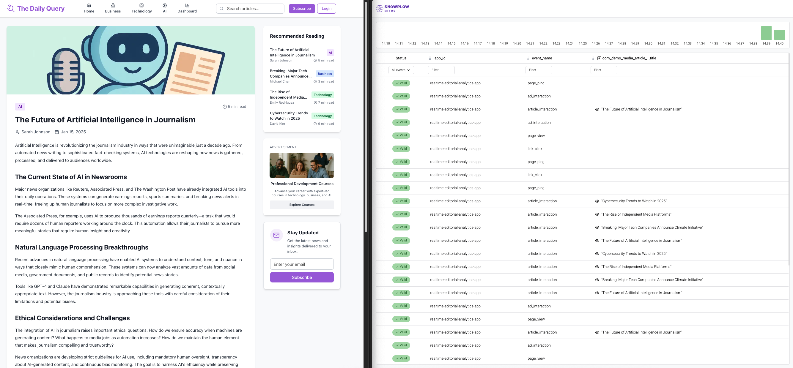
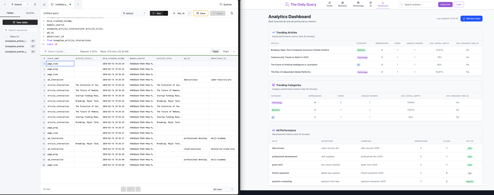
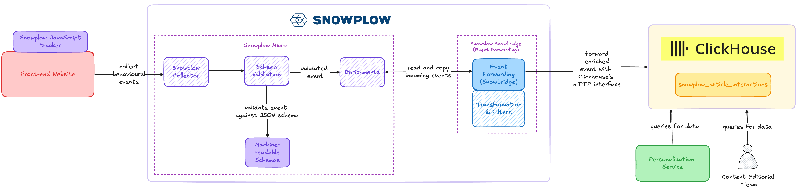

Welcome to the **Real-time Editorial Analytics** solution accelerator for media publishers.

This accelerator demonstrates how to build a real-time use case leveraging **Snowplow event data** to understand article engagement and user behaviour for a media publisher site. By combining Snowplow's streaming pipeline with **Clickhouse Cloud**, the solution processes live streaming events to understand user interactions with article content and advertisements.

On the left side of the image below, a user is browsing and engaging with an online media website. They are reading online articles and clicking different advertisements. Their events are sent through the Snowplow pipeline and the right window displays Snowplow Micro consuming and processing the events generated by the application. From here, events are forwarded to a Clickhouse table in near real-time latency.
 

Once Snowplow sends events to ClickHouse, each event is stored as an individual row in a single ClickHouse table as displayed on the left side of the image below. Displayed on the right is an example dashboard hosted on the wesbite which queries Clickhouse for real-time article engagement and ad performance metrics from the prevous 30 minutes.

Through this hands-on guide, you'll learn how to build, deploy, and extend real-time, event-driven architectures using Snowplow and Clickhouse, enabling real-time insights and analytics for media publishers. The framework is inspired by real customer use-cases in media including tracking user behaviour, understanding content engagement on a minute-by-minute basis and performance of ad placement on site.

This accelerator is open source and can serve as the foundation to build practical applications like real-time viewer insights, engagement analytics, ad performance tracking and personalized content recommendations. Whether you're optimizing ad placements or enhancing content engagement, this guide equips you to unlock the full potential of Snowplow event data.

## Solution Accelerator code

The code for this infrastructure is available [here on GitHub](https://github.com/snowplow-industry-solutions/clickhouse-realtime-editorial-analytics/tree/main).

## Architecture

The solution comprises several interconnected components:

- **Web tracking application**:
  - A Next.js application with a number of articles and advertisements
  - Snowplow's tracking has been configured to send events related to article engagement (e.g., article impressions, article views, ad impressions, ad clicks, page pings) to the [Snowplow Collector](http://docs.snowplow.io/docs/fundamentals/)
  - Code available in the [snowtype.ts](https://github.com/snowplow-industry-solutions/clickhouse-realtime-editorial-analytics/blob/main/website/snowtype/snowplow.ts) file in GitHub

- **Snowplow Micro**:
  - [Snowplow Micro](https://docs.snowplow.io/docs/testing/snowplow-micro/) is a lightweight version of the Snowplow pipeline which can be ran locally.
  - Collects, peforms schema validation and passes enriched events to [Snowbridge](https://docs.snowplow.io/docs/api-reference/snowbridge/)

- **Snowplow Snowbridge (also known as Event Forwarding)**:
  - Filters incoming Snowplow events to only forward a subset of events and dimensions to Clickhouse.
  - Publishes events and lands events in a single table in Clickhouse using Clickhouse's [HTTP interface](https://clickhouse.com/docs/interfaces/http)

- **Clickhouse Cloud**:
  - [Clickhouse Cloud](https://clickhouse.com/) receives and stored events from Snowplow. Stored data can then be queried using Clickhouse's UI or via API.

The following diagram maps out where each component sits in the end-to-end communication flow.

## Prerequisites

- **Clickhouse Cloud account**: A Clickhouse Cloud account is needed to receive Snowplow events. A 30-day free trial signup is [available](https://clickhouse.com/cloud)

## Acknowledgements
Thank you to the [Clickhouse](https://clickhouse.com/) team for their support and collaboration with building this accelerator.