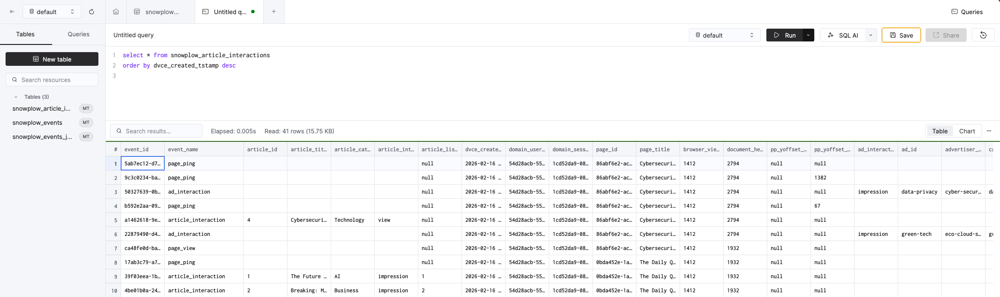

The following steps will deploy the solution accelerator using Docker.

## Step 0: Prerequisites

1. Open a terminal
2. Install **Docker** and **Docker Compose**
3. [Clone the project](https://github.com/snowplow-industry-solutions/clickhouse-realtime-editorial-analytics) and navigate to its directory
```bash
git clone https://github.com/snowplow-industry-solutions/clickhouse-realtime-editorial-analytics.git
```
4. Run the SQL query in `./clickhouse-queries/create-table-query.sql` within Clickhouse's SQL console. This will be the table that will store the Snowplow events. 
5. Create a `.env` file based on `.env.example`. The variables can be retrieved from your Clickhouse account by selecting the [HTTPS connection](https://clickhouse.com/docs/getting-started/quick-start/cloud#connect-with-your-app) method.

## Step 1: Start the containers

Run the following command to download and run everything in Docker:

```bash
docker-compose up -d
```
Details on everything that's installed can be found in the [architecture](/tutorials/realtime-editorial-analytics-clickhouse/introduction#architecture) section on the previous page.


## Step 2: Open the web tracking front-end

Wait for about 30 seconds for the website container to kickstart. Once its ready, visit [http://localhost:3000](http://localhost:3000) to view the website application and start tracking events.


2.1 Click on any of the articles that are on the homepage. Scroll down on the new page which opens. Wait for about 10 seconds to simulate a user reading.

2.2 Click on the advertisement which appears on the right-hand sidebar. Return to the homepage by clicking the "The Daily Query" logo in the header.


2.3 Select a different article from the homepage. Scroll down on the new page which opens.  Wait for about 10 seconds to simulate a user reading.

2.4 Click on the advertisement which appears on the right-hand sidebar as you did in Step 2.2. Return to the homepage by clicking the "The Daily Query" logo in the header.

## Step 3: Open the Snowplow Micro front-end

Open Snowplow Micro on [http://localhost:3000](http://localhost:3000) in a separate window. Press the "Refresh" button located in the header. This will display the current Snowplow events which are being tracked (e.g. page_view, page_ping, article_interaction, ad_interaction). You can use the "Pick Columns" button to select certain dimensions which are collected. Try selecting the following:
- event_name from the "Events" section
- com_demo_ad_interaction_1.type from the "Atomic" section
- com_demo_media_article_interaction_1.type from the "Events" section
- com_demo_media_article_1.title from the "Entities" section

## Step 4: Query the data in Clickhouse Console

Run the following query in Clickhouse's SQL Console. You should see events landing in real-time within the Clickhouse table.

```
select * from snowplow_article_interactions
order by dvce_created_tstamp desc
```



## Step 5: View the editorial analytics data in a sample real-time dashboard

Visit the real-time editoral analytics dashboard located at localhost:3000/dashboard(http://localhost:3000/dashboard) which is querying data from Clickhouse. Press the "Load Data" button. The article engagement and ad performance metrics for the last 30 minutes will then be displayed.


If you are interested in the queries powering these insights, take a look at the code here:
- [Trending Articles report](https://github.com/snowplow-industry-solutions/clickhouse-realtime-editorial-analytics/blob/main/website/app/api/dashboard/route.ts#L52)
- [Trending Categories report](https://github.com/snowplow-industry-solutions/clickhouse-realtime-editorial-analytics/blob/main/website/app/api/dashboard/route.ts#L122)
- [Ad Performance](https://github.com/snowplow-industry-solutions/clickhouse-realtime-editorial-analytics/blob/main/website/app/api/dashboard/route.ts#L204)

## Step 6: Generate more insights

Keep looking through different parts of the website by selecting different news articles or clicking on different ads displayed. Re-do Step 4 or Step 5 and the data will refresh in real-time.

Congratulations! You have successfully run the accelerator to stream web behavior through Snowplow to Clickhouse and visualising the current user behaviour in a real-time editoral analytics dashboard.

## Cleaning up

### Clean up and delete

Shut down and delete all running containers:

```bash
docker-compose down
```

**Tips:**
- There will still be data in your Clickhouse Cloud account. If you want to delete the generated data, run the following command in Clickhouse's SQL Console:
```
DROP TABLE snowplow_article_interactions
```