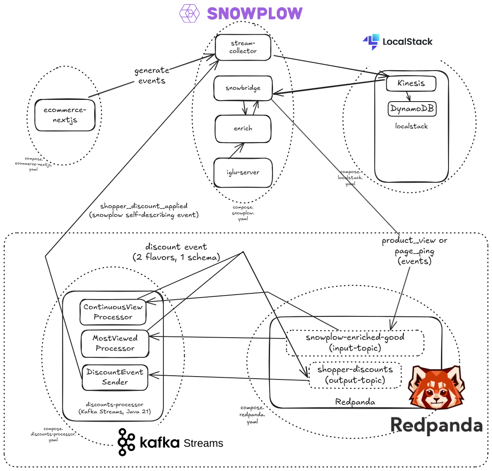

Welcome to the **dynamic discounts** solution accelerator for ecommerce.

This accelerator shows how to use Snowplow's real-time capabilities with ecommerce solutions to offer discounts dynamically when detecting an hesitant shopper. Detecting high-interest products without purchases is a popular real-time use case for ecommerce.

A hesitant shopper is one who has shown a certain amount of interest in a given product without adding it to cart. This solution implements two complementary methods for detecting hesitancy:
* Time-based: the user viewing a product for more than 90 seconds in a 5-minute window
* Visit-based: the user viewing a product more than 5 times in the same 5-minute window

When one of these conditions is met, the application generates a discount event. Use this to trigger downstream actions, such as sending a coupon code to the user using Braze for live couponing, or use the Census Dataset API to make the discount available to the front-end application from your data warehouse.

This accelerator is open source and can serve as the foundation to build practical applications of your own.

## Solution accelerator code

The code for this accelerator is available [here on GitHub](https://github.com/snowplow-industry-solutions/redpanda-dynamic-ecommerce-discounts).

## Architecture

The solution is based on the [Snowplow Next.js demo web application](https://github.com/snowplow-industry-solutions/ecommerce-nextjs-example-store).

On top of that demo ecommerce application, this accelerator adds the `discounts-processor` Java and Kafka Streams application, as well as a Redpanda broker. Redpanda is a streaming data platform.

It consists of the following components:

* The [`ecommerce-nextjs-example-store`](https://github.com/snowplow-industry-solutions/ecommerce-nextjs-example-store) is a Next.js web application that tracks user behavior and sends events to the Snowplow pipeline
* Four Snowplow components are required to receive, validate, and process the events: the [Collector](/docs/fundamentals), [Enrich](/docs/fundamentals), [Snowbridge](/docs/destinations/forwarding-events/snowbridge), and [Iglu Server](/docs/api-reference/iglu)
* Snowbridge receives the events via Kinesis, and sends them to Redpanda
* The Redpanda broker receives in the input-topic `snowplow-enriched-good`
* Within the `discounts-processor` application, the `ContinuousViewProcessor` and `MostViewedProcessor` components process the time-based and visit-based discount methods, respectively, generating a discount event in the output-topic `shopper-discounts`
* The `DiscountEventSender` component sends the discount event to the Snowplow pipeline

## Component configuration

Use the following files in the [GitHub repository](https://github.com/snowplow-industry-solutions/redpanda-dynamic-ecommerce-discounts) to run the project's components.
- **Snowplow components**: `docker/compose.snowplow.yaml`
- **Redpanda infrastructure**: `docker/compose.redpanda.yaml`
- **`discounts-processor` application components**: `docker/compose.discounts-processor.yaml`
- **LocalStack** for local AWS resources (Kinesis, DynamoDB): `docker/compose.localstack.yaml`
- **Front-end application**: `docker/compose.ecommerce-nextjs.yaml`

## Acknowledgements

Thank you to the Kafka experts [OSO](https://oso.sh/) for their support with building this accelerator.
