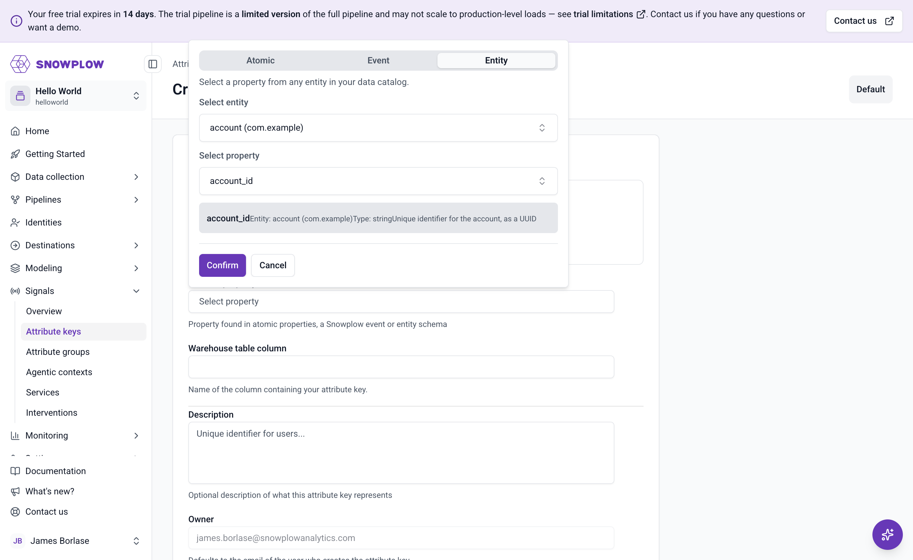
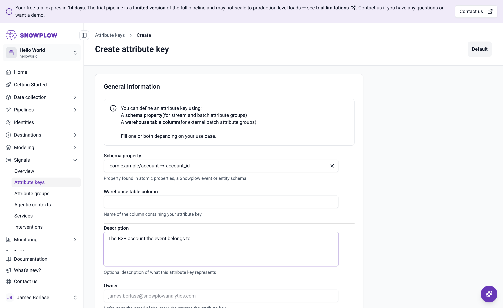

```mdx-code-block
import Tabs from '@theme/Tabs';
import TabItem from '@theme/TabItem';
```

With account-carrying events flowing, you can tell Signals to group them by account. An [attribute key](/docs/signals/attributes/attribute-keys/) is the identifier that attributes are calculated against. Signals ships with four built-in keys, all scoped to a user, device, or session, and lets you define custom keys from any property in your events.

Here you'll create a custom attribute key named `account_id`, based on the `account_id` property of the `account` entity. Any attribute group that uses this key aggregates events per account.

You can create the key in Snowplow Console or with the Signals Python SDK. Both produce the same definition, so pick whichever fits your workflow.

<Tabs groupId="signals-impl" queryString>
<TabItem value="console" label="Console" default>

In [Snowplow Console](https://console.snowplowanalytics.com), go to **Signals** > **Attribute keys**. The list shows the four built-in keys. Click **Create attribute key**.

The form offers two ways to define the key: a **Schema property** for stream attribute groups, or a **Warehouse table column** for warehouse attribute groups. You're building from the event stream, so under **Schema property**, click **Select property**.

The property picker has three tabs: **Atomic**, **Event**, and **Entity**. Open the **Entity** tab, select the `account` entity from the `com.example` vendor, then select the `account_id` property.



Click **Confirm** to close the picker, then add an optional description. The **Owner** field defaults to your Console user's email address.



Click **Create attribute key** to save it. There's no name field: the key's name is taken from the selected property, so it appears in the list as `account_id`.

:::note[The data catalog refreshes periodically]
The property picker shows the events and entities in your pipeline's data catalog, which is built from events your pipeline has processed. If the **Entity** tab is empty, the `task_completed` events from the previous section haven't been cataloged yet.

The catalog refreshes periodically rather than instantly, so wait and reload the page. Rather than waiting, switch to the Python SDK tab, which doesn't depend on the catalog at all, and come back to Console later if you want to see the key there.
:::

</TabItem>
<TabItem value="sdk" label="Python SDK">

Define the key with the `AttributeKey` class, pointing its `property` argument at the entity property with `EntityProperty`.

```python
from snowplow_signals import AttributeKey, EntityProperty

account_id_key = AttributeKey(
    name="account_id",
    description="The B2B account the event belongs to",
    property=EntityProperty(
        vendor="com.example",
        name="account",
        major_version=1,
        path="account_id",
    ),
)
```

`major_version=1` picks the schema's major version, so minor and patch revisions of the `account` schema keep working with this key.

This only creates a local object. The key is registered with Signals when you publish it, which you'll do together with the attribute group in the next section. An attribute group can only reference keys that already exist in Signals, so the publish call there includes the key.

</TabItem>
</Tabs>

The property reference is what makes this key account-scoped: for every event, Signals reads `account_id` from the attached `account` entity and uses that value as the profile identifier. That's specific to stream attribute groups. For [warehouse attribute groups](/docs/signals/attributes/warehouse-config/), the attributes are pre-calculated in a warehouse table, so the key names the table column holding the key values with `external_column` in place of `property`.

:::note[When built-in keys are enough]
If you want attributes per user, session, or device, skip custom keys and use the built-in `user_id`, `domain_userid`, `domain_sessionid`, or `network_userid` keys directly. See [attribute keys](/docs/signals/attributes/attribute-keys/) for the full list.
:::
