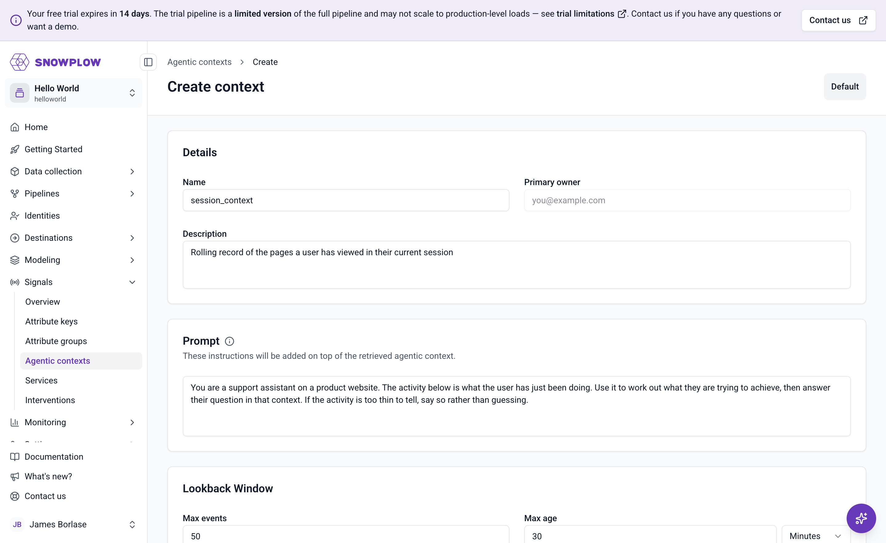
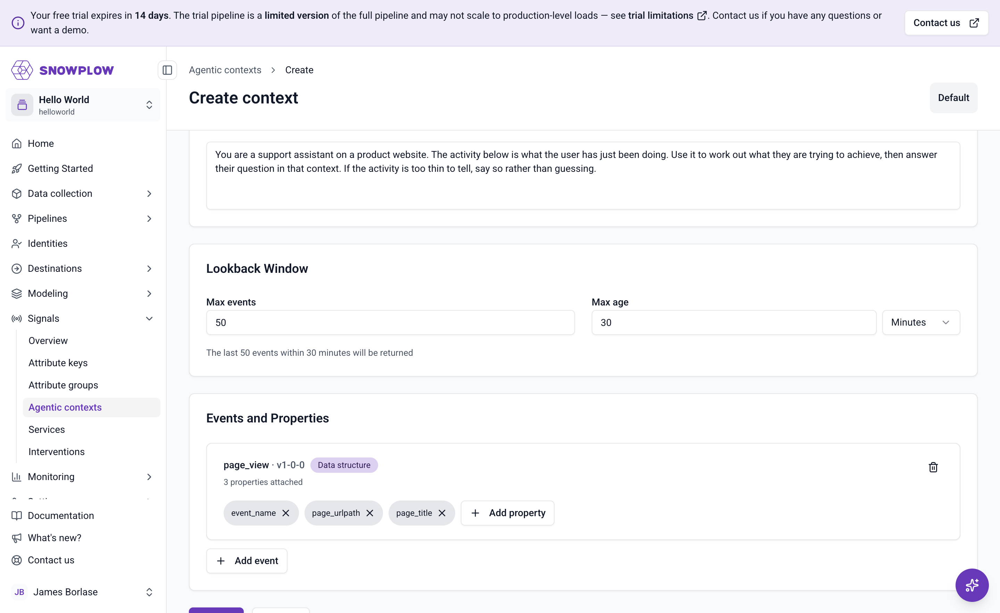

```mdx-code-block
import Tabs from '@theme/Tabs';
import TabItem from '@theme/TabItem';
```

You'll define an agentic context that keeps the last 50 page views of a session, for up to 30 minutes, and attaches a prompt telling an agent how to read them. Signals scopes the buffer to a single session using the `domain_sessionid` [attribute key](/docs/signals/concepts/#attribute-keys), so each session gets its own rolling record.

Do this by asking an AI assistant, in Snowplow Console, or with the Signals Python SDK. All three produce the same thing, so pick whichever you prefer.

<Tabs groupId="signals-impl" queryString>
<TabItem value="assistant" label="AI assistant" default>

Use the [Snowplow Assistant](/docs/llms-support/console-agent/) in Console, which needs no setup, or your own MCP-capable assistant connected to the [Snowplow MCP server](/docs/llms-support/snowplow-mcp/).

Paste this prompt into the chat:

```text
Create a Signals agentic context called session_context, keyed on domain_sessionid,
that keeps the last 50 page_view events for up to 30 minutes. Attach the atomic
properties event_name, page_urlpath, and page_title to the event, and use this as
the prompt:

"You are a support assistant on a product website. The activity below is what the
user has just been doing. Use it to work out what they are trying to achieve, then
answer their question in that context. If the activity is too thin to tell, say so
rather than guessing."
```

The assistant creates the definition and can publish it for you. Review it under **Signals** > **Agentic contexts** in Console before you publish.

</TabItem>
<TabItem value="console" label="Console">

Go to **Signals** > **Agentic contexts** in Snowplow Console and create a new agentic context. On the **Create context** form, fill in the **Details** and **Prompt** sections:

| Field | Value |
| ----- | ----- |
| Name | `session_context` |
| Primary owner | Your email address |
| Description | `Rolling record of the pages a user has viewed in their current session` |
| Prompt | The prompt text below |

Use this as the prompt:

```text
You are a support assistant on a product website. The activity below is what the
user has just been doing. Use it to work out what they are trying to achieve,
then answer their question in that context. If the activity is too thin to tell,
say so rather than guessing.
```



Under **Lookback Window**, set **Max events** to `50` and **Max age** to `30` minutes. Console shows the window it will use underneath the fields.

Under **Events and Properties**, click **Add event** and choose `page_view` at version `1-0-0`. Then use **Add property** to attach `event_name`, `page_urlpath`, and `page_title` to it.



</TabItem>
<TabItem value="sdk" label="Python SDK">

You'll need Python 3.9 or later. Install the SDK:

```bash
pip install snowplow-signals
```

The SDK models an agentic context as an `EventLog`, so that's the class you import. Store your [connection credentials](/docs/signals/connection/) in the environment first, then define and publish the agentic context:

```python
import os
from snowplow_signals import (
    Signals,
    EventLog,
    EventSelection,
    EventLogEvent,
    EventLogAtomicProperty,
    domain_sessionid,
)

sp_signals = Signals(
    api_url=os.environ["SP_API_URL"],
    api_key=os.environ["SP_API_KEY"],
    api_key_id=os.environ["SP_API_KEY_ID"],
    org_id=os.environ["SP_ORG_ID"],
)

session_context = EventLog(
    name="session_context",
    description="Rolling record of the pages a user has viewed in their current session",
    owner="you@example.com",
    prompt=(
        "You are a support assistant on a product website. "
        "The activity below is what the user has just been doing. "
        "Use it to work out what they are trying to achieve, then answer their "
        "question in that context. If the activity is too thin to tell, say so "
        "rather than guessing."
    ),
    attribute_key=domain_sessionid,
    max_events=50,
    max_age_seconds=1800,
    events=[
        EventSelection(
            event=EventLogEvent(
                name="page_view",
                vendor="com.snowplowanalytics.snowplow",
                version="1-0-0",
            ),
            properties=[
                EventLogAtomicProperty(name="event_name"),
                EventLogAtomicProperty(name="page_urlpath"),
                EventLogAtomicProperty(name="page_title"),
            ],
        )
    ],
)

sp_signals.publish([session_context])
```

`SP_API_URL` is your Signals API URL, in the form `https://YOUR_ID.signals.snowplowanalytics.com`.

</TabItem>
</Tabs>

## Choose which properties to keep

An agentic context doesn't store whole events. For each event you select, you list the properties to project, and only those reach the agent. Properties can come from the [atomic](/docs/fundamentals/canonical-event/) event, the event's own schema, or its entities.

Here you keep three atomic properties of each page view:

| Property | In the narrative |
| -------- | ---------------- |
| `event_name` | Fills the `event` column |
| `page_urlpath` | Fills the `url` column |
| `page_title` | Appears in the `event_context` field |

For the full range of selection options, including schema and entity properties, see [selecting events](/docs/signals/agentic-contexts/#selecting-events).

## Publish it

Publishing sends the definition to your Signals infrastructure and starts the buffering. Until you publish, nothing is captured.

<Tabs groupId="signals-impl" queryString>
<TabItem value="assistant" label="AI assistant" default>

Ask the assistant to publish it:

```text
Publish my session_context agentic context.
```

</TabItem>
<TabItem value="console" label="Console">

Click **Publish**. Console keeps your changes as a draft until you do.

</TabItem>
<TabItem value="sdk" label="Python SDK">

The `publish()` call in the code above both registers the agentic context and sends it to your Signals infrastructure.

To change an agentic context you've already published, edit it in Console and publish the draft, as you'll do later in this tutorial.

</TabItem>
</Tabs>

Publish first, then browse: an agentic context captures events from the moment it goes live. There's one live agentic context per name, and publishing replaces the one that was live.
