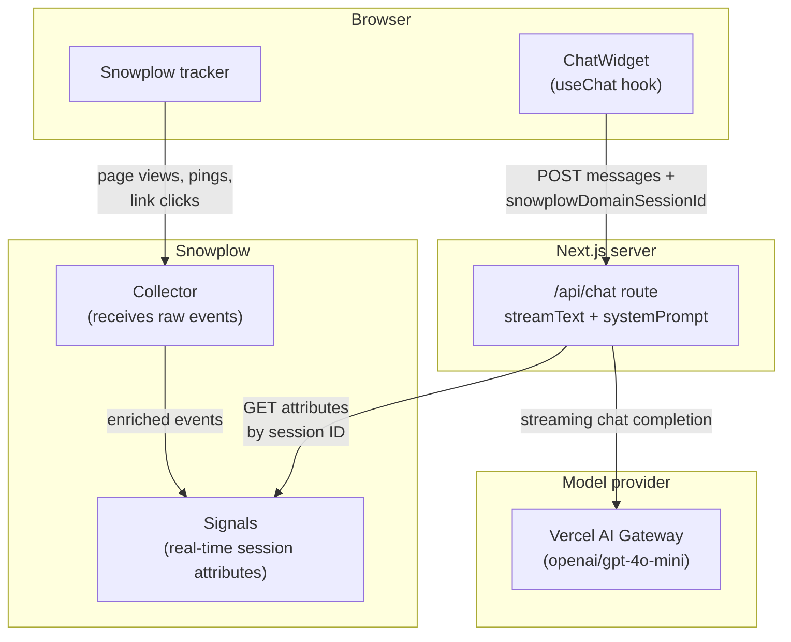

In this tutorial, you'll build a Next.js AI agent that uses [Snowplow Signals](/docs/signals/introduction/) to understand what your users are doing in real time. Instead of responding generically to every user, the agent will have live awareness of the current user's session behavior: which pages they've visited, what they've been exploring, and how long they've been on the site.

The app will:

1. Track user behavior automatically using the [Snowplow Browser tracker](/docs/sources/web-trackers/)
2. Compute live user attributes with Snowplow Signals
3. Inject those attributes into the AI agent's system prompt using the Vercel AI SDK
4. Deliver contextually aware responses that respond to what the user is actually doing

Adding real-time context from Signals can improve responses. In this example, the user has spent 20 minutes exploring the enterprise pricing page:

```txt
User: "Can you help me understand your pricing?"

// Without Signals context
Agent: "Sure! We offer three plans: Starter, Pro, and Enterprise..."

// With Signals context
Agent: "I can see you've been exploring our Enterprise plan — happy to help.
       Are you mainly comparing SSO requirements, infrastructure options,
       or SLA tiers?"
```

The agent can tailor its response based on the user's actual behavior, making for a more engaging and personalized experience.

## How the components fit together



The Snowplow JavaScript tracker streams behavioral [events](/docs/fundamentals/events/) (page views, page pings, link clicks) to the Collector, and Signals computes live session attributes from that stream. On the front-end, the `ChatWidget` reads the Snowplow session ID from the tracker's cookie and sends it alongside every chat request as `pageContext.snowplowDomainSessionId`. The Next.js `/api/chat` route uses that session ID to fetch fresh attributes from Signals, appends them to the system prompt, and hands the combined prompt to `streamText`, which streams the model's response back through the Vercel AI Gateway to the browser.

## Prerequisites

This tutorial requires:

* A Snowplow account with [Signals deployed](/docs/signals/connection/)
* Node.js 18+ and npm/pnpm
* A [Vercel AI Gateway API key](https://vercel.com/docs/ai-gateway/getting-started)
  * This tutorial uses `openai/gpt-4o-mini` via AI Gateway, but any supported model works
* Basic familiarity with Next.js and TypeScript

This tutorial should take approximately 30 minutes to complete.
