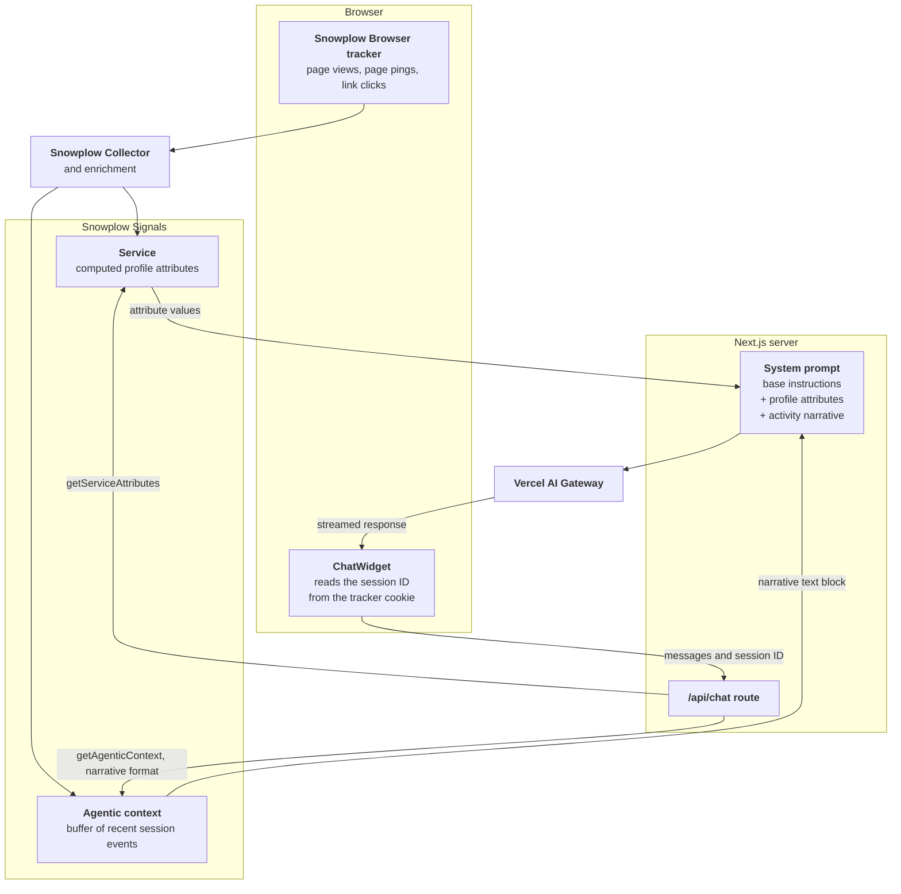

In this tutorial, you'll build a Next.js AI agent that uses [Snowplow Signals](/docs/signals/introduction/) to understand what your users are doing in real time. Instead of responding generically to every user, the agent will have live awareness of the current user's session behavior: which pages they've visited, what they've been exploring, and how long they've been on the site.

The agent will draw on two complementary kinds of Signals context:

* Profile attributes: computed aggregates about the session, such as page view counts, served by a Signals [service](/docs/signals/concepts/#services). Use attributes when you want defined metrics that your agent, or any other consumer, can rely on.
* An [agentic context](/docs/signals/agentic-contexts/): the user's recent activity, returned as an LLM-ready narrative. Use it when you want to ground the agent in the user's immediate journey, without writing aggregation or formatting logic.

The app will:

1. Track user behavior automatically using the [Snowplow Browser tracker](/docs/sources/web-trackers/)
2. Compute live user attributes with Snowplow Signals
3. Capture recent session activity with a Signals agentic context
4. Inject both into the AI agent's system prompt using the Vercel AI SDK
5. Deliver contextually aware responses that respond to what the user is actually doing

Adding real-time context from Signals can improve responses. In this example, the user has spent 20 minutes exploring the enterprise pricing page:

```txt
User: "Can you help me understand your pricing?"

// Without Signals context
Agent: "Sure! We offer three plans: Starter, Pro, and Enterprise..."

// With Signals context
Agent: "I can see you've been exploring our Enterprise plan — happy to help.
       Are you mainly comparing SSO requirements, infrastructure options,
       or SLA tiers?"
```

The agent can tailor its response based on the user's actual behavior, making for a more engaging and personalized experience.

## How the components fit together

The flow works like this:
- The Snowplow Browser tracker streams behavioral [events](/docs/fundamentals/events/) to your Collector
- Signals computes live session attributes from that stream, and buffers the session's recent events for the agentic context
- On the front-end, the `ChatWidget` reads the Snowplow session ID from the tracker's cookie and sends it alongside every chat request as `pageContext.snowplowDomainSessionId`
- The Next.js `/api/chat` route uses that session ID to fetch both the profile attributes and the activity narrative from Signals, and appends both to the system prompt
- The model's response is streamed back through the Vercel AI Gateway to the browser


```mermaid
flowchart TD
    subgraph browser ["Browser"]
        tracker["<b>Snowplow Browser tracker</b><br/>page views, page pings, link clicks"]
        widget["<b>ChatWidget</b><br/>reads the session ID<br/>from the tracker cookie"]
    end

    collector["<b>Snowplow Collector</b><br/>and enrichment"]

    subgraph signals ["Snowplow Signals"]
        service["<b>Service</b><br/>computed profile attributes"]
        agentic["<b>Agentic context</b><br/>buffer of recent session events"]
    end

    subgraph server ["Next.js server"]
        route["<b>/api/chat route</b>"]
        prompt["<b>System prompt</b><br/>base instructions<br/>+ profile attributes<br/>+ activity narrative"]
    end

    gateway["<b>Vercel AI Gateway</b>"]

    tracker --> collector
    collector --> service
    collector --> agentic
    widget -- "messages and session ID" --> route
    route -- "getServiceAttributes" --> service
    route -- "getAgenticContext, narrative format" --> agentic
    service -- "attribute values" --> prompt
    agentic -- "narrative text block" --> prompt
    prompt --> gateway
    gateway -- "streamed response" --> widget
```

## Prerequisites

This tutorial requires:

* A Snowplow account with [Signals enabled](/docs/signals/setup/)
* Node.js 18+ and npm/pnpm
* A [Vercel AI Gateway API key](https://vercel.com/docs/ai-gateway/getting-started)
  * This tutorial uses `openai/gpt-4o-mini` via AI Gateway, but any supported model works
* Basic familiarity with Next.js and TypeScript

:::note[A full pipeline is required]
Signals computes attributes and captures session activity from real events flowing through your pipeline, so this tutorial can't be completed with [Snowplow Micro](/docs/testing/snowplow-micro/) or in a purely local setup. You need a running Snowplow pipeline with Signals enabled.

If you don't have one, you can deploy and use a [Snowplow free trial](https://snowplow.io/get-started/snowplow-free-trial) to follow along.
:::

This tutorial should take approximately 30 minutes to complete.
