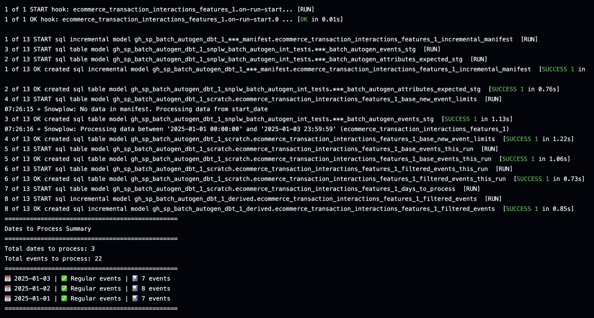

Now that your models are generated, it's time to run them and verify that everything works as expected. This step allows you to test your models locally before moving them to production.

During the run process:
* dbt will compile your SQL models
* Tables will be created in your data warehouse
* You'll see progress updates in the terminal
* Any errors will be clearly displayed

Best practice to ensure successful model runs:
* Always test your models after generation
* Review the generated SQL for accuracy
* Document any custom modifications you make
* Keep track of model versions
* Regularly update your models as your data evolves

## Configure dbt

Before running your new models, you'll need to configure their dbt connection profile. Read more about this in the [dbt documentation](https://docs.getdbt.com/docs/core/connect-data-platform/connection-profiles). The batch engine doesn't generate a `profiles.yml` because it isn't best practice to store credentials in the same place as models.

## Run the models

After configuring dbt, you can run your models locally using the `dbt run` command.

For your first run, you'll want to do a full refresh to ensure all tables are created properly:

```bash
dbt run --full-refresh
```



For later runs, you can use the standard command:

```bash
dbt run
```

Running the models will create tables of your newly calculated attributes.

## Test and validate

It's important to test your models before moving them to production. The local testing phase is your opportunity to:
* Verify that the generated models meet your requirements
* Make any necessary adjustments to the models
* Explore the data transformations
* Ensure data quality and accuracy

Follow your standard dbt testing process.
