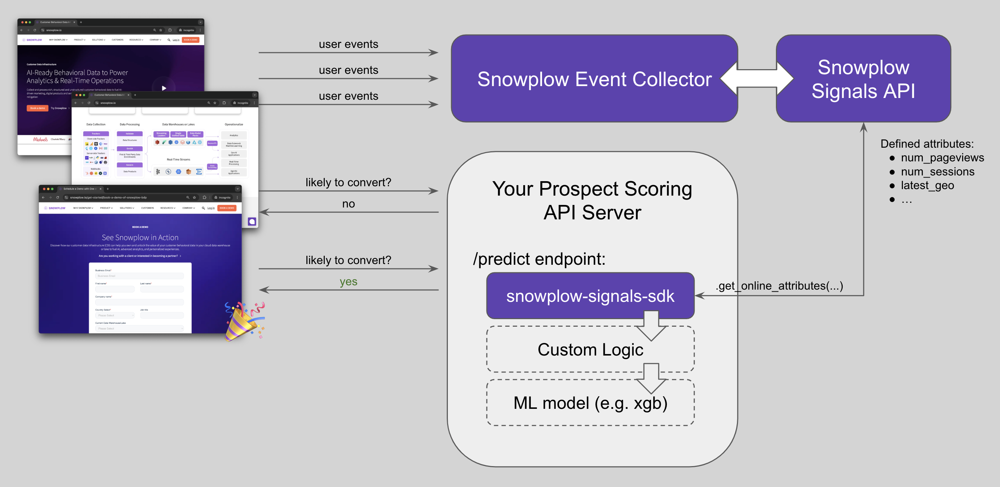

This tutorial will guide you through the process of building a real-time prospect scoring system using Snowplow Signals AI together with a machine learning model.

By the end, you'll understand how to leverage Snowplow event data to predict a prospect's likelihood to convert on your website and trigger personalized engagements.

Use this tutorial as a starting point for how one can integrate Signals data with any ML use cases or other backend services.

### Prospect Journey Overview

During the customer journey, prospects browse the marketing website, visit product and pricing pages, watch videos, etc.
The goal is to drive them to the main CTA - a form submission.

We'd like to predict if a specific prospect is likely to submit a form in the next hour given their behaviour up until the prediction moment.

For simplicity in this tutorial, we'll score prospects every 10 seconds as they browse the website.

Depending on the requirements, one would score prospects at the start of each `page_view`, after certain events, or at some time interval.

### High-Level Architecture

The system consists of three main blocks:

1. **Marketing Website** – users browse the website, Snowplow behaviour events are sent to the Snowplow Collector.
2. **Snowplow Infrastructure**: Collector captures the events, Signals calculates aggregated user attributes in near real-time (e.g., `num_pageviews, num_sessions`, etc.).
3. **Intermediary `/predict` API** that calls the Signals API to get the latest attributes, runs an ML model on the Signals AI output, and sends the response back to the Marketing Website.

:::note
You can replace the ML model with any other backend system that you'd use to act on live prospects' attributes.
:::

### End Result

At the end of the tutorial, you will:

* see live prospect attribute updates in the browser console,
* score them using an ML model,
* and use the outputs to drive decisions on the website.

Let's go!
