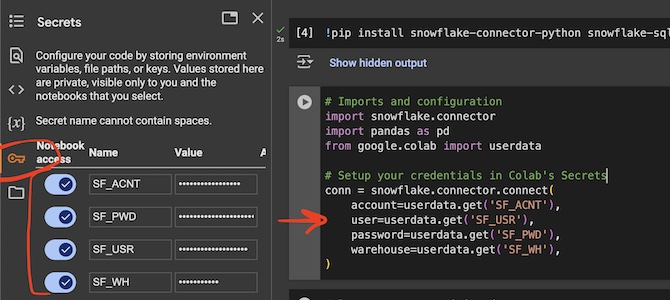
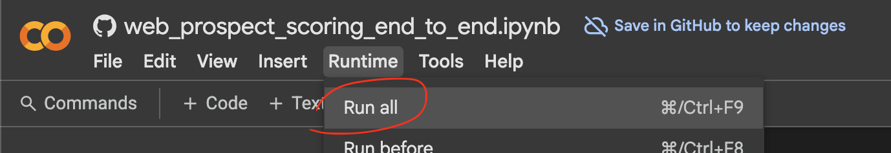

### Required Prerequisites

1. Google Colab - open this end-to-end [Example Python Notebook](https://colab.research.google.com/github/snowplow-incubator/signals-notebooks/blob/main/web/web_prospect_scoring_end_to_end.ipynb) to follow along.
2. Configure credentials in Google Colab:
    - **Snowplow Signals API keys**. Get these in the [Console](https://console.snowplowanalytics.com/).
    - **[ngrok](https://dashboard.ngrok.com/) API key**. We will use ngrok to expose an endpoint from the Colab notebook behind an HTTPS URL.
    - **Snowflake**. We will train our data on the raw Snowplow Atomic Events table. If you use a different warehouse, please adjust the connection code.

### Credentials Configuration

Make sure to configure credentials in Colab Credentials section like this:



Here's the list of all credential variables you may need to configure:

```python
from google.colab import userdata
# Snowflake credentials to access raw Atomic Events table to prepare a historical training dataset
# Adjust to your Snowflake authentication mechanism.
ENV_SF_ACNT = userdata.get('SF_ACNT') # Account
ENV_SF_USR = userdata.get('SF_USR') # User
ENV_SF_PWD = userdata.get('SF_PWD') # Pwd
ENV_SF_WH = userdata.get('SF_WH') # Warehouse

# Snowplow Signals credentials
ENV_SP_API_KEY = userdata.get('SP_API_KEY') # Snowplow Signals API Key
ENV_SP_API_KEY_ID = userdata.get('SP_API_KEY_ID') # Snowplow Signals API ID
ENV_SP_ORG_ID = userdata.get('SP_ORG_ID') # Snowplow Org ID

# ngrok token to be able to expose notebook behind HTTPS for querying the API
ENV_NGROK_TOKEN = userdata.get('NGROK_TOKEN')
```

Adjust these to suit your warehouse authentication methods.

### Configure Atomic Events and API Endpoint

Make sure to also update the Signals API endpoint and Atomic Events table in Snowflake:

```python
ENV_SIGNALS_API_ENDPOINT = "https://d0a9ba0f-893a-445f-91a5-a1abf1359d34.svc.snplow.net" # Snowplow Signals API Endpoint
ENV_ATOMIC_TABLE = "snowplow_db.atomic_stream.events" # Snowflake Snowplow Atomic Table
```

### Run Colab

Now hit that `Runtime > Run all` button!


