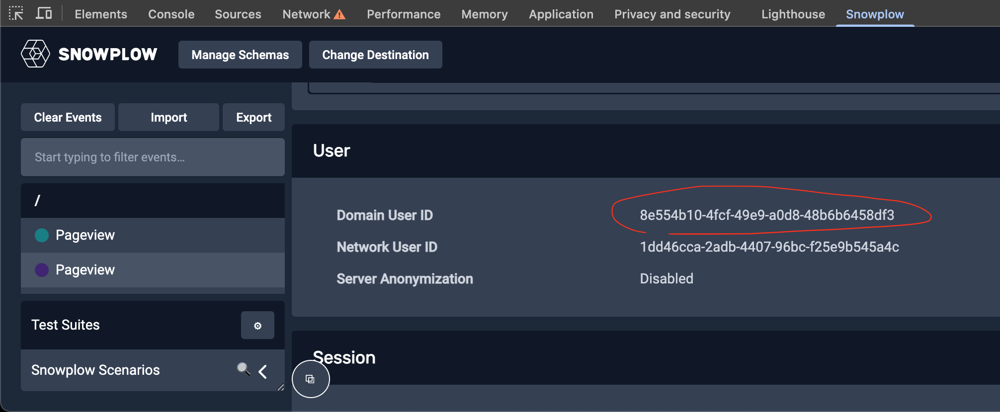

### Create and Deploy Simple API Endpoint

Navigate to the `Create Model Serving API Endpoint` section in the Colab where we create a simple HTTP endpoint with FastAPI.

```python
...

@app.post("/predict")
def predict(data: InputData):
    input_dict = data.model_dump()

    # Get Signals data and prepare dataframe for scoring
    df, signals_response = get_duid_values(input_dict['domain_userid'])

    # Score dataframe using the trained model
    prediction, explanations = get_predictions(df, 5)

    # Return the result
    print(f"P: {round(prediction, 4)} - {input_dict}")
    return {
        "signals": signals_response.to_dict(orient='records')[0],
        "scoring_attributes": df.to_dict(orient='records')[0],
        "explanations": explanations,
        "score": prediction
    }
```

Our `/predict` endpoint does these 4 things:

1. Receives `domain_userid`.
2. Calls Signals API to get latest attribute values using `sp_signals.get_view_attributes(...)` API.
3. Scores latest attribute values using an ML model.
4. Returns Signals API attributes, ML prediction score, ML prediction explanations back.

More implementation details are in each of the `get_duid_values, get_predictions` functions.

For example, in order to get live Signals Attributes for a `domain_userid` one can use this Signals API:

```python
def get_duid_values(duid: str):
    response = sp_signals.get_view_attributes(
        name=view_name,
        version=view_version,
        attributes=attributes,
        identifier=duid
    )
    df = response.to_dataframe()
    ...
```

### Proxy API Endpoint for Testing

In order to be able to call this endpoint from your local machine or via JS in the browser, you need to proxy Colab's localhost to the world behind HTTPS.

Let's use `ngrok` for that.
ngrok exposes Colab's localhost 8000 port behind a one-time HTTPS URL like `https://00ab-11-22-333-44.ngrok-free.app`.

```python
import ...

conf.get_default().auth_token = userdata.get('NGROK_TOKEN')
ngrok_tunnel = ngrok.connect(8000)
print('Public URL:', ngrok_tunnel.public_url)
nest_asyncio.apply()
uvicorn.run(app, port=8000)
```

As a result you should see this in the output.

```
Public URL: https://00ab-11-22-333-44.ngrok-free.app
...
INFO:     Uvicorn running on http://127.0.0.1:8000 (Press CTRL+C to quit)
```

### Perform Actions to Seed Signals with Data

Go to your website and find your own `domain_userid`.

You can use the [Snowplow Chrome Plugin](https://chromewebstore.google.com/detail/snowplow-inspector/maplkdomeamdlngconidoefjpogkmljm?hl=en&pli=1) to get it.



### Test Using cURL

Now take the ngrok API URL, your `domain_userid` and call the proxy using `cURL`:

```bash
curl -X POST "https://00ab-11-22-333-44.ngrok-free.app/predict" -H "Content-Type: application/json" -d '{"domain_userid": "9a947ebb-5107-437c-b6c6-1d6cb6be3cf7"}'
```

### Test in the Browser Console

Additionally, let's try this in the browser console to act on predictions:

```js
// Let's call the API every 10s from the frontend
let base_url = "https://00ab-11-22-333-44.ngrok-free.app";
let api_url = `${base_url}/predict`;
let tracker_name = "sp";

setInterval(function () {
    // assuming Snowplow tracker is available at 'window.snowplow(...)'
    window.snowplow(function () {
        // get domain_userid
        var sp = this[tracker_name];
        var domainUserId = sp.getDomainUserId();

        // call the API
        fetch(api_url, {
            method: "POST",
            headers: { "Content-Type": "application/json" },
            body: JSON.stringify({ domain_userid: domainUserId })
        })
        .then(response => response.json())
        .then(result => {
            console.log("Prediction: ", domainUserId, " - ", result.score);

            // act on prediction
            if (result.score >= 0.9) console.log('Prospect is likely to convert!');
        })
        .catch(console.error);
    });
}, 10 * 1000);
```

This simple snippet calls the API every 10 seconds.
Adjust it to call the endpoint APIs as often as needed in your use case.


## Final Notes and Next Steps

This tutorial walked you through the process of building a prospect scoring system using Snowplow Signals together with a machine learning model.
It is a starting point in exploring and using Signals APIs for your own needs.

Suggested **next steps**:

- **Define More Signals Attributes:** Define more Signals attributes custom-tailored for your use cases and events.
- **Integrate Attributes into your Flows:** Integrate Signals APIs into your backend workflows to act on the users attributes.
- **Explore More Signals Use Cases and Docs:** Explore Signals Documentation to get more ideas on how to integrate Signals capabilities into your use cases.
