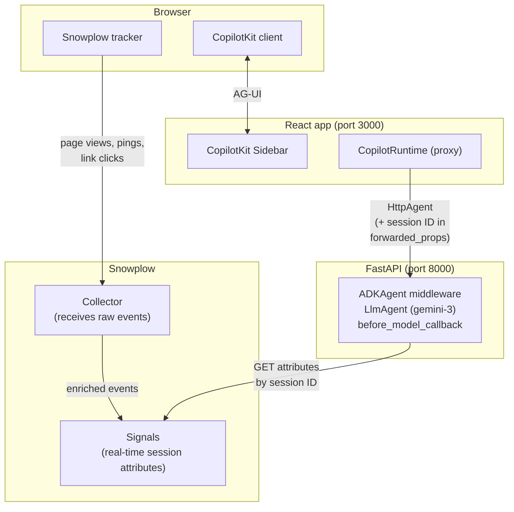

In this tutorial, you'll add [Snowplow Signals](/docs/signals/) to a Google ADK agent so the agent gets fresh context about the current user's session before every response. Instead of responding generically, the agent will know which pages the user has been browsing, how long they've been on the site, and what they've been looking at.

The app will:

- Track user behavior automatically using the [Snowplow Browser tracker](/docs/sources/web-trackers/)
- Compute live session attributes with Snowplow Signals
- Inject those attributes into the agent's system instruction on every turn, using a `before_model_callback`
- Deliver contextually aware responses via a React + CopilotKit chat sidebar

Adding real-time context from Signals can improve responses. In this example, the user has spent 20 minutes browsing enterprise pricing:

```txt
User: "Can you help me understand your pricing?"

// Without Signals context
Agent: "Sure! We offer three plans: Starter, Pro, and Enterprise..."

// With Signals context
Agent: "I can see you've been exploring our Enterprise plan — happy to help.
       Are you mainly comparing SSO requirements, infrastructure options,
       or SLA tiers?"
```

The agent can tailor its response based on the user's actual behavior.

## Architecture



The flow works like this:
- The Snowplow Browser tracker streams behavioral [events](/docs/fundamentals/events/) to your Collector
- Signals computes live session attributes from that stream
- On the front-end, `CopilotProvider` reads the Snowplow session ID from the tracker's cookie and passes it to CopilotKit via a `properties` prop
- The session ID gets sent as `forwarded_props` in every CopilotKit request, including the very first turn
- The ADK agent's `before_model_callback` uses that session ID to fetch fresh attributes from Signals and append them to the system instruction

## Prerequisites

- A Snowplow account with [Signals deployed](/docs/signals/connection/)
- Node.js 18+ and npm/pnpm
- Python 3.12+
- A Google AI Studio API key
  - [AI Studio](https://aistudio.google.com/app/apikey)
  - [Vertex AI](https://docs.cloud.google.com/agent-builder/agent-engine/quickstart-adk)
- Basic familiarity with React, Python, and TypeScript
