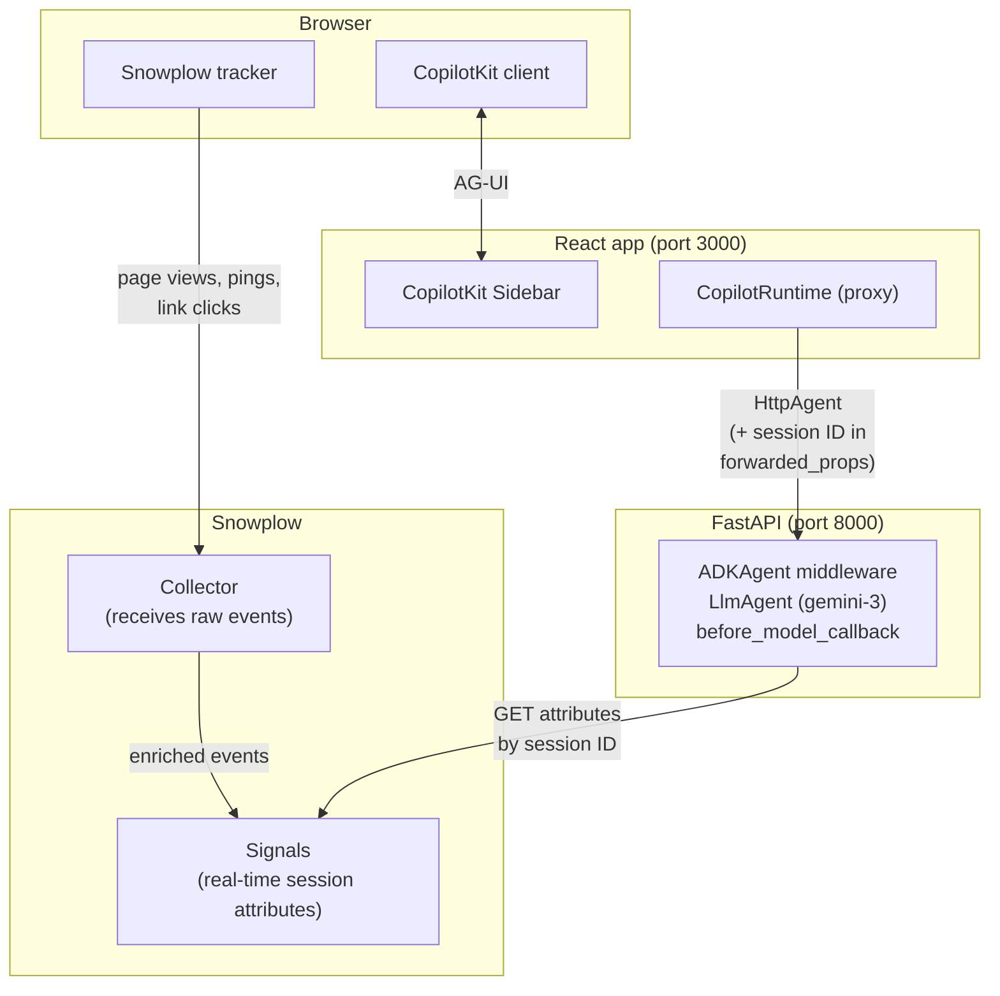

Every company shipping an AI agent hits the same wall: the agent doesn't know who it's talking to or what they're trying to accomplish. A user has spent twenty minutes deep on your website, browsing its enterprise features and pricing — comparing tiers, reading the SLA fine print — and when they open the chat, the agent starts from zero:

> User: "Can you help me understand your pricing?"
>
> Agent: "Sure! We offer three plans: Starter, Pro, and Enterprise..."

That's not helpful, it's a step backwards. The user already knows you have three plans. They wanted help choosing and understanding the nuance between them. Your agent is operating within a silo. It is completely unaware of what the user has been doing. This type of interaction causes a customer to lose trust in your agent, and your company.

Next, see what happens when the agent has context — specifically, when it knows the user has been browsing enterprise pricing for the last twenty minutes:

> User: "Can you help me understand your pricing?"
>
> Agent: "I can see you've been exploring our Enterprise plan — happy to help. Are you mainly comparing SSO requirements, infrastructure options, or SLA tiers?"

That's the same model, the only difference is real-time behavioral user context.

Now take it a step further. That user on the enterprise pricing page — what if they've been there for twenty minutes, visited the comparison table three times, and still haven't clicked "Talk to Sales"? That's a high-intent user who's stuck. With Signals interventions, the agent doesn't wait for the user to open the chat. It can proactively reach out — "I noticed you've been comparing our Enterprise and Pro plans. Want me to walk you through the differences for your team size?" — right when the behavioral data says the moment matters. Context tells the agent what to say. Interventions tell it *when* to say it.

In this tutorial, you'll build that behavioral context layer. You'll wire [Snowplow Signals](/docs/signals/) — which computes real-time attributes from your behavioral event stream — into a Google ADK agent, so the agent gets fresh context about the current user's session before every turn. The session attributes (pages viewed, engagement depth, time on site) get appended to the system prompt, and the model does the rest. Interventions are covered in a separate tutorial, but together they form the full picture: agents that know what to say and when to say it.

## What you'll build

A full-stack agent app with:

- A Python Google ADK agent (Gemini 3 Flash) running on FastAPI
- A React + CopilotKit frontend with an embedded chat sidebar, wired to the agent over the AG-UI protocol
- Automatic behavioral tracking via the Snowplow Browser SDK
- Live user attributes computed by Snowplow Signals and injected into the agent's system instruction at request time

## Architecture

Here's how the pieces fit together. The Snowplow Browser SDK streams behavioral [events](/docs/fundamentals/events/) (page views, page pings, link clicks) to your Collector. Signals computes live session attributes from that stream. On the frontend, `CopilotProvider` reads the Snowplow session ID from the tracker's cookie and passes it to CopilotKit via a `properties` prop — which gets sent as `forwarded_props` in every AG-UI request, including the very first turn. The ADK agent's `before_model_callback` uses that session ID to fetch fresh attributes from Signals and append them to the system instruction.

## Prerequisites

- A Snowplow account with Snowplow Signals deployed
- Node.js 18+ and npm/pnpm
- Python 3.12+ (the scaffold uses [`uv`](https://docs.astral.sh/uv/) for dependency management — it will be installed automatically if needed)
- A Google AI Studio API key — get one at [aistudio.google.com/app/apikey](https://aistudio.google.com/app/apikey). If you prefer Vertex AI, see the ADK docs on [Vertex AI auth](https://docs.cloud.google.com/agent-builder/agent-engine/quickstart-adk).
- Basic familiarity with React, Python, and TypeScript
