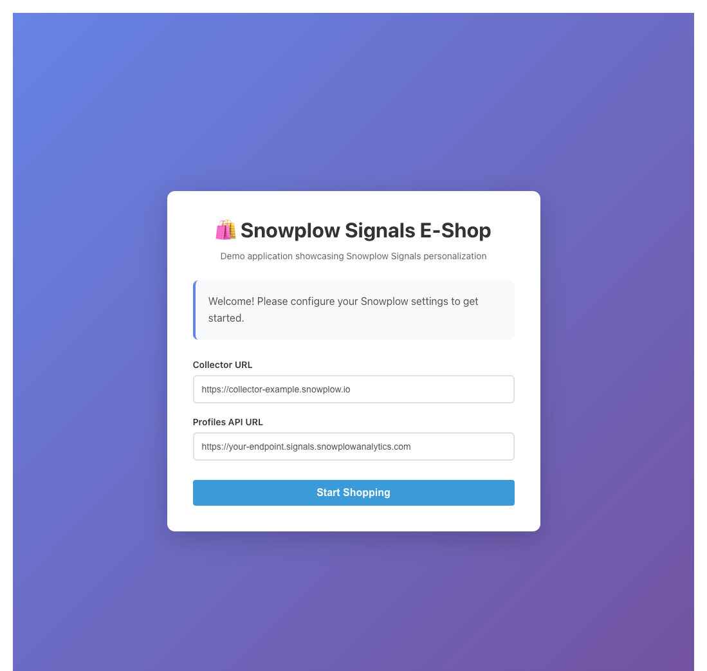
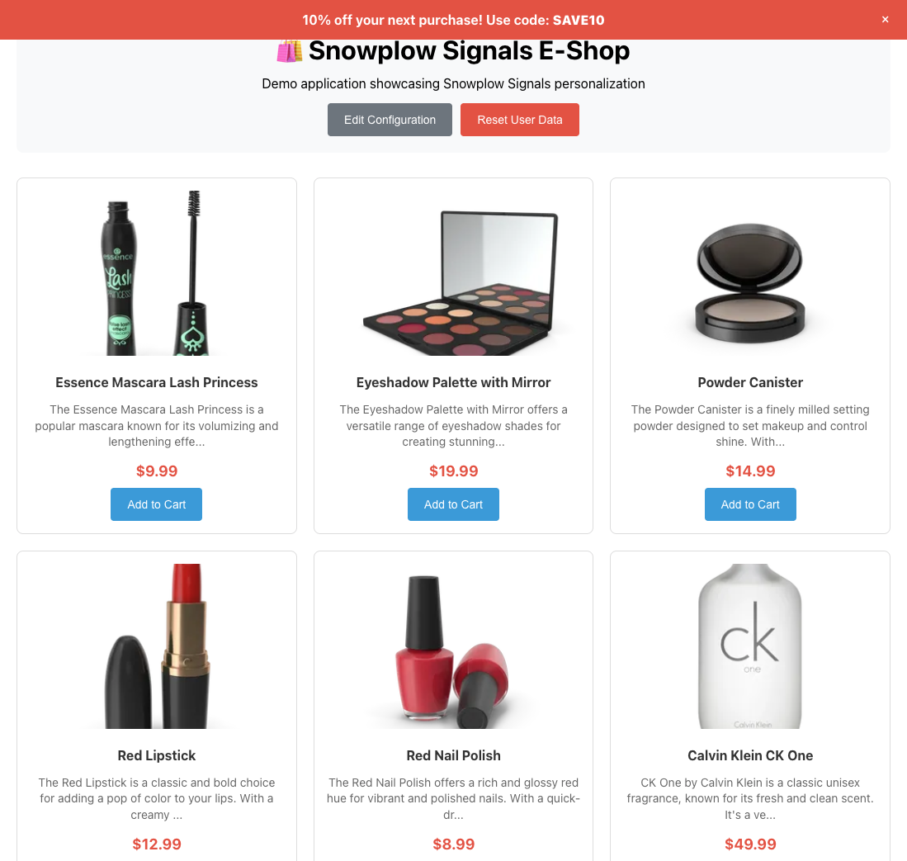
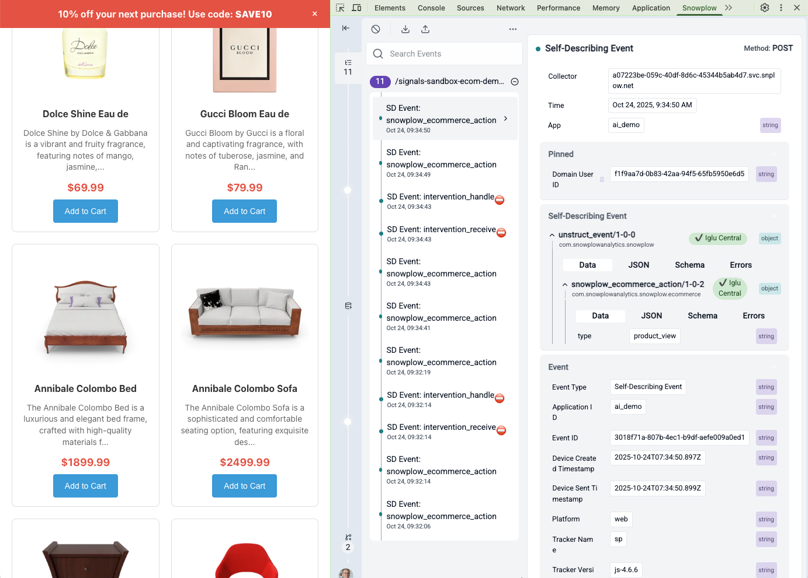
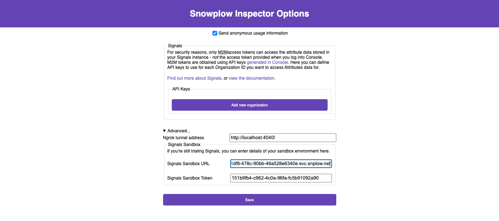
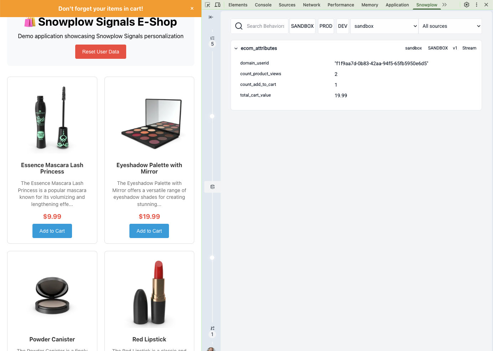
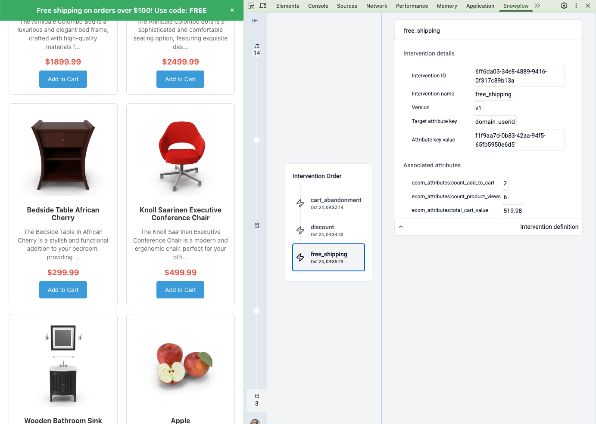

```mdx-code-block
import Tabs from '@theme/Tabs';
import TabItem from '@theme/TabItem';
```

Now that you've defined attributes and interventions, it's time to see them work in a real application. We've prepared a demo React application with Snowplow tracking that can integrate with your Signals instance to demonstrate real-time personalization.

The demo application features:

* **Product catalog**: products fetched from an external API
* **Snowplow tracking**: the [JavaScript tracker](/docs/sources/trackers/web-trackers/) with the [ecommerce plugin](/docs/sources/trackers/web-trackers/tracking-events/ecommerce/)
* **Intervention display**: the [browser tracker plugin](/docs/signals/receive-interventions/#using-the-browser-tracker-plugin) to receive and show intervention banners
* **Logging**: the app prints to the console when it tracks an event, or receives an intervention
* **Reset functionality**: ability to clear your user data and start fresh

## Access the demo application

The demo application is deployed at:

[https://snowplow-incubator.github.io/signals-interventions-demo/](https://snowplow-incubator.github.io/signals-interventions-demo/)

When you first open the app, you'll see a configuration screen.



Enter your credentials from the setup step.

<Tabs groupId="connection" queryString>
<TabItem value="console" label="Snowplow Console" default>

* **Collector URL**: your Snowplow Collector endpoint for the pipeline you enabled Signals on
* **Profiles API URL**: your Signals API URL (from Snowplow Console > **Signals** > **Overview**)

</TabItem>
<TabItem value="sandbox" label="Signals Sandbox">

* **Collector URL**: your Snowplow Collector endpoint
* **Profiles API URL**: your Signals Profiles API endpoint

</TabItem>
</Tabs>

The app will store these values in your browser's local storage, so you won't need to enter them again during this session.

Click **Start Shopping** to proceed to the e-shop.

## Test your interventions

Follow these steps to trigger each intervention.

### Trigger the discount intervention

1. Browse the product catalog
2. Click on different products to view their details
3. After viewing four products, you should see a banner appear at the top:
   * **Message**: "10% off your next purchase!"
   * **Code**: `SAVE10`

### Trigger the cart abandonment intervention

1. Click **Add to Cart** on any product
2. After adding at least one item, you should see:
   * **Message**: "Don't forget your items in cart!"

### Trigger the free shipping intervention

1. Add multiple items to your cart until the total value exceeds $100
2. You should see:
   * **Message**: "Free shipping on orders over $100!"
   * **Code**: `FREE`



## Inspecting events, attributes and interventions using Snowplow Inspector

We highly recommend installing the [Snowplow Inspector](/docs/data-product-studio/data-quality/snowplow-inspector) Chrome extension that lets you validate which Snowplow events are triggering on the website and also check the values of Signals attributes and interventions.

You can install the extension from the [Chrome Web Store](https://chrome.google.com/webstore/detail/snowplow-inspector/maplkdomeamdlngconidoefjpogkmljm?hl=en). Once you add the extension to Chrome, you can view it by [opening Developer Tools](https://developer.chrome.com/docs/devtools/open/) (usually <kbd>Ctrl</kbd>+<kbd>Shift</kbd>+<kbd>I</kbd> or on Mac <kbd>Cmd</kbd>+<kbd>Option</kbd>+<kbd>I</kbd>), where it has its own tab named 'Snowplow'. Right away, you will see the tracked events as you open a product or add a product to cart.



<Tabs groupId="connection" queryString>
<TabItem value="console" label="Snowplow Console" default>

To configure the extension to show Signals attributes and interventions:

1. In Chrome, navigate to [the Extensions settings page](chrome://extensions/)
2. Click on "Details" for the Snowplow Inspector extension
3. Scroll down and click on "Extension options"
4. Click on "Add new organization" and enter your Organization ID and API key details.

</TabItem>
<TabItem value="sandbox" label="Signals Sandbox">

To configure the extension to show Signals attributes and interventions:

1. In Chrome, navigate to [the Extensions settings page](chrome://extensions/).
2. Click on "Details" for the Snowplow Inspector extension.
3. Scroll down and click on "Extension options".
4. Open "Advanced options" and enter you Signals Sandbox URL and token.



</TabItem>
</Tabs>

Now, in addition to seeing the Snowplow events tracked, you will be able to see the attributes and interventions calculated by Signals after switching the section on the left side of the extension.





## Behind the scenes

Here's what happens when you interact with the demo app:

1. **Event tracking**: when you view a product or add to cart, the JavaScript tracker sends an ecommerce event to your Sandbox Collector
2. **Attribute calculation**: Signals processes the event and updates your user attributes in real time
3. **Intervention evaluation**: Signals checks if any intervention criteria are now met
4. **Delivery**: if an intervention triggers, Signals sends it to the browser via Server-Sent Events (SSE)
5. **Display**: the browser tracker plugin receives the intervention and your application displays the appropriate banner

## Reset and experiment

You can click **Reset User Data** to clear your current user session and start testing again with a fresh profile. This generates a new `domain_userid` so you can re-trigger interventions.

The demo app is open source. You can explore the implementation in the [GitHub repository](https://github.com/snowplow-incubator/signals-interventions-demo):

* **Tracker setup**: see how the Snowplow tracker and Signals plugin are initialized in `app/src/snowplow.ts`
* **Intervention handling**: see how interventions are received and displayed in `app/src/App.tsx`
* **Attribute definitions**: review the Python notebook `attributes_and_interventions.ipynb` that you followed in this tutorial

You've successfully configured Signals to calculate real-time attributes and trigger personalized interventions based on user behavior.
