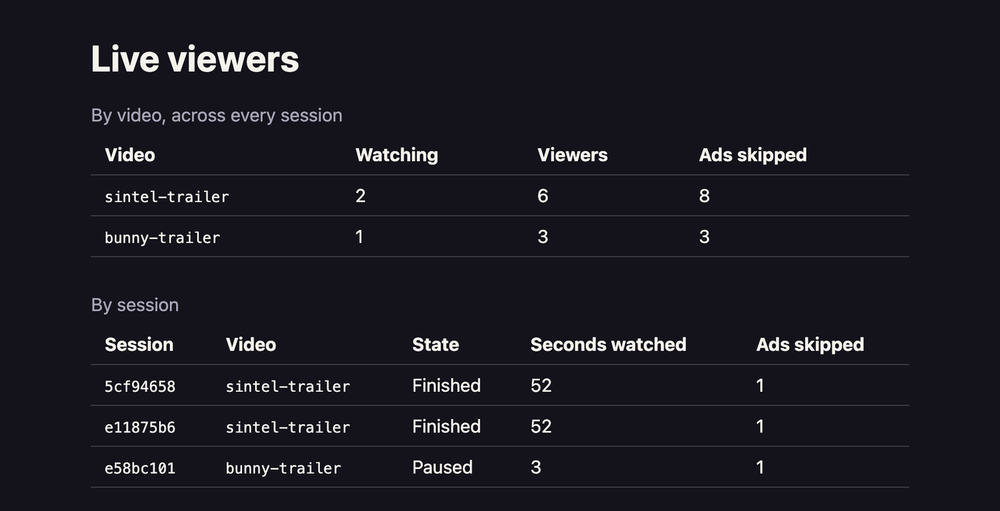

In this section you'll build the dashboard: a page that lists every live viewer with their state, watch time, and skipped ads, and every video with its audience metrics, polling for fresh values every few seconds.

There's one design problem to solve first. Signals is a lookup store: given an attribute key value such as a `domain_sessionid`, it returns that profile's attributes. It doesn't provide a way to enumerate all sessions that have profiles. The dashboard therefore needs to learn what to look up. The simplest solution is for the video page to announce itself: on load, it sends its `domain_sessionid` and the video's ID to a small back-end, which keeps the set of live sessions in memory. The dashboard asks that back-end for one profile row per registered session, and one audience row per video anyone is watching.

The back-end has one route, with two methods:

* `POST /api/viewers` registers a session ID and the video it's watching
* `GET /api/viewers` fetches attributes for all registered sessions and videos from Signals, using the [Node.js SDK](/docs/signals/connection/), and returns one row per viewer and one row per video

In production you'd use whatever session registry you already have, for example your platform's concurrent-stream or heartbeat service, and add an expiry to the set. The in-memory version keeps this accelerator focused on the Signals integration.

## Register the session from the video page

Start with the video page, because everything else depends on knowing which sessions exist. The page needs to send its `domain_sessionid` and video ID to the back-end on load. The tracker exposes the session ID through the [`getDomainSessionId` method](/docs/sources/web-trackers/cookies-and-local-storage/getting-cookie-values/).

In `src/VideoPage.jsx`, import the tracker at the top of the file:

```javascript
import { tracker } from './tracker';
```

Then add the registration call to the existing mount effect, after `startMediaTracking`, so the effect reads:

```jsx
  // Start a media tracking session when the page loads, and register this
  // viewer's session with the dashboard back-end.
  useEffect(() => {
    const id = crypto.randomUUID();
    mediaIdRef.current = id;
    startMediaTracking({
      id,
      player: { label: videoId, mediaType: 'video' },
      pings: { pingInterval: 10 },
    });
    fetch('/api/viewers', {
      method: 'POST',
      headers: { 'Content-Type': 'application/json' },
      body: JSON.stringify({ sessionId: tracker.getDomainSessionId(), videoId }),
    });
    return () => endMediaTracking({ id });
  }, []);
```

Nothing answers that route until you build the back-end. The video page tracks media events either way, but a viewer only reaches the dashboard once this registration call succeeds.

## Create the back-end

The back-end needs the same four connection values you used for the Python SDK. Add them to the app's `.env` file, below the Collector URL. Only variables prefixed with `VITE_` are exposed to the browser, so these stay server-side:

```text
SIGNALS_API_URL=https://YOUR_ID.signals.snowplowanalytics.com
SIGNALS_API_KEY=your-api-key
SIGNALS_API_KEY_ID=your-api-key-id
SNOWPLOW_ORG_ID=your-organization-id
```

Create `server.js` in the project root:

```javascript
import express from 'express';
import { Signals } from '@snowplow/signals-node';

const signals = new Signals({
  baseUrl: process.env.SIGNALS_API_URL,
  apiKey: process.env.SIGNALS_API_KEY,
  apiKeyId: process.env.SIGNALS_API_KEY_ID,
  organizationId: process.env.SNOWPLOW_ORG_ID,
});

// The sessions that have opened the video page, mapped to the video they opened.
const viewers = new Map();

const app = express();
app.use(express.json());

// The video page calls this on load to make its session discoverable.
app.post('/api/viewers', (req, res) => {
  const { sessionId, videoId } = req.body ?? {};
  if (typeof sessionId === 'string' && typeof videoId === 'string') {
    viewers.set(sessionId, videoId);
  }
  res.status(204).end();
});

// The dashboard polls this for one row per viewer and one row per video.
app.get('/api/viewers', async (req, res) => {
  const sessionIds = [...viewers.keys()];
  const videoIds = [...new Set(viewers.values())];
  if (sessionIds.length === 0) {
    res.json({ viewers: [], videos: [] });
    return;
  }
  try {
    // Two calls, because a service covers exactly one attribute key.
    const [profiles, audience] = await Promise.all([
      signals.getBatchServiceAttributes({
        name: 'viewer_profile_service',
        attribute_key: 'domain_sessionid',
        identifiers: sessionIds,
      }),
      signals.getBatchServiceAttributes({
        name: 'video_audience_service',
        attribute_key: 'video_id',
        identifiers: videoIds,
      }),
    ]);
    // Each response is columnar: one array per attribute, in the same order as
    // the identifiers that were sent.
    res.json({
      viewers: sessionIds.map((sessionId, i) => ({
        sessionId,
        videoId: viewers.get(sessionId),
        viewerState: profiles.viewer_state?.[i] ?? null,
        secondsWatched: profiles.seconds_watched?.[i] ?? null,
        adsSkipped: profiles.ads_skipped?.[i] ?? null,
      })),
      videos: videoIds.map((videoId, i) => ({
        videoId,
        activeViewers: audience.active_viewers?.[i] ?? null,
        viewers: audience.viewers?.[i] ?? null,
        adsSkipped: audience.total_ads_skipped?.[i] ?? null,
      })),
    });
  } catch (err) {
    res.status(502).json({ error: String(err) });
  }
});

app.listen(3001, () => {
  console.log('Live viewers backend listening on http://localhost:3001');
});
```

The interesting call is `getBatchServiceAttributes`, which fetches attributes for any number of identifiers in a single request. It returns an object with one key per attribute, each holding an array of values in the same order as the `identifiers` array. There's no identifier column in the response, so the rows are rebuilt from the order of the request. A session or video that hasn't produced any counted events yet returns `null` values, which the dashboard renders as a waiting state. See [retrieve attributes](/docs/signals/applications/retrieve-attributes/) for the full SDK reference.

Both services are queried in parallel because a service covers a single attribute key: session profiles come from `viewer_profile_service` keyed on `domain_sessionid`, and audience metrics from `video_audience_service` keyed on your custom `video_id`.

Proxy the app's `/api` requests to the back-end by updating `vite.config.js`:

```javascript
import { defineConfig } from 'vite'
import react from '@vitejs/plugin-react'

// https://vite.dev/config/
export default defineConfig({
  plugins: [react()],
  server: {
    proxy: {
      '/api': 'http://localhost:3001',
    },
  },
})
```

## Build the dashboard page

Create `src/DashboardPage.jsx`. It polls the back-end every three seconds and renders two tables: the videos being watched, then the individual sessions, translating the raw `viewer_state` event names into labels:

```jsx
import { useEffect, useState } from 'react';

const STATE_LABELS = {
  play_event: 'Playing',
  pause_event: 'Paused',
  end_event: 'Finished',
};

export default function DashboardPage() {
  const [data, setData] = useState({ viewers: [], videos: [] });
  const [error, setError] = useState(null);

  useEffect(() => {
    let timeout;
    async function poll() {
      try {
        const response = await fetch('/api/viewers');
        if (!response.ok) throw new Error(`Back-end returned ${response.status}`);
        setData(await response.json());
        setError(null);
      } catch (err) {
        setError(String(err));
      }
      timeout = setTimeout(poll, 3000);
    }
    poll();
    return () => clearTimeout(timeout);
  }, []);

  return (
    <main className="page">
      <h1>Live viewers</h1>
      {error && <p className="error">{error}</p>}
      {data.viewers.length === 0 && !error && (
        <p>No viewers yet. Open the video page in another tab and press play.</p>
      )}
      {data.videos.length > 0 && (
        <table>
          <caption>By video, across every session</caption>
          <thead>
            <tr>
              <th>Video</th>
              <th>Watching</th>
              <th>Viewers</th>
              <th>Ads skipped</th>
            </tr>
          </thead>
          <tbody>
            {data.videos.map((video) => (
              <tr key={video.videoId}>
                <td>
                  <code>{video.videoId}</code>
                </td>
                <td>{video.activeViewers ?? 0}</td>
                <td>{video.viewers ?? 0}</td>
                <td>{video.adsSkipped ?? 0}</td>
              </tr>
            ))}
          </tbody>
        </table>
      )}
      {data.viewers.length > 0 && (
        <table>
          <caption>By session</caption>
          <thead>
            <tr>
              <th>Session</th>
              <th>Video</th>
              <th>State</th>
              <th>Seconds watched</th>
              <th>Ads skipped</th>
            </tr>
          </thead>
          <tbody>
            {data.viewers.map((row) => (
              <tr key={row.sessionId}>
                <td>
                  <code>{row.sessionId.slice(0, 8)}</code>
                </td>
                <td>
                  <code>{row.videoId}</code>
                </td>
                <td>{STATE_LABELS[row.viewerState] ?? 'Waiting for events'}</td>
                <td>{Math.round(row.secondsWatched ?? 0)}</td>
                <td>{row.adsSkipped ?? 0}</td>
              </tr>
            ))}
          </tbody>
        </table>
      )}
    </main>
  );
}
```

Replace `src/main.jsx` to route between the two pages based on the path:

```jsx
import { createRoot } from 'react-dom/client';
import './index.css';
import './tracker';
import VideoPage from './VideoPage.jsx';
import DashboardPage from './DashboardPage.jsx';

const page =
  window.location.pathname === '/dashboard' ? <DashboardPage /> : <VideoPage />;

createRoot(document.getElementById('root')).render(page);
```

## Run it end to end

Start the back-end before the video page, so that the registration call has somewhere to go. Run the back-end and the dev server in two terminals. Node.js loads the `.env` file itself with the `--env-file` flag:

```bash
node --env-file=.env server.js
```

```bash
npm run dev
```

Open `http://localhost:5173` and start the video, then open `http://localhost:5173/dashboard` in a second tab or window. Within a few seconds the dashboard shows your session's row. Skip an ad and watch `Ads skipped` increment, pause the video and watch the state flip to `Paused`, and leave it playing to see `Seconds watched` climb with each ping.

To see the video-level attributes do their job, open the same video in a second browser, or in a private window, so that two different sessions are watching it. The session table gains a row, and the video's `Watching` count goes to two while both keep pinging. Opening `http://localhost:5173/?video=bunny-trailer` adds a second video row, aggregating only the sessions watching that title.



The two counts per video differ on purpose. `Watching` comes from `active_viewers`, which only counts sessions that pinged in the last five minutes, so it tracks who's watching at this moment. `Viewers` comes from the lifetime `viewers` attribute, which counts every session that has ever played the video, so it keeps climbing as you test and is normally higher than the number of rows in the session table.

## Troubleshooting

If the dashboard doesn't show what you expect, work through these:

* The dashboard reports an error from the back-end: check that the service names in `server.js` match the services you published, under **Signals** > **Services** in Console, and that the `attribute_key` values are `domain_sessionid` and the name you gave your custom key, `video_id`
* The back-end can't authenticate with Signals: check all four credential values in `.env`, and make sure you started the server with `--env-file=.env`
* The row shows `Waiting for events` and zeros: the session is registered but has no computed attributes yet. Interact with the video after the attribute groups have finished publishing, since earlier events aren't counted.
* The row disappears after a back-end restart: the in-memory set is empty again. Reload the video page to re-register.
