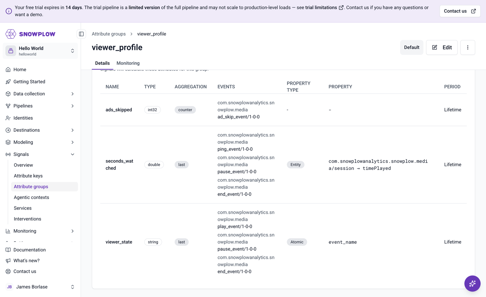

With media events flowing, you can tell Signals what to compute from them. In this section you'll define two [attribute groups](/docs/signals/attributes/attribute-groups/) with the [Signals Python SDK](/docs/signals/connection/):

* `viewer_profile`, keyed on the built-in `domain_sessionid` [attribute key](/docs/signals/attributes/attribute-keys/), so that each viewing session gets its own profile
* `video_audience`, keyed on a custom `video_id` attribute key, so that every session watching the same video updates one shared set of counters

You'll also define a [service](/docs/signals/applications/services/) for each group, and publish everything in a single call. If you'd rather describe the definitions than write them, [an AI assistant can create the same configuration](#define-the-attributes-with-an-ai-assistant) from a single prompt.

## How viewer actions map to session attributes

The `viewer_profile` group computes three [attributes](/docs/signals/attributes/attributes/):

| Attribute         | Calculated from                          | Aggregation | Property                                  |
| ----------------- | ---------------------------------------- | ----------- | ----------------------------------------- |
| `viewer_state`    | `play_event`, `pause_event`, `end_event` | Last        | `event_name` atomic property              |
| `seconds_watched` | `ping_event`, `pause_event`, `end_event` | Last        | `timePlayed` in the media `session` entity |
| `ads_skipped`     | `ad_skip_event`                          | Counter     | None                                      |

Two details of the [media schemas](/docs/events/ootb-data/media-events/) shape this design:

* Each media action is its own event schema under the `com.snowplowanalytics.snowplow.media` vendor, and the playback state events (`play_event`, `pause_event`, `end_event`) have no properties of their own. The most recent event name is therefore the viewer's state: `viewer_state` takes the `last` value of the `event_name` atomic property across those three event types.
* The media `session` entity, attached to every media event, already accumulates playback statistics. Its `timePlayed` property is the total seconds of content played so far, so `seconds_watched` takes the `last` value of `timePlayed` rather than summing anything. Ping events refresh it every 10 seconds during playback, and pause and end events capture the final value when playback stops.

`timePlayed` counts playback within one media session, which starts when the page calls `startMediaTracking`. Reloading the video page starts a new media session, so `seconds_watched` restarts from zero, while `ads_skipped` keeps counting because it's a counter over the whole `domain_sessionid`. Watching the same video twice without reloading does add up, because that stays within one media session.

`ads_skipped` is a plain counter: it increments every time Signals processes an `ad_skip_event` for the session. All three attributes use the `Lifetime` period, so they cover the whole session rather than a rolling time window.

:::note[Why this group is defined in code]
`viewer_state` and `seconds_watched` each aggregate across several media event types, and the Console attribute editor takes one event type per attribute, so this group can't be expressed there. The rest of the configuration follows the same route, which keeps the whole definition in one file you can version alongside your app. You'll review the published result in Console at the end of this section.
:::

## Connect to Signals

Install the Signals Python SDK into your Python environment:

```bash
pip install snowplow-signals
```

You'll need four connection values, all reachable from the **Signals** > **Overview** page in [Snowplow Console](https://console.snowplowanalytics.com): the Signals API URL and your organization ID are displayed there, and you can generate the API key and key ID in Console under [account management](/docs/account-management/). Export them as environment variables, using your own values:

```bash
export SIGNALS_API_URL=https://YOUR_ID.signals.snowplowanalytics.com
export SIGNALS_API_KEY=your-api-key
export SIGNALS_API_KEY_ID=your-api-key-id
export SNOWPLOW_ORG_ID=your-organization-id
```

Create a script called `define_attributes.py`, starting with the imports and the connection:

```python
import os
from datetime import timedelta

from snowplow_signals import (
    Attribute,
    AtomicProperty,
    AttributeKey,
    EntityProperty,
    Event,
    Service,
    Signals,
    StreamAttributeGroup,
    domain_sessionid,
)

sp_signals = Signals(
    api_url=os.environ["SIGNALS_API_URL"],
    api_key=os.environ["SIGNALS_API_KEY"],
    api_key_id=os.environ["SIGNALS_API_KEY_ID"],
    org_id=os.environ["SNOWPLOW_ORG_ID"],
)

OWNER = "you@example.com"  # replace with your email address
```

## Define the session attributes

Each `Event` object references a media schema by vendor, name, and version, exactly as the schema URIs appear in the Inspector. Defining them once keeps the attributes readable, because several attributes read the same events:

```python
MEDIA_VENDOR = "com.snowplowanalytics.snowplow.media"

play = Event(vendor=MEDIA_VENDOR, name="play_event", version="1-0-0")
pause = Event(vendor=MEDIA_VENDOR, name="pause_event", version="1-0-0")
end = Event(vendor=MEDIA_VENDOR, name="end_event", version="1-0-0")
ping = Event(vendor=MEDIA_VENDOR, name="ping_event", version="1-0-0")
ad_skip = Event(vendor=MEDIA_VENDOR, name="ad_skip_event", version="1-0-0")
```

Group the three session attributes into a `StreamAttributeGroup`, keyed on the built-in `domain_sessionid` attribute key. None of the attributes set a `period`, so they all default to `Lifetime`:

```python
viewer_profile = StreamAttributeGroup(
    name="viewer_profile",
    version=1,
    attribute_key=domain_sessionid,
    owner=OWNER,
    description="Live playback state for each viewing session",
    attributes=[
        Attribute(
            name="viewer_state",
            description="The most recent playback state event in this session",
            type="string",
            events=[play, pause, end],
            aggregation="last",
            property=AtomicProperty(name="event_name"),
        ),
        Attribute(
            name="seconds_watched",
            description="Total seconds of content played in this media session",
            type="double",
            events=[ping, pause, end],
            aggregation="last",
            property=EntityProperty(
                vendor=MEDIA_VENDOR,
                name="session",
                major_version=1,
                path="timePlayed",
            ),
        ),
        Attribute(
            name="ads_skipped",
            description="Number of ads skipped in this session",
            type="int32",
            events=[ad_skip],
            aggregation="counter",
            default_value=0,
        ),
    ],
)
```

## Aggregate metrics per video

The session profiles answer "what is this viewer doing?". A dashboard for the whole catalog also needs the opposite view: "how many people are watching this title, across every session?". Signals answers that with a second attribute group keyed on the video rather than the session.

Attribute keys aren't limited to the built-in user, device, and session identifiers. A [custom attribute key](/docs/signals/attributes/attribute-keys/) points at any property in your events, and Signals aggregates against whatever value that property holds. Here the property is the `label` on the `media_player` entity, which the video page sets to the video's ID:

```python
video_id = AttributeKey(
    name="video_id",
    description="The video being watched, read from the media player label",
    property=EntityProperty(
        vendor="com.snowplowanalytics.snowplow",
        name="media_player",
        major_version=2,
        path="label",
    ),
)
```

:::note[The media player entity has no ID field]
The standard `media_player` entity carries `label`, `mediaType`, `playerType`, and playback state, but no identifier for the content itself. `label` is the only per-content field, which is why the video page puts a stable video ID there instead of a display title. If you want a dedicated field, attach your own entity to the media events and point the attribute key at that instead.
:::

The group keyed on `video_id` aggregates across sessions, so `domain_sessionid` becomes something to count rather than something to group by:

```python
video_audience = StreamAttributeGroup(
    name="video_audience",
    version=1,
    attribute_key=video_id,
    owner=OWNER,
    description="Audience metrics for each video, across all sessions",
    attributes=[
        Attribute(
            name="active_viewers",
            description="Sessions that sent a playback ping in the last five minutes",
            type="int32",
            events=[ping],
            aggregation="approx_count_distinct",
            property=AtomicProperty(name="domain_sessionid"),
            period=timedelta(minutes=5),
            default_value=0,
        ),
        Attribute(
            name="viewers",
            description="Distinct sessions that have played this video",
            type="int32",
            events=[play, ping],
            aggregation="approx_count_distinct",
            property=AtomicProperty(name="domain_sessionid"),
            default_value=0,
        ),
        Attribute(
            name="total_ads_skipped",
            description="Ads skipped on this video across all sessions",
            type="int32",
            events=[ad_skip],
            aggregation="counter",
            default_value=0,
        ),
    ],
)
```

`active_viewers` and `viewers` both use `approx_count_distinct` on the `domain_sessionid` atomic property, which counts how many different sessions produced the events. The difference is the window: `active_viewers` has a five-minute `period`, so it only counts sessions that pinged recently, which is a reasonable stand-in for concurrent viewers when the page pings every 10 seconds. `viewers` has no `period`, so it counts every session that has ever played the video. `total_ads_skipped` is the same counter as the session-level `ads_skipped`, but summed over everyone watching.

`approx_count_distinct` uses [HyperLogLog](https://redis.io/docs/latest/develop/data-types/probabilistic/hyperloglogs/) internally, so at high cardinality it's a close approximation rather than an exact count. At the handful of viewers in this accelerator it's exact.

## Publish the definitions

Retrieving attributes through a service is the recommended pattern for applications, because the service name stays stable while you iterate on attribute group versions. Pass the group objects straight to `Service`, and the SDK records the group name and version for you:

```python
viewer_profile_service = Service(
    name="viewer_profile_service",
    owner=OWNER,
    description="Session-level viewer profiles for the dashboard",
    attribute_groups=[viewer_profile],
)

video_audience_service = Service(
    name="video_audience_service",
    owner=OWNER,
    description="Video-level audience metrics for the dashboard",
    attribute_groups=[video_audience],
)
```

:::note[One service per attribute key]
A service bundles attribute groups that share an attribute key, so each of these two groups needs its own service. The dashboard back-end makes one call per service.
:::

Nothing exists in Signals until you publish. Include the custom attribute key in the same list, and put it before the group that uses it: an attribute group can only be published once its key exists.

```python
sp_signals.publish(
    [
        video_id,
        viewer_profile,
        video_audience,
        viewer_profile_service,
        video_audience_service,
    ]
)
print("Published 1 attribute key, 2 attribute groups, and 2 services")
```

Run the script:

```bash
python define_attributes.py
```

Publishing isn't instant: give the definitions a moment to reach the streaming engine. Signals only computes attributes from events processed after that point, so events you tracked before publishing don't contribute to the values.

Open **Signals** > **Attribute groups** in [Snowplow Console](https://console.snowplowanalytics.com) and select `viewer_profile` to review what you published:



Your new `video_id` key appears under **Attribute keys**, alongside the four built-in keys, and both services appear under **Services**.

:::note[Republishing]
A published attribute group version is immutable, so running the script again as it stands won't change anything. To change a definition, increment `version` and publish again.
:::

## Define the attributes with an AI assistant

The Python above is a description of what to compute, and an AI assistant with access to your Signals registry can work from that description instead. Two ways to get one:

* Any MCP-capable assistant, such as Claude Code or Cursor, connected to the [Snowplow MCP server](/docs/llms-support/snowplow-mcp/), which exposes the Signals registry as tools alongside the rest of your Snowplow account
* The [Snowplow Assistant](/docs/llms-support/console-agent/), if your organization has it enabled in [Snowplow Console](https://console.snowplowanalytics.com): it covers the same Signals capabilities with nothing to set up

Paste this prompt into the assistant. It asks for the whole configuration: the custom attribute key, both attribute groups, and both services.

```text
Using the Snowplow tools available to you, set up Snowplow Signals for a live
viewer profiles dashboard, computed from the standard Snowplow media events.
Create everything as drafts and don't publish anything yet.

1. An attribute key called video_id that reads the label property of the
   media_player entity (vendor com.snowplowanalytics.snowplow, major
   version 2). Our video page puts the video's ID in that label.

2. A stream attribute group called viewer_profile, keyed on the built-in
   domain_sessionid attribute key, with three attributes over the
   com.snowplowanalytics.snowplow.media events at version 1-0-0:
   - viewer_state (string): the last event_name across play_event,
     pause_event, and end_event, so the most recent playback state wins
   - seconds_watched (double): the last value of timePlayed from the media
     session entity (com.snowplowanalytics.snowplow.media session, major
     version 1), across ping_event, pause_event, and end_event. timePlayed
     is already a running total, so read its most recent value, don't sum it
   - ads_skipped (int32): a counter of ad_skip_event, default 0
   All three cover the whole session, so none of them has a period.

3. A stream attribute group called video_audience, keyed on video_id, with:
   - active_viewers (int32): approximate distinct count of domain_sessionid
     over ping_event, within a five-minute period, default 0
   - viewers (int32): approximate distinct count of domain_sessionid over
     play_event and ping_event, with no period, default 0
   - total_ads_skipped (int32): a counter of ad_skip_event, default 0

4. One service per group: viewer_profile_service for viewer_profile, and
   video_audience_service for video_audience. A service can only reference
   groups that share an attribute key, so these two can't be combined.
```

The prompt spells out the aggregations because they're the design decisions this section is about, not details to leave to an assistant: `timePlayed` is a running total that has to be read with `last` rather than summed, and the two audience counts differ only in their window. Everything else is the assistant's job: the exact shape of each property reference, and the order the resources have to be published in.

What comes back is the same five resources as the Python script, with the same aggregations, properties, periods, and attribute key wiring. The one field an assistant can't fill in is `owner`: the MCP tools don't accept one, so groups and services created this way record no owner. Define them with the SDK if your team relies on that metadata.

:::note[Review before you publish]
Signals saves new definitions as drafts. Nothing reaches the streaming engine, and nothing is calculated, until you publish, which is your safety net for a configuration you didn't write yourself. Ask the assistant to show you the full definition of each group, or open **Signals** > **Attribute groups** in Console, and check the aggregations, properties, and periods against this page before you tell it to publish.
:::

## Verify the attributes while a video plays

Go back to the video page, reload it, and interact with the video: skip the pre-roll ad, play for at least 10 seconds so a ping fires, and pause.

You can watch the attribute values update with the [Snowplow Inspector Signals integration](/docs/testing/snowplow-inspector/signals-integration/). Connect the extension to your organization, then open its **Attributes** tab: the Inspector discovers your session's `domain_sessionid` from the observed events and fetches the `viewer_profile` values for it. After pausing, you should see:

* `viewer_state`: `pause_event`
* `seconds_watched`: roughly the seconds you spent playing
* `ads_skipped`: `1` if you skipped the pre-roll

If the values stay empty, check that the events were sent after the group finished publishing, and remember that pre-publish events are never counted. Track a few more play and pause events, and use the Inspector's refresh button.

The `video_audience` values are keyed on the video rather than your session, so the Inspector doesn't discover them automatically. You'll see them on the dashboard in the next section, where they're worth watching with two browsers open on the same video.
