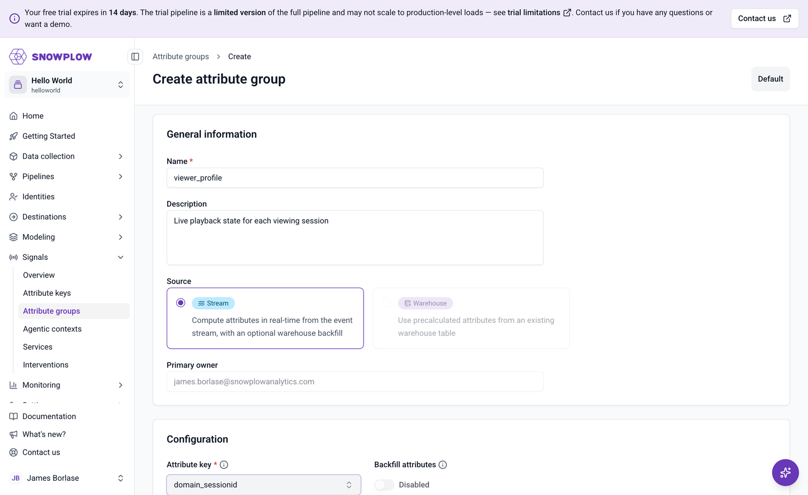
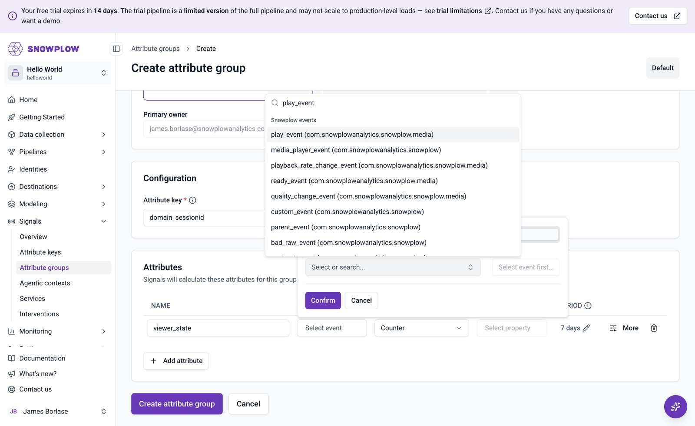
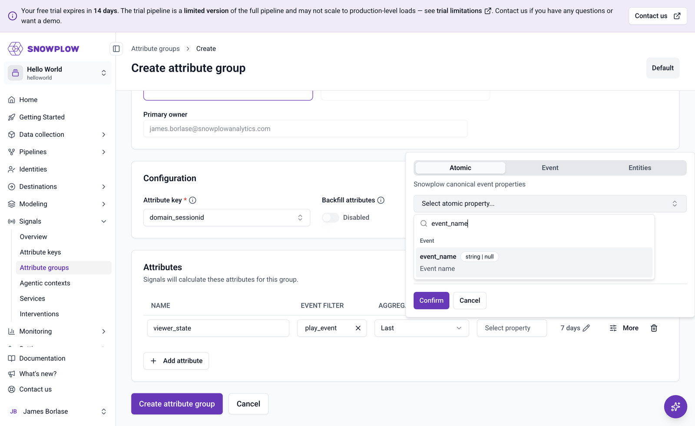
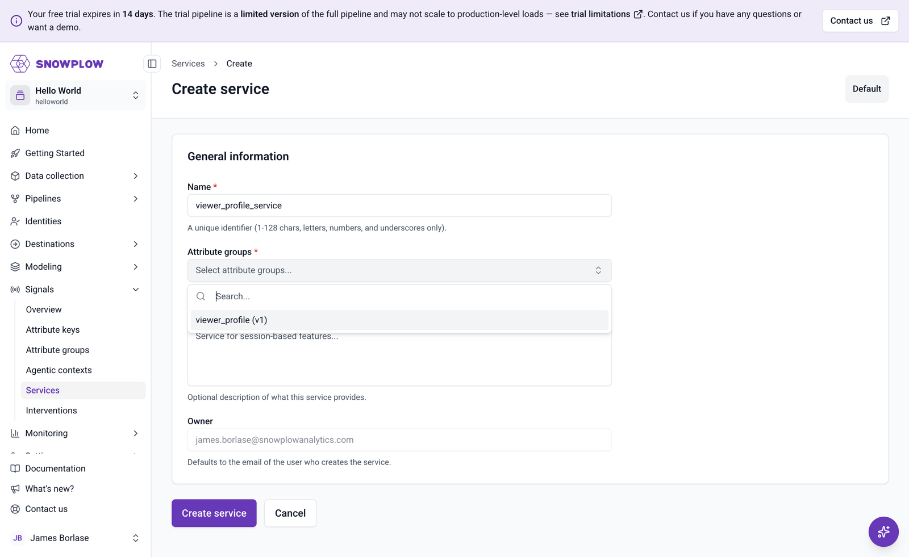

```mdx-code-block
import Tabs from '@theme/Tabs';
import TabItem from '@theme/TabItem';
```

With media events flowing, you can now tell Signals what to compute from them. In this section you'll define an [attribute group](/docs/signals/attributes/attribute-groups/) called `viewer_profile`, keyed on the `domain_sessionid` [attribute key](/docs/signals/attributes/attribute-keys/) so that each viewing session gets its own profile. You'll then bundle it into a [service](/docs/signals/applications/services/) for the dashboard to query.

## How viewer actions map to attributes

The group computes three [attributes](/docs/signals/attributes/attributes/):

| Attribute         | Calculated from                          | Aggregation | Property                                  |
| ----------------- | ---------------------------------------- | ----------- | ----------------------------------------- |
| `viewer_state`    | `play_event`, `pause_event`, `end_event` | Last        | `event_name` atomic property              |
| `seconds_watched` | `ping_event`, `pause_event`, `end_event` | Last        | `timePlayed` in the media `session` entity |
| `ads_skipped`     | `ad_skip_event`                          | Counter     | None                                      |

Two details of the [media schemas](/docs/events/ootb-data/media-events/) shape this design:

* Each media action is its own event schema under the `com.snowplowanalytics.snowplow.media` vendor, and the playback state events (`play_event`, `pause_event`, `end_event`) have no properties of their own. The most recent event **name** is therefore the viewer's state: `viewer_state` takes the `last` value of the `event_name` atomic property across those three event types.
* The media `session` entity, attached to every media event, already accumulates playback statistics. Its `timePlayed` property is the total seconds of content played so far, so `seconds_watched` takes the `last` value of `timePlayed` rather than summing anything. Ping events refresh it every 10 seconds during playback, and pause and end events capture the final value when playback stops.

`timePlayed` counts playback within one media session, which starts when the page calls `startMediaTracking`. Reloading the video page starts a new media session, so `seconds_watched` restarts from zero, while `ads_skipped` keeps counting because it's a counter over the whole `domain_sessionid`. Watching the same video twice without reloading does add up, because that stays within one media session.

`ads_skipped` is a plain counter: it increments every time Signals processes an `ad_skip_event` for the session. All three attributes use the `Lifetime` period, so they cover the whole session rather than a rolling time window.

## Define the attribute group

<Tabs groupId="signals-impl" queryString>
<TabItem value="console" label="Console" default>

To explore the attribute group workflow in Console, go to **Signals** > **Attribute groups** and click **Create attribute group**. In the dialog that appears, choose **Create new** and click **Start**. You can also start from one of the listed templates, but this group's attributes are specific to media playback.

Fill in the general information and configuration:

* **Name**: `viewer_profile`
* **Description**: `Live playback state for each viewing session`
* **Source**: **Stream**
* **Attribute key**: `domain_sessionid`

The primary owner is your Console user email, filled in automatically.



Click **Add attribute** to configure an attribute row. The event filter lists the standard media schemas under **Snowplow events**, so you can search for `play_event` or `ad_skip_event` directly:



After choosing an event and aggregation, the property picker offers **Atomic**, **Event**, and **Entities** tabs. The `event_name` property that `viewer_state` uses is on the **Atomic** tab:



:::note[Define this group with the Python SDK]
The Console attribute editor accepts one event type per attribute. `viewer_state` and `seconds_watched` each aggregate across several media event types, so you can't fully build this particular group in Console: switch to the **Python SDK** tab to define it. Two more things to be aware of:

* The **Entities** tab of the property picker lists entities from your pipeline's data catalog, which is built from processed events. The media `session` entity only becomes selectable some time after your first media events arrive.
* Single-event attributes like `ads_skipped` work fine in Console: choose `ad_skip_event`, the **Counter** aggregation, and set the period to **Lifetime** under **More options**.

You'll still use Console to review the published group below, and you can create the service in either tab.
:::

Click **Cancel** to discard the draft, and define the group with the Python SDK instead.

Once the group is published from the SDK, its definition is visible in Console. Go to **Signals** > **Attribute groups** > `viewer_profile` to review the attribute configuration:


</TabItem>
<TabItem value="sdk" label="Python SDK">

Install the [Signals Python SDK](/docs/signals/connection/) into your Python environment:

```bash
pip install snowplow-signals
```

You'll need four connection values, all shown on the **Signals** > **Overview** page in [Snowplow Console](https://console.snowplowanalytics.com): the Signals API URL and your organization ID are displayed there, and you can generate the API key and key ID in Console under [account management](/docs/account-management/). Export them as environment variables, using your own values:

```bash
export SIGNALS_API_URL=https://YOUR_ID.signals.snowplowanalytics.com
export SIGNALS_API_KEY=your-api-key
export SIGNALS_API_KEY_ID=your-api-key-id
export SNOWPLOW_ORG_ID=your-organization-id
```

Create a script called `define_viewer_attributes.py`, starting with the connection:

```python
import os

from snowplow_signals import (
    Attribute,
    AtomicProperty,
    EntityProperty,
    Event,
    Signals,
    StreamAttributeGroup,
    domain_sessionid,
)

sp_signals = Signals(
    api_url=os.environ["SIGNALS_API_URL"],
    api_key=os.environ["SIGNALS_API_KEY"],
    api_key_id=os.environ["SIGNALS_API_KEY_ID"],
    org_id=os.environ["SNOWPLOW_ORG_ID"],
)
```

Next, define the three attributes. Each `Attribute` lists the media events it reads, referenced by vendor, name, and version, exactly as they appear in the schema URIs you saw in the Inspector:

```python
MEDIA_VENDOR = "com.snowplowanalytics.snowplow.media"

viewer_state = Attribute(
    name="viewer_state",
    description="The most recent playback state event in this session",
    type="string",
    events=[
        Event(vendor=MEDIA_VENDOR, name="play_event", version="1-0-0"),
        Event(vendor=MEDIA_VENDOR, name="pause_event", version="1-0-0"),
        Event(vendor=MEDIA_VENDOR, name="end_event", version="1-0-0"),
    ],
    aggregation="last",
    property=AtomicProperty(name="event_name"),
)

seconds_watched = Attribute(
    name="seconds_watched",
    description="Total seconds of content played in this media session",
    type="double",
    events=[
        Event(vendor=MEDIA_VENDOR, name="ping_event", version="1-0-0"),
        Event(vendor=MEDIA_VENDOR, name="pause_event", version="1-0-0"),
        Event(vendor=MEDIA_VENDOR, name="end_event", version="1-0-0"),
    ],
    aggregation="last",
    property=EntityProperty(
        vendor=MEDIA_VENDOR,
        name="session",
        major_version=1,
        path="timePlayed",
    ),
)

ads_skipped = Attribute(
    name="ads_skipped",
    description="Number of ads skipped in this session",
    type="int32",
    events=[
        Event(vendor=MEDIA_VENDOR, name="ad_skip_event", version="1-0-0"),
    ],
    aggregation="counter",
    default_value=0,
)
```

The attributes have no `period`, so they default to `Lifetime`: each one covers the whole session.

Now group them into a `StreamAttributeGroup` keyed on the built-in `domain_sessionid` attribute key:

```python
OWNER = "you@example.com"  # replace with your email address

viewer_profile = StreamAttributeGroup(
    name="viewer_profile",
    version=1,
    attribute_key=domain_sessionid,
    owner=OWNER,
    description="Live playback state for each viewing session",
    attributes=[viewer_state, seconds_watched, ads_skipped],
)

sp_signals.publish([viewer_profile])
print("Published attribute group")
```

Run the script:

```bash
python define_viewer_attributes.py
```

Publishing isn't instant: it can take a minute or two for the definition to be applied to the streaming engine, and Signals only computes attributes from events processed after that point. Events you tracked before publishing don't contribute to the values.

:::note[Republishing]
Running the script a second time fails with `400: Cannot update published attribute group`. A published attribute group version is immutable: to change the definition, increment `version` and publish again.
:::

</TabItem>
</Tabs>

## Create the service

Retrieving attributes through a service is the recommended pattern for applications, because the service name stays stable while you iterate on attribute group versions. The dashboard back-end will request attributes from this service by name.

<Tabs groupId="signals-impl" queryString>
<TabItem value="console" label="Console" default>

The attribute group must already be published, from the Python SDK script in the previous section, so that it appears in the selection list. Go to **Signals** > **Services** and click **Create service**. Fill in:

* **Name**: `viewer_profile_service`
* **Attribute groups**: select `viewer_profile (v1)`

The owner is filled in automatically. Click **Create service** to save it. Services are published as soon as they're created, so there's no separate publish step.



</TabItem>
<TabItem value="sdk" label="Python SDK">

Create a second script, `create_service.py`. It references the published attribute group by name and version, so it stands alone:

```python
import os

from snowplow_signals import Service, Signals

sp_signals = Signals(
    api_url=os.environ["SIGNALS_API_URL"],
    api_key=os.environ["SIGNALS_API_KEY"],
    api_key_id=os.environ["SIGNALS_API_KEY_ID"],
    org_id=os.environ["SNOWPLOW_ORG_ID"],
)

viewer_profile_service = Service(
    name="viewer_profile_service",
    owner="you@example.com",  # replace with your email address
    attribute_groups=[{"name": "viewer_profile", "version": 1}],
)

sp_signals.publish([viewer_profile_service])
print("Published service")
```

Run it:

```bash
python create_service.py
```

Open **Signals** > **Services** in [Snowplow Console](https://console.snowplowanalytics.com) to confirm the service exists, alongside the attribute group you published before.

</TabItem>
</Tabs>

## Verify the attributes while a video plays

Go back to the video page, reload it, and interact with the video: skip the pre-roll ad, play for at least 10 seconds so a ping fires, and pause.

The quickest way to watch the attribute values update is the [Snowplow Inspector Signals integration](/docs/testing/snowplow-inspector/signals-integration/). Connect the extension to your organization, then open its **Attributes** tab: the Inspector discovers your session's `domain_sessionid` from the observed events and fetches the `viewer_profile` values for it. After pausing, you should see:

* `viewer_state`: `pause_event`
* `seconds_watched`: roughly the seconds you spent playing
* `ads_skipped`: `1` if you skipped the pre-roll

If the values stay empty, check that the events were sent after the group finished publishing, and remember that pre-publish events are never counted. Track a few more play and pause events, and use the Inspector's refresh button.
