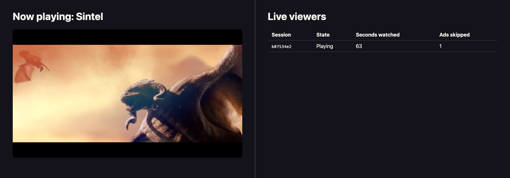

In this solution accelerator you'll build live viewer profiles for a video streaming site: a dashboard that shows who's watching right now, whether they're playing or paused, how many seconds they've watched, and how many ads they've skipped.

This is the [Snowplow Signals](/docs/signals/introduction/) counterpart to the [live viewer profiles with Kafka accelerator](/tutorials/kafka-live-viewer-profiles/introduction). Both accelerators solve the same problem with the same Snowplow media events. The difference is what you have to build and operate. The Kafka version consumes the event stream with self-managed infrastructure: Snowbridge forwards events to Kafka, a Java application processes them into viewer state, DynamoDB stores the profiles, and a WebSocket back-end pushes updates to the dashboard. Signals replaces all of that: the [streaming engine](/docs/signals/concepts/) computes the profiles inside your Snowplow pipeline, and your only custom code is the tracking page and a thin dashboard.

| Component | Kafka accelerator | This accelerator |
| --- | --- | --- |
| Video page with media tracking | React app | React app |
| Event delivery to the consumer | Snowbridge and Kafka | Not needed: Signals reads the enriched stream |
| Viewer state computation | Java consumer application | Signals attribute group (managed) |
| Profile storage | DynamoDB | Signals Profiles Store (managed) |
| Serving profiles to the dashboard | WebSocket back-end | One-route Node.js back-end |
| Dashboard | HTML and JavaScript front-end | React page |
| Local infrastructure | Docker Compose, LocalStack, or Terraform | None |

Seven moving parts become three: a video page, a Signals configuration, and a small dashboard app. If you want full control of the stream processing instead, the Kafka accelerator remains the self-managed alternative.

On the left side of the image below, someone is watching a video with Snowplow media tracking. On the right, the dashboard lists their session with its live state, watch time, and skipped ad count, served from the Signals Profiles Store.

## What you'll build

The accelerator has three parts, and you'll build them in order:

1. A React video page that tracks play, pause, seek, ping, and ad events with the Snowplow [media tracking plugin](/docs/sources/web-trackers/tracking-events/media/snowplow/)
2. A Signals [attribute group](/docs/signals/attributes/attribute-groups/) that computes each session's viewer state, watch time, and skipped ads from those events in real time
3. A dashboard page backed by a one-route Node.js server that looks up live sessions with the [Signals Node.js SDK](/docs/signals/connection/)

This accelerator should take around one hour to complete.

## Solution accelerator code

The finished demo application is available in the [signals-live-viewer-profiles repository](https://github.com/snowplow-industry-solutions/signals-live-viewer-profiles) on GitHub. The instructions for building and running it are all in these pages.

## Prerequisites

This accelerator assumes that you have:

* a Snowplow pipeline with a [Collector endpoint](/docs/sources/) you can send events to, because Signals computes attributes from your live event stream
* [Signals enabled](/docs/signals/setup/) on your Snowplow account, since the viewer profiles depend on it
* Node.js 20.6 or later, to run the demo app and its back-end
* Python 3.9 or later, to define the Signals configuration with the [Signals Python SDK](/docs/signals/connection/)
* basic familiarity with React and with [Snowplow events and entities](/docs/fundamentals/events/)

:::note[A full pipeline is required]
This accelerator computes attributes from real events flowing through your pipeline, so it can't be completed with [Snowplow Micro](/docs/testing/snowplow-micro/) or in a purely local setup. You need a running Snowplow pipeline with Signals enabled.

If you don't have one, you can deploy and use a [Snowplow free trial](https://snowplow.io/get-started/snowplow-free-trial) to follow along.
:::
