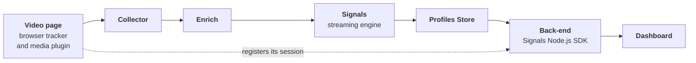

In this solution accelerator you'll build live viewer profiles for a video streaming site: a dashboard that shows who's watching right now, whether they're playing or paused, how many seconds they've watched, and how many ads they've skipped. It also aggregates the same events per video, so you can see how many people are watching each title across every session.

[Snowplow Signals](/docs/signals/introduction/) computes the profiles inside your Snowplow pipeline, from the media events your trackers already send. There's no stream processing to write and no profile store to operate, so the only code you write is the tracking page and a thin dashboard. If you'd rather own the stream processing yourself, the [live viewer profiles with Kafka accelerator](/tutorials/kafka-live-viewer-profiles/introduction) builds the same dashboard on self-managed infrastructure.

On the left side of the image below, a viewer is watching a video with Snowplow media tracking. On the right, the dashboard lists their session with its live state, watch time, and skipped ad count, alongside a row for each video, all served from the Profiles Store.

## Architecture

The video page sends media events to your Snowplow pipeline like any other tracked application. Signals reads the enriched stream, folds the events into attributes, and serves them from the Profiles Store. Your dashboard back-end reads those attributes over HTTPS:

Everything between the Collector and the Profiles Store is managed by Snowplow. You build the boxes at either end: the video page and the dashboard, joined by a back-end that does little more than pass identifiers to Signals and hand the attributes back.

You'll build them in this order:

1. A React video page that tracks play, pause, seek, ping, and ad events with the Snowplow [media tracking plugin](/docs/sources/web-trackers/tracking-events/media/snowplow/)
2. Two Signals [attribute groups](/docs/signals/attributes/attribute-groups/): one keyed on the session, for each viewer's state, watch time, and skipped ads, and one keyed on a custom [attribute key](/docs/signals/attributes/attribute-keys/) for the video, for audience metrics across sessions. Define them with the [Signals Python SDK](/docs/signals/connection/), or from a single prompt with an AI assistant
3. A dashboard page backed by a one-route Node.js server that reads both groups with the [Signals Node.js SDK](/docs/signals/connection/)

Every file you need is listed in full in these pages, so there's nothing to clone and nothing to download. This accelerator should take around one hour to complete.

### Snowplow implementation

The demo tracks standard Snowplow [media events](/docs/events/ootb-data/media-events/) and computes everything from them, so there are no custom schemas to design:

* The video page sends `play_event`, `pause_event`, `end_event`, `seek_start_event`, and `seek_end_event` as the viewer controls playback, a `ping_event` every 10 seconds while the video plays, and `ad_break_start_event`, `ad_start_event`, and `ad_skip_event` or `ad_complete_event` for a simulated pre-roll
* Every one of those events carries two entities: `media_player`, whose `label` holds the video's ID, and the media `session` entity, whose `timePlayed` is a running total of seconds played
* The `viewer_profile` attribute group folds the playback events into each session's state, watch time, and skipped ads, keyed on the built-in `domain_sessionid` attribute key
* The `video_audience` attribute group aggregates the same events per video, keyed on a custom attribute key that reads the `media_player` label, which is what turns per-session tracking into per-video metrics without any new tracking code
* A [service](/docs/signals/applications/services/) for each group gives the back-end one stable name to read, so you can iterate on attribute group versions without changing the dashboard

## Prerequisites

This accelerator assumes that you have:

* A Snowplow pipeline with a [Collector endpoint](/docs/sources/) you can send events to, because Signals computes attributes from your live event stream
* [Signals enabled](/docs/signals/setup/) on your Snowplow account, since the viewer profiles depend on it
* Node.js 20.6 or later, to run the demo app and its back-end
* Python 3.9 or later, to define the Signals configuration with the [Signals Python SDK](/docs/signals/connection/), unless you define it with an AI assistant instead
* Basic familiarity with React, and with [Snowplow events](/docs/fundamentals/events/) and [entities](/docs/fundamentals/entities/)

:::note[A Snowplow account is required]
Signals computes attributes from real events flowing through your pipeline, so you'll need a Snowplow account with a pipeline you can send events to, and Signals enabled on it.

If you don't have one, you can deploy and use a [Snowplow free trial](https://snowplow.io/get-started/snowplow-free-trial) to follow along.
:::
