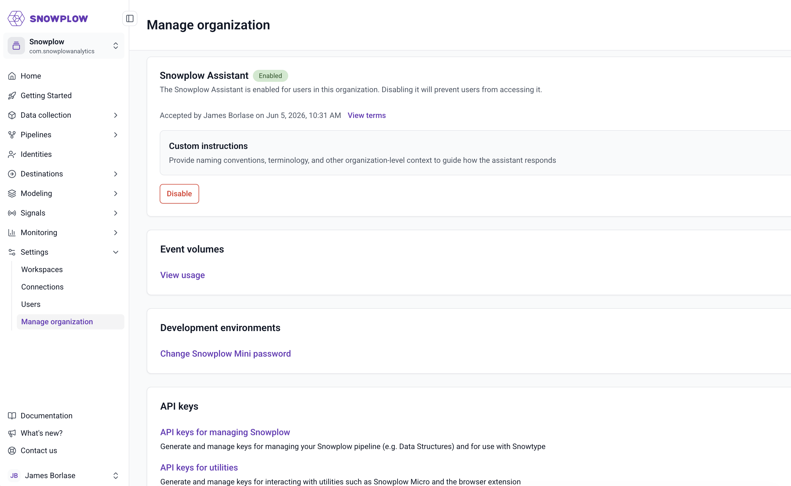

Both routes end in the same place: a conversation that can read and change your Signals configuration on your behalf. Pick the one that fits where you want to work.

## Use the Snowplow Assistant

The [Snowplow Assistant](/docs/llms-support/console-agent/) is built into [Snowplow Console](https://console.snowplowanalytics.com) as a chat interface, so there's nothing to install and no credentials to configure. It authenticates with your current Console session and operates with your existing Console permissions, and it asks you to confirm any action that changes your configuration before it proceeds.

Log in to Console, open the assistant, and you're ready to start prompting. If the chat interface doesn't appear, an administrator can enable the assistant for your organization from the **Settings** section of Console: see [Snowplow Assistant](/docs/llms-support/console-agent/) for what it covers and how it handles your data.



On this route you can skip straight to [defining attributes](/tutorials/signals-mcp/define-attributes-conversationally). The rest of this page connects the MCP server to your own assistant instead.

## Install the Snowplow plugin

The Snowplow MCP server is a remote server, hosted by Snowplow: there's no server for you to deploy or maintain. Connecting your assistant to it means pointing your MCP client at the server URL and authenticating with your Snowplow Console account.

The Snowplow plugin bundles the MCP server with six skills, including the `signals` skill that guides the assistant through Signals workflows like the one in this tutorial. The skills are loaded on demand: when you ask about attribute groups, the assistant automatically engages the `signals` skill, so there's no slash command to run. The plugin source lives in the [`snowplow/skills` repository](https://github.com/snowplow/skills).

### Install in any assistant

Whichever assistant you use, the recommended way to install is the vendor-neutral [open-plugin](https://github.com/vercel-labs/plugins) CLI, which installs the MCP server and the skills together:

```bash
npx plugins add snowplow/skills
```

The CLI detects which agent tools you have on your machine and installs the plugin to all of them. To install for a single one, name it with `--target`:

```bash
npx plugins add snowplow/skills --target claude-code
```

### Install in Claude Code

Claude Code also has a native plugin marketplace, which reads the plugin definition straight from the repository and updates it automatically when the repository changes. Run these two commands inside Claude Code:

```text
/plugin marketplace add snowplow/skills
/plugin install snowplow@snowplow
```

### Other MCP clients

Any MCP-capable client can connect to the server directly. For example, using [`mcp-remote`](https://www.npmjs.com/package/mcp-remote) in a JSON-based client configuration such as Claude Desktop or Cursor:

```json
{
  "mcpServers": {
    "snowplow-mcp": {
      "command": "npx",
      "args": [
        "-y",
        "mcp-remote",
        "https://console.snowplowanalytics.com/api/agent/mcp",
        "3334",
        "--static-oauth-client-info",
        "{\"client_id\":\"NxCcdyu13Cr4umnIYw70evvUyRXRvyWf\"}"
      ]
    }
  }
}
```

See [Snowplow MCP server](/docs/llms-support/snowplow-mcp/) for tested configurations for Claude.ai, Claude Desktop, Claude Code, Codex, and Cursor. You won't get the bundled skills this way, but all the Signals tools work the same.

## Authenticate with your Console account

Use OAuth. It's the simpler path and the one to start with: there's nothing to configure, because every installation route above is already set up for it. The first time your assistant calls a Snowplow tool, a browser window opens for you to log in to [Snowplow Console](https://console.snowplowanalytics.com). The assistant then operates with the same permissions as your user account, and can only access your organization's resources.

For most people that's the whole of authentication, and you can go straight to checking the connection.

### Optional: authenticate with API keys

OAuth tokens expire, which means occasional re-authentication prompts. If you'd rather have a connection that keeps working without a browser, authenticate with a Console API key instead. You'll need three values:

1. Your organization ID, from the **Manage organization** page in Console settings
2. An API key ID, which you get when you [create an API key in Console](/docs/account-management/#create-an-api-key)
3. The API key itself, which Console shows only once, at creation

Then pass them as headers in your MCP client configuration:

```json
{
  "mcpServers": {
    "snowplow-mcp": {
      "command": "npx",
      "args": [
        "-y",
        "mcp-remote",
        "https://console.snowplowanalytics.com/api/agent/mcp",
        "--header",
        "X-Org-Id:<ORGANIZATION_ID>",
        "--header",
        "X-Api-Key-Id:<API_KEY_ID>",
        "--header",
        "X-Api-Key:<API_KEY>"
      ]
    }
  }
}
```

:::warning[Scope the key to what the assistant needs]
The assistant can perform any action the key allows. When you create the key, grant only the permissions the assistant needs, for example the **View** level on each feature for read-only use. API keys created before scoped API keys were introduced have full admin permissions, so create a new key rather than reusing one. Store the key securely, and never paste credentials into the assistant's chat.
:::

See [Connect to Snowplow Signals](/docs/signals/connection/) for the full list of connection credentials and where to find each one.

## Check the connection

Start a new session in your assistant and ask it something that requires a Snowplow tool call:

```text
Which Snowplow organization am I connected to?
```

The assistant should call the `get_organization` tool and reply with your organization's name and ID. With OAuth, this first call is what triggers the browser login. Confirm the organization ID matches the one in Console before continuing: it's worth being certain the assistant is pointed at the right account before you start creating resources.
