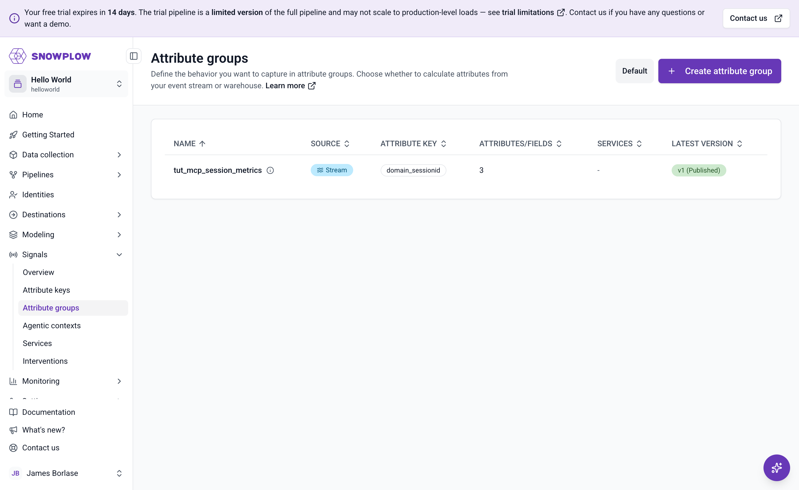
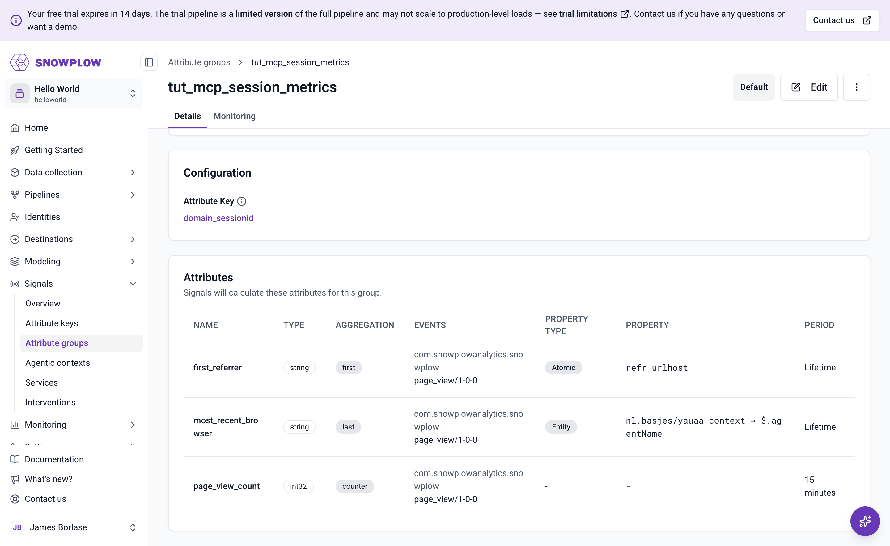
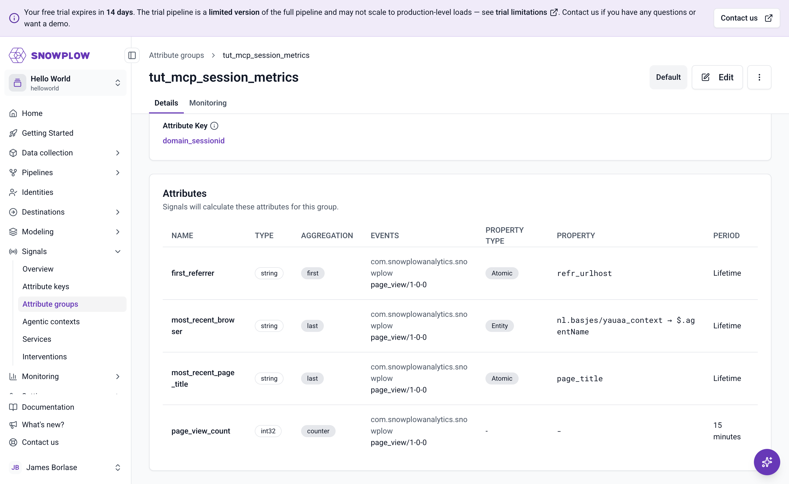

The assistant reports success, but the real test is whether the configuration exists in your Snowplow account and produces values. In this step you'll verify both, then make your first conversational edit.

## Confirm the group in Console

In [Snowplow Console](https://console.snowplowanalytics.com), go to **Signals** > **Attribute groups**. You should see `tut_mcp_session_metrics` in the list, at version 1, with a published status.



Open it and check the definition against what you reviewed in the previous step:

* Attribute key: `domain_sessionid`
* `page_view_count`: counter of `page_view` events, 15-minute period
* `most_recent_browser`: last `agentName` from the `yauaa_context` entity
* `first_referrer`: first `refr_urlhost`, filtered to non-empty referrers



This is the same screen you'd have used to build the group by hand in the [quick start](/tutorials/signals-quickstart/define-attribute-group). Whether a group was created through the Console UI, the Python SDK, or an AI assistant, it lands in the same registry, and Console is always the neutral place to audit what's deployed.

## Watch the attribute values in Snowplow Inspector

The configuration is right, but that doesn't prove Signals is calculating anything. To see the real values, use the [Snowplow Inspector](/docs/testing/snowplow-inspector/) browser extension, which reads them from the same Profiles Store your applications will query.

First, connect the extension to Signals. Open the [Signals integration](/docs/testing/snowplow-inspector/signals-integration/) by logging in to Snowplow Console through the extension: it then detects the Signals instances for every organization you have access to. For full functionality, add API credentials for each organization in the extension's options, which you reach from your browser's extensions menu by selecting **Options** for Snowplow Inspector.

Once connected, the Inspector uses the Signals API to discover your attribute keys and attribute group definitions, and matches them against the events it observes in the debugger. Because `tut_mcp_session_metrics` is keyed on `domain_sessionid`, the extension collects the `domain_sessionid` values from your page views and requests attributes for each one, so there's no session ID for you to copy by hand.

Now generate some data. With the Inspector open, browse your tracked website and view a few pages, then switch to the **Attributes** tab in the column of tabs down the left-hand side of the extension. You should see `tut_mcp_session_metrics` listed, with the three attributes and the values calculated for your session:

* `page_view_count` matching the number of pages you viewed in the last 15 minutes
* `most_recent_browser` showing your browser, such as `Chrome`
* `first_referrer` showing the host you arrived from, or empty if you navigated directly

Each attribute group in the list shows its organization, environment, version, and source in the top-right, so you can confirm you're looking at the version you just published. Click any attribute row to expand the JSON definition behind it, and click again to collapse it.

While you stay on the **Attributes** tab, new events refresh the values automatically, with a final refresh five seconds after the events stop, to allow for processing latency. View another page and watch `page_view_count` increase. If the values still look stale, use the refresh button at the top to request them again.

You can also ask the assistant for the same lookup: give it a session ID from the Inspector's **Events** tab and ask what the current attribute values are, and it reads them from the Profiles Store for you. Reading the values in the Inspector first keeps the verification independent of the assistant that made the change.

:::note[No values yet?]
Stream attribute groups only calculate from events that arrive after you publish, so events from before that point won't appear. If the list stays empty, check that the extension is observing your page views on the **Events** tab first, and that you added API credentials for the right organization in the extension's options.
:::

## Add an attribute and publish a new version

Attribute groups rarely stay finished. Ask the assistant to extend the group:

```text
Add a most_recent_page_title attribute to tut_mcp_session_metrics: the last
seen page title for the session.
```

```text
Assistant:
[calls signals_get_attribute_group]
[calls signals_create_attribute_group]

Created tut_mcp_session_metrics version 2 as a draft, with the three existing
attributes plus most_recent_page_title (string, last aggregation on the
page_title atomic field). Version 1 is still published and calculating.
```

You can't change a published version: once a group is live, editing it produces the next version rather than altering the one in production. So the assistant carries the existing definition over, adds your new attribute, and saves the result as version 2 in draft. Version 1 keeps running untouched while you review, exactly as when you created the group.

Publish the new version once you're happy with it:

```text
Looks good. Publish version 2.
```

```text
Assistant:
[calls signals_publish]

Published tut_mcp_session_metrics version 2. Version 1 is still published, so
both versions are calculating now.
```

Publishing version 2 doesn't retire version 1. Each version is a separate deployment that consumers ask for by name, as in `tut_mcp_session_metrics_v2:page_view_count`. That's the point of versioning: applications reading version 1 carry on working while you test version 2. Attributes whose definitions haven't changed share their calculation between versions, so version 2's `page_view_count` reports the same values as version 1. Only the new `most_recent_page_title` attribute starts fresh, populating from the next page view that arrives. Once nothing reads the old version any more, ask the assistant to unpublish it.

:::note[Versioning is how you edit]
Every attribute group starts at `v1`, and the version increments each time you edit and publish a published group, so nothing in production changes underneath its consumers. Bear this in mind when you name a version in a [service](/docs/signals/applications/services/) or a retrieval call: adding an attribute means there's a newer version to point at. See [versioning](/docs/signals/attributes/attribute-groups/#versioning) for how versions behave.
:::

Verify the change the same way as before. The new version's page in Console lists four attributes:



Back in the Inspector, the **Attributes** tab fetches the highest version of each group by default, so after viewing another page you'll see `most_recent_page_title` alongside the original three, with the version shown in the group's top-right corner. If you want to compare, switch to version 1 from the same listing, which appears as an option now that the group has more than one version.

You've now completed the full loop: defined, tested, published, verified, and extended a Signals attribute group without leaving your assistant, with every change confirmed in Console or in the Inspector.
