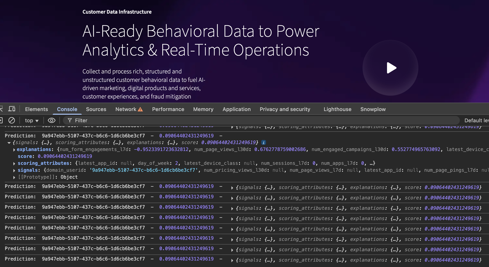

The final requirement is to see the prospect scores and predictions in the browser. In this tutorial, we'll call the API every 10 seconds.

You need an API endpoint that you can access from your local machine, or from JavaScript in the browser. This tutorial uses ngrok.

## Install ngrok

Run `pip install pyngrok` to install the required library.

## Set up proxy

On running this code, ngrok will expose Colab's `localhost:8000` port behind a one-time HTTPS URL with the format `https://00ab-11-22-333-44.ngrok-free.app`.

```python
import nest_asyncio
from pyngrok import ngrok, conf
import uvicorn

conf.get_default().auth_token = userdata.get('NGROK_TOKEN')
ngrok_tunnel = ngrok.connect(8000)
print('Public URL:', ngrok_tunnel.public_url)
nest_asyncio.apply()
uvicorn.run(app, port=8000)
```

As a result you should see this in the output:

```
Public URL: https://00ab-11-22-333-44.ngrok-free.app
...
INFO:     Uvicorn running on http://127.0.0.1:8000 (Press CTRL+C to quit)
```

## Test with cURL

Test the endpoint using `cURL`, passing in your `domain_userid` that you got earlier using the Snowplow Inspector.

The URL is your ngrok API URL plus `/predict`, the endpoint address you defined earlier.

```bash
curl -X POST \
  "https://00ab-11-22-333-44.ngrok-free.app/predict" \
  -H "Content-Type: application/json" \
  -d '{"domain_userid": "8e554b10-4fcf-49e9-a0d8-48b6b6458df3"}'
```

You should see an output like this:

```json
{
  "signals": {
    "domain_userid": "8e554b10-4fcf-49e9-a0d8-48b6b6458df3",
    "num_form_engagements_l7d": null,
    "num_sessions_l30d": [
      "d100158b-c1f9-4833-9211-1f7d2c2ae5ec"
    ],
    "num_pricing_views_l7d": null,
    "first_refr_medium_l30d": null,
    "latest_device_class": "Desktop",
    "first_mkt_medium_l30d": null,
    "num_sessions_l7d": [
      "d100158b-c1f9-4833-9211-1f7d2c2ae5ec"
    ],
    "num_media_events_l30d": null,
    "num_pricing_views_l30d": null,
    "num_page_pings_l30d": 3,
    "num_page_views_l7d": 1,
    "num_apps_l7d": [
      "website"
    ],
    "num_page_pings_l7d": 3,
    "num_page_views_l30d": 1,
    "latest_app_id": "website",
    "num_apps_l30d": [
      "website"
    ],
    "num_conversions_l30d": null,
    "num_conversions_l7d": null,
    "num_engaged_campaigns_l30d": null
  },
  "scoring_attributes": {
    "latest_app_id": "website",
    "day_of_week": 1,
    "latest_device_class": "Desktop",
    "num_sessions_l7d": 1,
    "num_apps_l7d": 1,
    "num_page_views_l7d": 1,
    "num_page_pings_l7d": 3,
    "num_pricing_views_l7d": 0,
    "had_conversions_l7d": 0,
    "num_form_engagements_l7d": 0,
    "num_sessions_l30d": 1,
    "num_apps_l30d": 1,
    "num_page_views_l30d": 1,
    "num_page_pings_l30d": 3,
    "num_pricing_views_l30d": 0,
    "had_conversions_l30d": 0,
    "num_media_events_l30d": 0,
    "first_refr_medium_l30d": null,
    "first_mkt_medium_l30d": null,
    "num_engaged_campaigns_l30d": 0
  },
  "explanations": {
    "num_sessions_l30d": 0.4983027254906483,
    "num_page_views_l7d": -0.39927947099437006,
    "num_page_views_l30d": 0.2720082590635866,
    "num_page_pings_l30d": -0.1769901583553292,
    "num_page_pings_l7d": 0.15350821211002766,
    "__sum_of_others": -0.09441755977226424
  },
  "score": 0.07480665296316147
}
```

## See scores in the browser

Finally, run the code below in your browser console on your website to see your live prospect score. The code retrieves your `domain_userid` directly from the tracker, and calls the intermediary API to get the scores.

You may need to update this if your tracker name is different. Check the tracker name in outbound events using the Snowplow Inspector.

Run this in your browser console to see your predictions:

```js
let api_url = "https://00ab-11-22-333-44.ngrok-free.app/predict"; // UPDATE THIS
let tracker_name = "sp"; // MAYBE UPDATE THIS

// Calls the API every 10s from the front-end
setInterval(function () {
    // assuming the Snowplow tracker is available at 'window.snowplow(...)'
    window.snowplow(function () {
        // Gets domain_userid from the tracker instance
        var sp = this[tracker_name];
        var domainUserId = sp.getDomainUserId();

        // Calls the API
        fetch(api_url, {
            method: "POST",
            headers: { "Content-Type": "application/json" },
            body: JSON.stringify({ domain_userid: domainUserId })
        })
        .then(response => response.json())
        .then(result => {
            console.log("Prediction: ", domainUserId, " - ", result.score);

            // Acts on prediction
            if (result.score >= 0.9) console.log('Prospect is likely to convert!');
        })
        .catch(console.error);
    });
}, 10 * 1000);
```

Every 10 seconds it will print out the prediction score that you'll convert, as well as the full API response.

Adjust the timing interval to call the endpoint APIs as often as needed in your use case.



In a real use case, you'd be able to take actions based on these scores and predictions.
