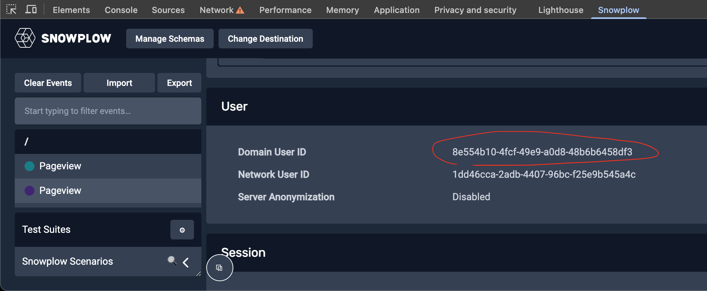

The final requirement is to see the prospect scores and predictions in the browser, updated in near real time. TODO is it?

You need an API endpoint that you can access from your local machine, or from JavaScript in the browser. This tutorial uses ngrok to proxy Colab's `localhost:8000` port behind an HTTPS URL. You already installed the Python ngrok library `pyngrok` in the last set of installs.

## Set up proxy

On running this code, ngrok will expose Colab's `localhost:8000` port behind a one-time HTTPS URL with the format `https://00ab-11-22-333-44.ngrok-free.app`.

```python
import ... TODO

conf.get_default().auth_token = userdata.get('NGROK_TOKEN')
ngrok_tunnel = ngrok.connect(8000)
print('Public URL:', ngrok_tunnel.public_url)
nest_asyncio.apply()
uvicorn.run(app, port=8000)
```

As a result you should see this in the output.

```
Public URL: https://00ab-11-22-333-44.ngrok-free.app
...
INFO:     Uvicorn running on http://127.0.0.1:8000 (Press CTRL+C to quit)
```

## Find your `domain_userid` for testing

Go to your website, and use the [Snowplow Inspector](/docs/data-product-studio/data-quality/snowplow-inspector/) browser plugin to find your own `domain_userid` in outbound web events.



## Test with cURL

Test the endpoint using `cURL`, passing in your `domain_userid`.

The URL is your ngrok API URL plus `/predict`, the endpoint address you defined earlier.

```bash
curl -X POST \
  "https://00ab-11-22-333-44.ngrok-free.app/predict" \
  -H "Content-Type: application/json" \
  -d '{"domain_userid": "8e554b10-4fcf-49e9-a0d8-48b6b6458df3"}'
```

TODO expected outcome

## See scores in the browser

Finally, try this on your website. Run this in your browser console to see your predictions:

```js
// Call the API every 10s from the frontend
let base_url = "https://00ab-11-22-333-44.ngrok-free.app";
let api_url = `${base_url}/predict`;
let tracker_name = "sp";

setInterval(function () {
    // assuming Snowplow tracker is available at 'window.snowplow(...)'
    window.snowplow(function () {
        // get domain_userid
        var sp = this[tracker_name];
        var domainUserId = sp.getDomainUserId();

        // call the API
        fetch(api_url, {
            method: "POST",
            headers: { "Content-Type": "application/json" },
            body: JSON.stringify({ domain_userid: domainUserId })
        })
        .then(response => response.json())
        .then(result => {
            console.log("Prediction: ", domainUserId, " - ", result.score);

            // act on prediction
            if (result.score >= 0.9) console.log('Prospect is likely to convert!');
        })
        .catch(console.error);
    });
}, 10 * 1000);
```

This snippet calls the API every 10 seconds.
Adjust it to call the endpoint APIs as often as needed in your use case.


For a real use case, you'd be able to take actions based on these scores and predictions.
