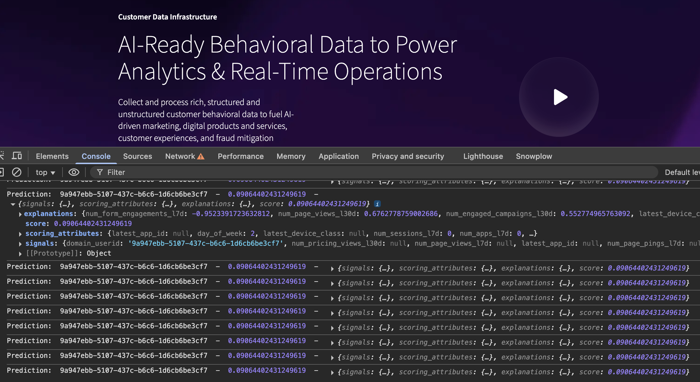

In this tutorial you've learned how to build a prospect scoring system using Snowplow Signals together with a machine learning model, your own website, and your own Snowplow data.

What you achieved:
* Used Signals to calculate attributes
* Scored prospects using an ML model
* Served live prospect scores in the browser

This tutorial is a starting point for exploring and using Signals APIs for your own needs and use cases.

## Next steps

Here are some ideas for further exploration:
* Define more Signals attributes that are specific for your use cases and tracking
* Act on the prospect scores and predictions in your application
* Use attributes to trigger actions and decisions without modeling
