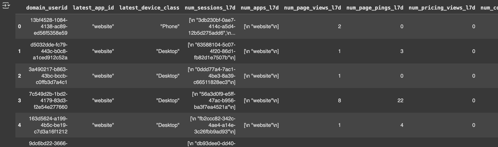

Next, you need to define which attributes to calculate, and to apply the configuration to Signals. The attributes will be calculated from your real-time event stream.

For this prospect scoring use case, use the following set of prospect attributes. They'll be calculated against the `domain_userid` device entity. Choosing this entity allows Signals to calculate attributes from events across multiple sessions for each prospect.

Some attributes will be calculated for two different time windows. We've chosen 7 and 30 days to cover both short- and long-term user behavior on the website.

Since the attributes will be calculated in stream, those with a defined `period` will be limited to the last 100 relevant events. Read more about this in the [Signals documentation](/docs/signals/stream-vs-batch/#stream-windowing-operations). For our marketing website, these attributes are unlikely to ever reach 100, but this may be something to be aware of for your site.

| Feature name                 | Description                                                                                     | Type   | Aggregation    |
| ---------------------------- | ----------------------------------------------------------------------------------------------- | ------ | -------------- |
| `latest_app_id`              | Current `app_id` value                                                                          | string | `last`         |
| `latest_device_class`        | Current YAUAA device class                                                                      | string | `last`         |
| `num_sessions_l7d/l30d`      | Number of unique sessions in the last 7 or 30 days                                              | int    | `unique_list`* |
| `num_apps_l7d/l30d`          | Number of unique `app_id`s engaged in the last 7 or 30 days                                     | int    | `unique_list`* |
| `num_page_views_l7d/l30d`    | Number of `page_view` events in the last 7 or 30 days                                           | int    | `counter`      |
| `num_page_pings_l7d/l30d`    | Number of `page_ping` events in the last 7 or 30 days, representing time on the site            | int    | `counter`      |
| `num_pricing_views_l7d/l30d` | Number of `page_view` events of the `/pricing` page in the last 7 or 30 days                    | int    | `counter`      |
| `num_conversions_l7d/30d`    | Number of recent `submit_form` events in the last 7 or 30 days                                  | int    | `counter`      |
| `num_form_engagements_l7d`   | Number of recent form engagements, e.g., `focus_form`, `change_form` events, in the last 7 days | int    | `counter`      |
| `num_media_events_l30d`      | Engagements with media events in the last 30 days                                               | int    | `counter`      |
| `first_refr_medium_l30d`     | First referrer medium in the last 30 days                                                       | string | `first`        |
| `first_mkt_medium_l30d`      | First `utm_medium` in the last 30 days                                                          | string | `first`        |
| `num_engaged_campaigns_l30d` | Number of distinct engaged `utm_campaign`s in the last 30 days                                  | int    | `unique_list`* |

*Signals doesn't have a "count distinct" aggregation. For "count distinct" features like `num_sessions_l7d` or `num_engaged_campaigns_l30d`, we'll use Signal's `unique_list` aggregation, and count the number of distinct elements later, in the intermediary API.

With the exception of `num_media_events_l30d`, the attributes will be based on standard Snowplow web events such as `page_view`, `page_ping`, or `submit_form`. If you aren't tracking Snowplow media events, the `num_media_events_l30d` attribute value will just stay at 0.

## Define common variables

First, let's prepare the imports and useful variables. We will reuse the variables multiple times, and this makes the code concise and clear.


```python
# Imports
from snowplow_signals import Attribute, Criteria, Criterion, Event, StreamView, domain_userid
from datetime import timedelta

# Define standard events
sp_page_view = Event(
    vendor="com.snowplowanalytics.snowplow",
    name="page_view",
    version="1-0-0"
)
sp_page_ping = Event(
    vendor="com.snowplowanalytics.snowplow",
    name="page_ping",
    version="1-0-0"
)
sp_submit_form = Event(
    vendor="com.snowplowanalytics.snowplow",
    name="submit_form",
    version="1-0-0"
)
sp_focus_form = Event(
    vendor="com.snowplowanalytics.snowplow",
    name="focus_form",
    version="1-0-0"
)
sp_change_form = Event(
    vendor="com.snowplowanalytics.snowplow",
    name="change_form",
    version="1-0-0"
)
sp_media_events = Event(
    # This will match any event for this vendor
    # because no event name or version are defined
    vendor="com.snowplowanalytics.snowplow.media"
)

l7d=timedelta(days=7)
l30d=timedelta(days=30)
```

## Define attributes

Next, define the attributes to calculate.

TODO time window

```python
# Latest page_view behavior
latest_app_id = Attribute(
    name="latest_app_id",
    type="string",
    events=[sp_page_view],
    aggregation="last",
    property="app_id"
)

latest_device_class = Attribute(
    name="latest_device_class",
    type="string",
    events=[sp_page_view],
    aggregation="last",
    property="contexts_nl_basjes_yauaa_context_1[0].deviceClass"
)


# Behavior over the last 7 days
num_sessions_l7d = Attribute(
    name="num_sessions_l7d",
    type="string_list",
    events=[sp_page_view],
    period=l7d,
    aggregation="unique_list",
    property="domain_sessionid"
)

num_apps_l7d = Attribute(
    name="num_apps_l7d",
    type="string_list",
    events=[sp_page_view],
    period=l7d,
    aggregation="unique_list",
    property="app_id"
)

num_page_views_l7d = Attribute(
    name="num_page_views_l7d",
    type="int32",
    events=[sp_page_view],
    period=l7d,
    aggregation="counter"
)

num_page_pings_l7d = Attribute(
    name="num_page_pings_l7d",
    type="int32",
    events=[sp_page_ping],
    period=l7d,
    aggregation="counter"
)

num_pricing_views_l7d = Attribute(
    name="num_pricing_views_l7d",
    type="int32",
    events=[sp_page_view],
    period=l7d,
    aggregation="counter",
    criteria=Criteria(
        all=[
            Criterion(
                property="page_url",
                operator="like",
                value="%pricing%"
            )
        ]
    )
)

num_conversions_l7d = Attribute(
    name="num_conversions_l7d",
    type="int32",
    events=[sp_submit_form],
    period=l7d,
    aggregation="counter"
)

num_form_engagements_l7d = Attribute(
    name="num_form_engagements_l7d",
    type="int32",
    events=[sp_focus_form, sp_change_form],
    period=l7d,
    aggregation="counter"
)


# Behavior over the last 30 days
num_sessions_l30d = Attribute(
    name="num_sessions_l30d",
    type="string_list",
    events=[sp_page_view],
    period=l30d,
    aggregation="unique_list",
    property="domain_sessionid"
)

num_apps_l30d = Attribute(
    name="num_apps_l30d",
    type="string_list",
    events=[sp_page_view],
    period=l30d,
    aggregation="unique_list",
    property="app_id"
)

num_page_views_l30d = Attribute(
    name="num_page_views_l30d",
    type="int32",
    events=[sp_page_view],
    period=l30d,
    aggregation="counter"
)

num_page_pings_l30d = Attribute(
    name="num_page_pings_l30d",
    type="int32",
    events=[sp_page_ping],
    period=l30d,
    aggregation="counter"
)

num_pricing_views_l30d = Attribute(
    name="num_pricing_views_l30d",
    type="int32",
    events=[sp_page_view],
    period=l30d,
    aggregation="counter",
    criteria=Criteria(
        all=[
            Criterion(
                property="page_url",
                operator="like",
                value="%pricing%"
            )
        ]
    )
)

num_conversions_l30d = Attribute(
    name="num_conversions_l30d",
    type="int32",
    events=[sp_submit_form],
    period=l30d,
    aggregation="counter"
)

num_media_events_l30d = Attribute(
    name="num_media_events_l30d",
    type="int32",
    events=[sp_media_events],
    period=l30d,
    aggregation="counter"
)

first_refr_medium_l30d = Attribute(
    name="first_refr_medium_l30d",
    type="string",
    events=[sp_page_view],
    period=l30d,
    aggregation="first",
    property="refr_medium"
)

first_mkt_medium_l30d = Attribute(
    name="first_mkt_medium_l30d",
    type="string",
    events=[sp_page_view],
    period=l30d,
    aggregation="first",
    property="mkt_medium"
)

num_engaged_campaigns_l30d = Attribute(
    name="num_engaged_campaigns_l30d",
    type="string_list",
    events=[sp_page_view],
    period=l30d,
    aggregation="unique_list",
    property="mkt_campaign"
)
```

## Group attributes into a view

Group the attributes into a view. This is where the `domain_userid` device entity is specified.

```python
# Wrap attributes into a view
user_attributes_view = StreamView(
    name="prospect_scoring",
    version=1,
    entity=domain_userid,
    attributes=[
        latest_app_id,
        latest_device_class,
        num_sessions_l7d,
        num_apps_l7d,
        num_page_views_l7d,
        num_page_pings_l7d,
        num_pricing_views_l7d,
        num_conversions_l7d,
        num_form_engagements_l7d,
        num_sessions_l30d,
        num_apps_l30d,
        num_page_views_l30d,
        num_page_pings_l30d,
        num_pricing_views_l30d,
        num_conversions_l30d,
        num_media_events_l30d,
        first_refr_medium_l30d,
        first_mkt_medium_l30d,
        num_engaged_campaigns_l30d,
    ],
)
```

## Deploy configuration to Signals

Apply the view to Signals.

```python
# Apply view to the Signals API
from snowplow_signals import Signals
sp_signals = Signals(
    api_url=ENV_SP_API_URL,
    api_key=ENV_SP_API_KEY,
    api_key_id=ENV_SP_API_KEY_ID,
    org_id=ENV_SP_ORG_ID
)

applied = sp_signals.apply([user_attributes_view])

# This should print "1 objects applied"
print(f"{len(applied)} objects applied")
```

Test the attribute outputs on a subset of recent event data. The `test` command uses the last hour of data from your atomic events table. Here we're restricting the results to events with the application ID `website`: this filtering is optional.

```python
sp_signals_test = sp_signals.test(
    view=user_attributes_view,
    app_ids=["website"]
)

sp_signals_test
```

The result should look similar to this:


