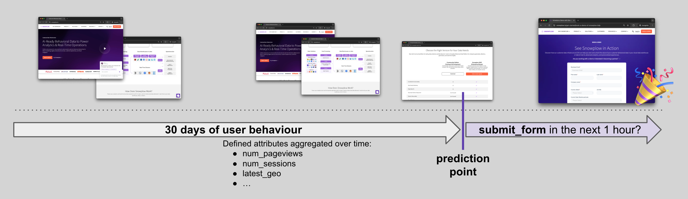
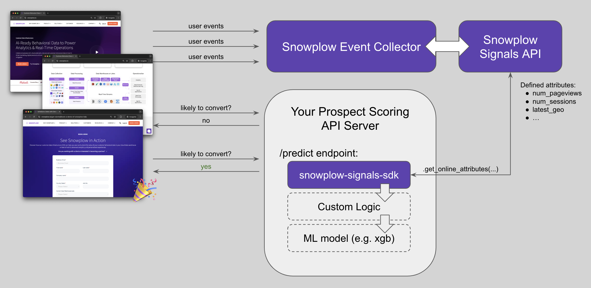

Welcome to the [Snowplow Signals](/docs/signals/) real-time prospect scoring tutorial.

Snowplow Signals is a real-time personalization engine for customer intelligence, built on Snowplow's behavioral data pipeline. It allows you to compute, access, and act on in-session stream and historical user data, in near real time.

This guide will through the process of building a real-time prospect scoring system using Signals together with a machine learning model. You'll learn how to leverage Snowplow event data to predict a prospect's likelihood to convert on your website, and how to trigger personalized engagements.

Use this tutorial as a starting point for how to integrate Signals data with any ML use cases or other back-end services.

The tutorial uses the Snowplow marketing website as an example. Follow along using your own website and Snowplow data.

At the end of the tutorial, you will:

* See live prospect attribute updates in the browser console
* Score prospects using an ML model
* Be ready to use the outputs to drive decisions on your website

## Business case overview

Prospects on the Snowplow marketing website visit product and pricing pages, watch videos, etc. The key call to action is a form submission to request a demo.

We want to predict if a specific prospect is likely to submit a form in the next hour, given their behavior for up to the last month until the prediction moment.

For simplicity in this tutorial, we'll score prospects every 10 seconds as they browse the website. Depending on your requirements, you could score prospects at the start of each `page_view`, after certain events, or at some other time interval.

We're calculating aggregated attributes based off real-time stream event data, so won't have much user history to work with initially. Over time, as prospects visit and revisit the website, the attributes will become more meaningful.

## Prerequisites

* A website with Snowplow tracking enabled
  * Page views
  * Page pings
  * Form tracking
  * Optional: media events
* Valid API credentials for your Signals account:
  * Signals API URL
  * Snowplow API key
  * Snowplow API key ID
  * Snowplow organization ID
* [ngrok](https://dashboard.ngrok.com/) account and Authtoken API key
* Snowplow events in Snowflake: if you are using a different warehouse, adjust the connection code
* Google Colab

Check out the [Signals configuration](/docs/signals/configuration) documentation to find out how to get the Signals credentials.

## Architecture

This tutorial uses this [Jupyter notebook](https://colab.research.google.com/github/snowplow-incubator/signals-notebooks/blob/main/web/web_prospect_scoring_end_to_end.ipynb).

The system consists of three main blocks:

1. **Your marketing website**: as users browse the website, Snowplow events are sent to the Snowplow Collector
2. **Snowplow Infrastructure**: the Collector captures the events, and Signals calculates aggregated user attributes in near real time e.g., `num_pageviews`, `num_sessions`
3. **Intermediary `/predict` API**:  an API that calls the Signals API to get the latest attributes, runs an ML model on the Signals output, and sends the response back

:::note
You can replace the ML model with any other back-end system that you'd use to act on live prospects' attributes.
:::
