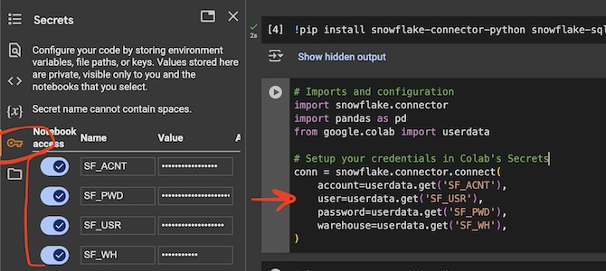

This tutorial uses this Google [Colab notebook](https://colab.research.google.com/github/snowplow-incubator/signals-notebooks/blob/main/web/web_prospect_scoring_end_to_end.ipynb).

For ML training data we will use an artificial set of Snowplow events. Feel free to replace with your warehouse connection to connect to your own dataset.

Start by configuring your Signals credentials in the notebook.



Here's a list of all the credentials you may need to configure, saved as variables:

```python
from google.colab import userdata

# Snowplow Signals Sandbox credentils
SP_SANDBOX_URL = userdata.get('SP_SANDBOX_URL')     # https://{{123abc}}.svc.snplow.net
SP_SANDBOX_TOKEN = userdata.get('SP_SANDBOX_TOKEN') # 12345678-0000-1111-2222-123456789012

# Snowplow Signals Console credentials
SP_API_URL = userdata.get('SP_API_URL')       # Signals API URL
SP_API_KEY = userdata.get('SP_API_KEY')       # Signals API key
SP_API_KEY_ID = userdata.get('SP_API_KEY_ID') # Signals API key ID
SP_ORG_ID = userdata.get('SP_ORG_ID')         # Snowplow org ID
```

Once you've added the secrets, start working through the tutorial. If you prefer to run the cells in one go with Run all, update your details in the required places first - they're marked with `UPDATE THIS`.
