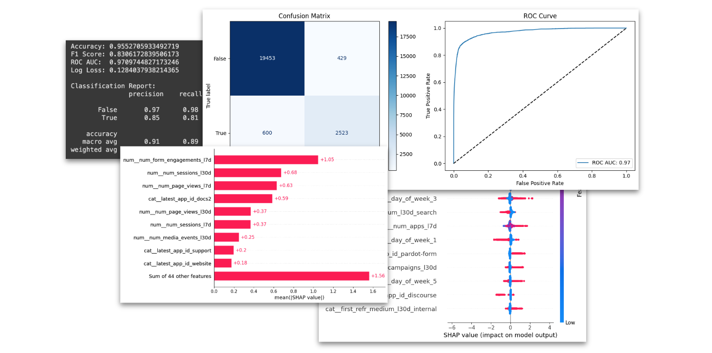

As prospects browse your website, Signals will calculate the aggregated attributes in near real time.

We want to score the combination of these attributes using an ML model to better understand if a specific prospect is likely to submit a form.

Here's the prediction structure and timeline:


The next task is to prepare historical data resembling the same Signals features, and train an XGBoost model on top.

## Install dependencies

Run `pip install snowflake-connector-python snowflake-sqlalchemy` to install the required libraries.

## Prepare training dataset

Double-check that your `ENV_ATOMIC_TABLE` variable points to your Snowflake atomic table address, e.g. `snowplow_tracker_db.atomic.events`.

Here's the SQL:

```sql
with

-- Change to your events table
events_table as (
    select * from {ENV_ATOMIC_TABLE}
    where derived_tstamp >= dateadd('day', -30-30, current_date)
),

-- Filter training dataset
eligible_duids as (
    -- let's train on users who first appeared between 60-30 days ago
    select
        domain_userid,
        min(derived_tstamp) as first_seen
    from events_table
    where domain_userid is not null
        and app_id in ('website', 'hs-landing')
    group by 1
    having first_seen between dateadd('day', -30-30, current_date) and dateadd('day', -30, current_date)
),
events as (
    select *
    from events_table
    -- where ...filter the events/app_ids that you need, exclude testing/bot traffic, etc.
    where domain_userid in (select domain_userid from eligible_duids)
        and domain_sessionid is not null
        and event_name not in ('application_error', 'web_vitals', 'link_click')
),

-- Prepare the target column
targets_as_of_event as (
    -- Target: will this person 'submit_form' in the next 1 hour?
    select
        -- identifiers
        er.event_id,
        -- target
        count_if(ef.event_name = 'submit_form') > 0 as target_had_submit_form_next1h,
    from events er
    left join events ef on er.domain_userid = ef.domain_userid
        and er.derived_tstamp < ef.derived_tstamp -- only future events
        and datediff('second', er.derived_tstamp, ef.derived_tstamp) <= 60 * 60 -- only the next 1h of events
    group by all
),

-- Prepare training features
agg_as_of_event as (
    select
        -- identifiers
        er.event_id,
        -- event features
        nvl(er.app_id, '') as latest_app_id,
        dayofweekiso(er.derived_tstamp) as day_of_week,
        nvl(er.contexts_nl_basjes_yauaa_context_1[0]:deviceClass::string, '') as latest_device_class,

        -- behaviour over the last 7d
        count(distinct iff(datediff('second', eh.derived_tstamp, er.derived_tstamp) <= 60 * 60 * 24 * 7, eh.domain_sessionid, null)) as num_sessions_l7d,
        count(distinct iff(datediff('second', eh.derived_tstamp, er.derived_tstamp) <= 60 * 60 * 24 * 7, eh.app_id, null)) as num_apps_l7d,
        nvl(count_if(iff(datediff('second', eh.derived_tstamp, er.derived_tstamp) <= 60 * 60 * 24 * 7, eh.event_name = 'page_view', null)), 0) as num_page_views_l7d,
        nvl(count_if(iff(datediff('second', eh.derived_tstamp, er.derived_tstamp) <= 60 * 60 * 24 * 7, eh.event_name = 'page_ping', null)), 0) as num_page_pings_l7d,
        nvl(count_if(iff(datediff('second', eh.derived_tstamp, er.derived_tstamp) <= 60 * 60 * 24 * 7, eh.event_name = 'page_view' and eh.page_url like '%pricing%', null)), 0) as num_pricing_views_l7d,
        nvl(count_if(iff(datediff('second', eh.derived_tstamp, er.derived_tstamp) <= 60 * 60 * 24 * 7, eh.event_name = 'submit_form', null)), 0) > 0 as had_conversions_l7d,
        nvl(count_if(iff(datediff('second', eh.derived_tstamp, er.derived_tstamp) <= 60 * 60 * 24 * 7, eh.event_name in ('focus_form', 'change_form'), null)), 0) > 0 as num_form_engagements_l7d,

        -- behaviour over the last 30d
        count(distinct eh.domain_sessionid) as num_sessions_l30d,
        count(distinct eh.app_id) as num_apps_l30d,
        nvl(count_if(eh.event_name = 'page_view'), 0) as num_page_views_l30d,
        nvl(count_if(eh.event_name = 'page_ping'), 0) as num_page_pings_l30d,
        nvl(count_if(eh.event_name = 'page_view' and eh.page_url like '%pricing%'), 0) as num_pricing_views_l30d,
        nvl(count_if(eh.event_name = 'submit_form'), 0) > 0 as had_conversions_l30d,
        nvl(count_if(eh.contexts_com_snowplowanalytics_snowplow_media_player_2 is not null), 0) as num_media_events_l30d,
        nvl(min_by(eh.refr_medium, eh.derived_tstamp), '') as first_refr_medium_l30d,
        nvl(min_by(eh.mkt_medium, eh.derived_tstamp), '') as first_mkt_medium_l30d,
        count(distinct eh.mkt_campaign) as num_engaged_campaigns_l30d,

        -- ...
    from events er
    left join events eh on er.domain_userid = eh.domain_userid
        and eh.derived_tstamp < er.derived_tstamp
        -- Here we join on the last 30d of history.
        -- To calculate any <30d features (e.g. l7d) use datediff in the features.
        and datediff('second', eh.derived_tstamp, er.derived_tstamp) <= 60 * 60 * 24 * 30
    group by all
),
final_training as (
    select
        e.*,
        t.target_had_submit_form_next1h
    from
    agg_as_of_event e
    inner join targets_as_of_event t on e.event_id = t.event_id
)
select * from final_training
```

Save the SQL as a variable:

```python
query = f"""
-- SQL query as shown in block above
"""
```

:::note
This query defines the target column based on `submit_form` events. If you're not tracking those events, the retrieved data won't work with the model - the target values will all be `False`. You'll get a `ValueError` when you try to train the model if this is the case.

If so, define a different target that exists in your database and represents meaningful user behavior. For a less meaningful but simple substitution for this tutorial, you could try multiple page views:

```sql
-- In targets_as_of_event, replace this line
count_if(ef.event_name = 'submit_form') > 0 as target_had_submit_form_next1h,

-- With this one
count_if(ef.event_name = 'page_view') > 2 as target_had_multiple_pageviews_next1h,
```

You'll need to update the variable name where it's called in `final_training` also.

:::

Connect to your database to run the query and retrieve data into a pandas DataFrame:

```python
import snowflake.connector
import pandas as pd

import warnings
warnings.filterwarnings('ignore')
seed = 0

conn = snowflake.connector.connect(
    account=ENV_SF_ACNT,
    user=ENV_SF_USR,
    password=ENV_SF_PWD,
    warehouse=ENV_SF_WH,
)

db_df = pd.read_sql(query, conn)
conn.close()

# Snowflake returns all uppercase by default
# Convert column names to lowercase
db_df.columns = db_df.columns.str.lower()

db_df
```

:::info
If you use a different warehouse, adjust the code here.
:::

### Best practice for atomic events training datasets

1. Check that key behaviors you want to use for predictions are captured in your events, and exclude irrelevant events such as `link_click`.
2. Choose a subset of `domain_userid`s (or your other entities, depending on what you're using) to include in training - see the `eligible_duids` section of the SQL.
3. Filter the atomic events for a subset of entities that you defined as eligible for training.
4. Choose historical training time periods that allow your `domain_userid`s (or other entities) to reach the target.
    * In this tutorial, we're choosing `domain_userid`s who first appeared between 60 and 30 days ago. This allows 30 days of events to represent historical behavior, and 30 days of potentially converted behavior.
    * Let's say you expect your `domain_userid` to convert in 7 days. Then choose `domain_userid`s who first appeared between 90 and 30 days ago, and set a cutoff of 7 days for them to convert. Don't just choose the last 30 days, as a `domain_userid` who appeared yesterday wouldn't have enough time to reach the cutoff date.
    * If you're trying to predict churn, give your `domain_userid`s enough time to become "churned". For example, you could make an assumption that anyone who hasn't had events for 30 days is churned. So you'd need to train only on data that happened up until `today - 30d`.
5. Make sure there's no target leakage in your dataset. The most common pitfalls are:
    * Including events in historical training that happened after the prediction point in the journey.
    * Including information that wouldn't be available at the time of prediction in training, e.g., accidentally enriching the training dataset with some "as of today" data from the warehouse or CRM.

## Train the model

In this tutorial, we're training a regular XGBoost classification model.

:::note
Use this template to adjust to your own ML needs.
Training an ML model for your specific use cases is a task in itself and goes far beyond this tutorial.
:::

Key steps in the ML journey are:

1. Preprocess the data for training, for example:
    * `StandardScaler` for numerical columns
    * `OneHotEncoder` for categorical columns
    * `train_test_split` for training/testing split
2. Fit the model pipeline using `model.fit`.
3. Persist model binary with `joblib.dump`. We will use the trained model binary later for inference in the API endpoint.
4. Evaluate model performance:
    * Calculate regular metrics
    * Confusion matrix
    * ROC-AUC curve
    * Visualize feature importance
    * Optionally, use SHAP to get prediction explanations

```python
import joblib
from sklearn.pipeline import Pipeline
from sklearn.compose import ColumnTransformer
from sklearn.preprocessing import OneHotEncoder, StandardScaler
from sklearn.model_selection import train_test_split
from sklearn.metrics import accuracy_score, f1_score, roc_auc_score, log_loss, ConfusionMatrixDisplay, roc_curve, classification_report
import xgboost as xgb
import matplotlib.pyplot as plt
import shap

# Preprocessing
x_columns = [
    'latest_app_id',
    'day_of_week',
    'latest_device_class',
    'num_sessions_l7d',
    'num_apps_l7d',
    'num_page_views_l7d',
    'num_page_pings_l7d',
    'num_pricing_views_l7d',
    'had_conversions_l7d',
    'num_form_engagements_l7d',
    'num_sessions_l30d',
    'num_apps_l30d',
    'num_page_views_l30d',
    'num_page_pings_l30d',
    'num_pricing_views_l30d',
    'had_conversions_l30d',
    'num_media_events_l30d',
    'first_refr_medium_l30d',
    'first_mkt_medium_l30d',
    'num_engaged_campaigns_l30d',
]
y_column = 'target_had_submit_form_next1h'

categorical_cols = [
    'latest_app_id',
    'day_of_week',
    'latest_device_class',
    'first_refr_medium_l30d',
    'first_mkt_medium_l30d',
]
numerical_cols = [
    'num_sessions_l7d',
    'num_apps_l7d',
    'num_page_views_l7d',
    'num_page_pings_l7d',
    'num_pricing_views_l7d',
    'num_form_engagements_l7d',
    'num_sessions_l30d',
    'num_apps_l30d',
    'num_page_views_l30d',
    'num_page_pings_l30d',
    'num_pricing_views_l30d',
    'num_media_events_l30d',
    'num_engaged_campaigns_l30d',
]

preprocessor = ColumnTransformer(transformers=[
    ('num', StandardScaler(), numerical_cols),
    ('cat', OneHotEncoder(handle_unknown='ignore'), categorical_cols)
])
model = Pipeline(steps=[
    ('preprocessor', preprocessor),
    ('classifier', xgb.XGBClassifier(eval_metric='logloss', random_state=seed))
])

# Split, train, and evaluate
X = db_df[x_columns]
y = db_df[y_column]
X_train, X_test, y_train, y_test = train_test_split(X, y, test_size=0.2, random_state=seed, stratify=y)

# Check if y_train contains both positive/negative classes
if len(set(y_train)) < 2:
    raise ValueError("Training labels (y_train) have to contain both 'True/False' classes for classification. Adjust your SQL above to provide both classes in the target column `target_had_submit_form_next1h`.")

model.fit(X_train, y_train)
y_pred = model.predict(X_test)
y_prob = model.predict_proba(X_test)[:, 1]

# Export
joblib.dump(model, "xgb_model.joblib")
```

## Evaluate model performance

Follow along in the notebook to evaluate your model's performance.


