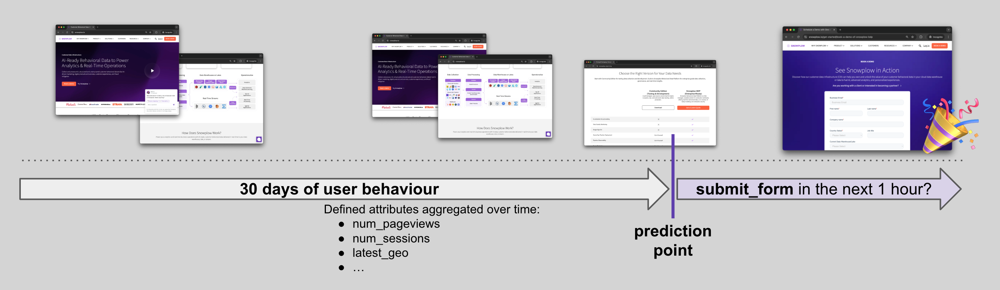
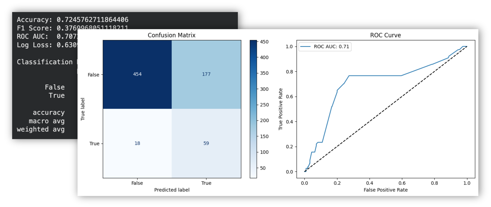

As prospects browse your website, Signals will calculate the aggregated attributes in real time.

We want to score the combination of these attributes using an ML model to better understand if a specific prospect is likely to submit a form.

Here's the prediction structure and timeline:



The next task is to prepare historical data resembling the same Signals features, and train a LogisticRegression model on top.

## Prepare training dataset

For this tutorial we will use an artificial set of Snowplow events in a CSV that resemble web traffic.

We will connect to it using duckdb and model data using SQL. You can replace this section with your warehouse data, just update the connection block. SQL syntax should translate to major warehouses easily.

Here's the SQL:

```sql
with
-- Change to your events table
events as (
    select * from read_csv_auto('{csv_filename}')
    where app_id = 'website' -- filter for your app_ids
        and domain_userid is not null -- filter to traffic with domain_userids
        and event_name in ('page_view', 'submit_form') -- filter the events you need
        -- and derived_tstamp >= dateadd('day', -90, current_date) -- filter by time
        -- filter out bots, new/returning users, etc
),
-- Filter out post-conversion events
post_conv as (
    select
        domain_userid,
        min(derived_tstamp) as first_conv
    from events
    where event_name = 'submit_form'
    group by 1
),
-- Prepare the target column
targets_as_of_event as (
    -- Target: will this person 'submit_form' in the next 1 hour?
    select
        -- identifiers
        er.event_id,
        -- target
        count_if(ef.event_name = 'submit_form') > 0 as target_had_submit_form_next1h,
    from events er
    left join events ef on er.domain_userid = ef.domain_userid
        and er.derived_tstamp < ef.derived_tstamp -- only future events
        and datediff('second', er.derived_tstamp, ef.derived_tstamp) <= 60 * 60 -- only the next 1h of events
    group by er.event_id
),
-- Prepare training features and dataset
final_training as (
    select
            er.domain_userid,
        er.derived_tstamp,
        er.event_name,
        coalesce(count_if(eh.event_name = 'page_view'), 0) as num_page_views,
        coalesce(count_if(eh.event_name = 'page_view' and eh.page_url like '%pricing%'), 0) as num_pricing_views,
        coalesce(count_if(eh.event_name = 'page_view' and eh.page_url like '%customers%'), 0) as num_customers_views,
        coalesce(t.target_had_submit_form_next1h, false) as target_had_submit_form_next1h,
    from events er
    left join events eh on er.domain_userid = eh.domain_userid
        and eh.derived_tstamp < er.derived_tstamp
    left join targets_as_of_event t on er.event_id = t.event_id
    left join post_conv p on er.domain_userid = p.domain_userid
        and er.derived_tstamp >= p.first_conv
    group by all
    having not p.domain_userid is not null -- remove post-conversion events
)
select * from final_training
```

Next we will connect to the CSV to run the query and retrieve data into a pandas DataFrame:

```python
csv_filename = 'https://github.com/snowplow-incubator/signals-notebooks/raw/refs/heads/main/web/sample_events.csv.gz'
query = f"""..."""

import duckdb
import pandas as pd

conn = duckdb.connect(database=':memory:')
db_df = conn.sql(query).df()
conn.close()

db_df
```

:::info
Adjust the query/connection here if you want to try the query on your own warehouse.
duckdb SQL syntax translates easily to all the major warehouses.
:::

### Best practices for atomic events training datasets

1. Check that key behaviors you want to use for predictions are captured in your events, and exclude events not needed for your use case like `application_error`.
2. Choose a subset of `domain_userid`s (or your other entities, depending on what you're using) to include in training. For example, sometimes you may want to exclude bots, new/returning users, specific segments, etc.
3. Choose historical training time periods that allow your `domain_userid`s (or other entities) to reach the target.
    * Let's say you expect your `domain_userid` to convert in 7 days. Then choose `domain_userid`s who first appeared between 90 and 30 days ago, and set a cutoff of 7 days for them to convert. Don't just choose the last 30 days, as a `domain_userid` who appeared yesterday wouldn't have enough time to reach the cutoff date.
    * If you're trying to predict churn, give your `domain_userid`s enough time to become "churned". For example, you could make an assumption that anyone who doesn't have events for 30 days is churned. So you'd need to train only on data that happened up until `today - 30d`.
4. Make sure there's no target leakage in your dataset. The most common pitfalls are:
    * Including events in historical training that happened after the prediction point in the journey.
    * Including information that wouldn't be available at the time of prediction in training, e.g., accidentally enriching the training dataset with some "as of today" data from the warehouse or CRM.

## Train and evaluate the model

In this tutorial, we're training a regular LogisticRegression model on top of numerical features.

:::note
Use this template to adjust to your own ML needs.
Training an ML model for your specific use cases goes far beyond this tutorial.
:::

In the next code block we prepare data for training, fit the model, and persist the model binary to use it later in the API.

```python
import joblib
from sklearn.model_selection import train_test_split
from sklearn.linear_model import LogisticRegression

# preprocessing
x_columns = [
    'num_page_views',
    'num_pricing_views',
    'num_customers_views',
]
y_column = 'target_had_submit_form_next1h'

seed = 42
model = LogisticRegression(random_state=seed, class_weight='balanced')

# Split, Train, and Evaluate
X = db_df[x_columns]
y = db_df[y_column]
X_train, X_test, y_train, y_test = train_test_split(X, y, test_size=0.2, random_state=seed, stratify=y)

model.fit(X_train, y_train)
y_pred = model.predict(X_test)
y_prob = model.predict_proba(X_test)[:, 1]

# Export
joblib.dump(model, "model.joblib")
```

Follow along in the notebook to evaluate your model's performance.



:::note
This model is built on an artificial subset of events. In real-life use-cases you'll most likely use a lot more Signals attributes that capture key user's behaviours including geo, useragent, traffic sources, various categorical attributes, and more.
:::
