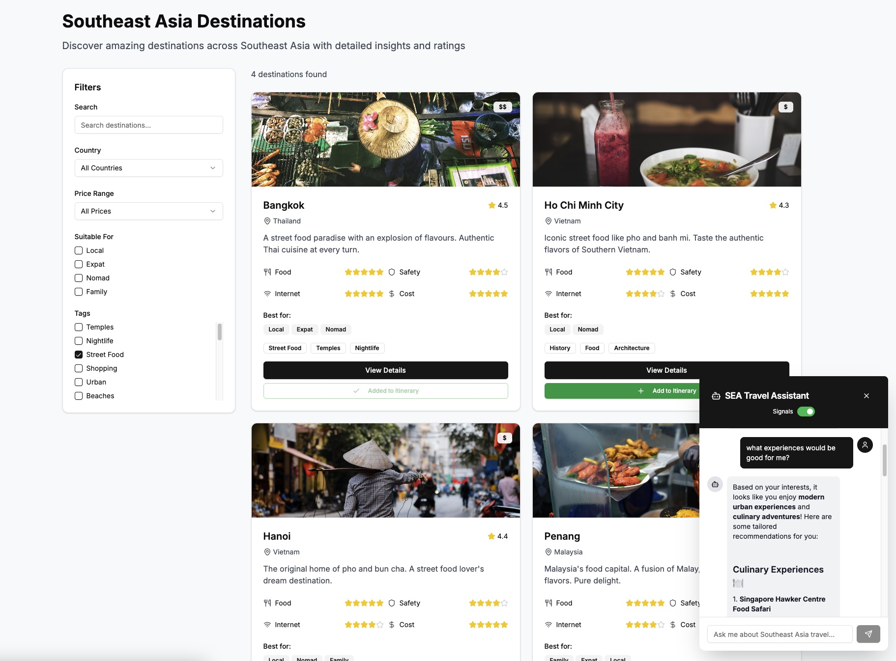

Welcome to the **Personalize content and agentic responses using Signals** tutorial.

This tutorial walks you through building personalized experiences on a travel website using Snowplow Signals. You'll learn how to capture user behavior, define attributes that represent user preferences, and use these insights to customize both website content and chatbot responses in real-time.

Personalization has become essential for creating engaging user experiences. Traditional approaches often rely on static user profiles or require manual segmentation. Snowplow Signals enables dynamic personalization by processing behavioral data in real-time and making it immediately available for customization.

This tutorial is designed for developers, engineers, and analysts who want to implement real-time personalization. You'll work with a demo travel website focused on Southeast Asian destinations, creating a practical example of how behavioral data can drive personalized experiences.

You'll build a complete personalization system that captures user interests through their browsing behavior, processes this data into meaningful attributes using Snowplow Signals, and applies these insights to customize both the content displayed on the website and the responses provided by an AI-powered chatbot.

## Prerequisites

* Signals enabled for your BDP pipeline or [Snowplow Local](https://github.com/snowplow-incubator/snowplow-local) set up with [Signals Sandbox](https://try-signals.snowplow.io/dashboard)
* The [Snowplow Inspector](https://chromewebstore.google.com/detail/snowplow-inspector/maplkdomeamdlngconidoefjpogkmljm?hl=en) browser extension installed
* Familiarity with running Jupyter notebooks, either locally or in Google Colab
* [Docker](https://www.docker.com/) installed and configured
* Access to the Jupyter [notebook](https://colab.research.google.com/github/snowplow/documentation/blob/main/tutorials/signals-bdp/signals.ipynb)
* Optional: an [OpenAI API key](https://platform.openai.com/api-keys) to customize agent responses
