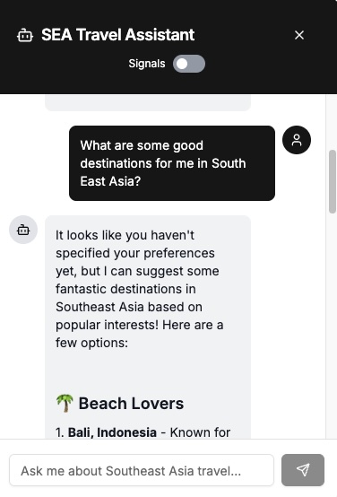
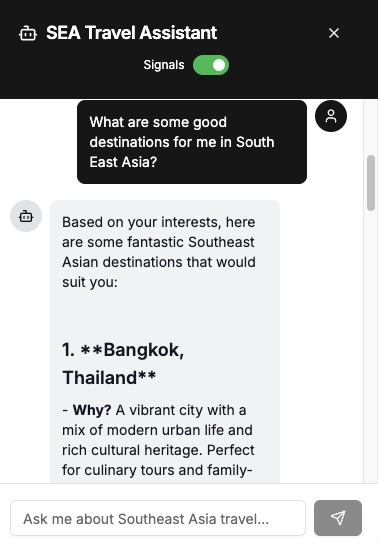

```mdx-code-block
import Mermaid from '@theme/Mermaid';
```

You'll now optionally personalize a chatbot experience by integrating Signals with an AI agent that uses OpenAI as the backend. The chatbot fetches user attributes via a tool call, allowing it to provide contextual, personalized responses based on the user's browsing behavior.

The demo site includes all necessary tools and SDKs, so you'll only need an OpenAI API key to implement this feature.

## How it works

When a user asks the agent a question, the system fetches the attribute values for the user using the Signals API and uses these to modify the prompt sent to OpenAI. This allows personalized responses based on the user's preferences and behavior.

A toggle button on the chat widget allows you to enable or disable the tool call so you can see the difference in responses with and without Signals personalization.

## Data flow

<Mermaid value={`
sequenceDiagram
    Agent->>+OpenAI: Message
    Agent->>+Tool call: domain_sessionid
    Tool call->>+Typescript SDK: domain_sessionid
    Typescript SDK->>+Signals API: domain_sessionid, service_name
    Signals API->>+Typescript SDK: attributes
    Typescript SDK->>+Tool call: attributes
    Tool call->>+OpenAI: attributes
    OpenAI->>+Agent: personalized response
  `}/>

## Configure the agent

Add these variables to your `.env` file in the `snowplow-local` directory:

```
AI_MODEL_PROVIDER=openai
AI_MODEL_NAME=gpt-4o-mini
OPENAI_API_KEY=your_openai_api_key
```

## Generate personalization data

You'll need some attribute data to personalize the agent responses. Browse different filters, destinations, and blog pages to generate additional attribute values.

Check your attribute values using the Snowplow Inspector **Attributes** tab. You should see values under the `travel_view` label.

## Test the agent

Start chatting with the agent by selecting the chat icon in the lower right portion of the screen.

First, test without personalization:
1. Turn the toggle switch off (gray means off, green means on)
2. Ask a question like "What are some good destinations for me in Southeast Asia?"
3. Note the generic response
4.


Then test with personalization:
1. Turn the toggle switch on (green)
2. Ask the same question
3. Compare the response - it should now be tailored to your browsing behavior




The personalized responses should provide destination suggestions and justifications that align with the preferences you've demonstrated through your behavior on the site.
