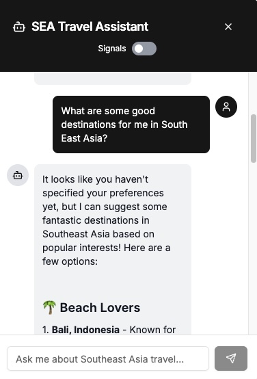
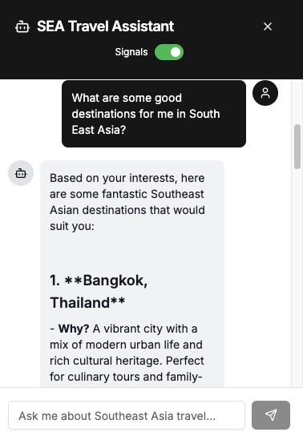
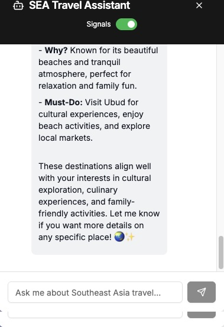

```mdx-code-block
import Mermaid from '@theme/Mermaid';
```

Personalized chatbot experiences represent one of the most powerful applications of behavioral data. Instead of providing generic responses, a chatbot can use real-time behavioral insights to offer recommendations that align with a user's demonstrated preferences and interests.

This section demonstrates how to integrate Snowplow Signals with an AI chatbot that uses OpenAI as the backend. The chatbot fetches user attributes via a tool call using the AI SDK, allowing it to provide contextual, personalized responses based on the user's browsing behavior.

The demo site includes all necessary tools and SDKs, so you'll only need an OpenAI API key to implement this personalization feature.

## How it will work

When a user asks a question of the agent we will fetch the attribute values for the user using the Signals API and use these to modify the prompt that is sent to OpenAI via a tool call which will use the Typescript SDK. This will allow us to provide more personalized responses based on the user's preferences and behavior.

A toggle button on the chat widget itself will allow us to enable or disable the tool call so we can see the difference in responses with and without Signals personalization.

## Data flow

<Mermaid value={`
sequenceDiagram
    Agent->>+OpenAI: Message
    Agent->>+Tool call: domain_sessionid
    Tool call->>+Typescript SDK: domain_sessionid
    Typescript SDK->>+Signals API: domain_sessiond, service_name
    Signals API->>+Typescript SDK: attributes
    Typescript SDK->>+Tool call: attributes
    Tool call->>+OpenAI: attributes
    OpenAI->>+Agent: personalized response
  `}/>

## Setup

In order to configure the agent to use Signals you will need to have the following additional variables set in your `.env` file in the `snowplow-local` directory.

```
AI_MODEL_PROVIDER=openai
AI_MODEL_NAME=gpt-4o-mini
OPENAI_API_KEY=your_openai_api_key
```

## Create a source of personalization data

Similar to the last section on personalizing the site you will also need some attribute data in order to personalize the agent. This time as we are not strictly limited to customising the user interface in a hardcoded way feel free to explore different filters, destinations and blog pages in order to generate additional attribute values.

Check that you have some valid attribute values (these are the same ones the agent will see) by using the Snowplow Inspector and clicking on the 'Attributes' tab. You should see this under the 'travel_view' label.

## Chatting to the agent

Once you have your attribute data set up, you can start chatting with the agent. You can do this by selecting the chat icon in the lower right hand portion of the screen. Initially we want to turn the Signals tool call off - to find out how the agent responds in the absence of any behavioral information.

To do this hit the toggle switch so that it turns gray (green indicates on).

You can now ask the agent a question - for example "What are some good destinations for me in South East Asia?" and see how it responds.

[](./screenshots/chat-nops.jpg)

You can see that the response you get back is not bad, but it is fairly generic and does take into account any of the personalized preferences you've expressed through your behavior on the site throughout your current session.

Next turn the toggle switch on (green) and ask the same identical question. The response should now differ significantly. Some of the destinations suggested may be identical but you should find the that the justification and reasoning for selecting each destination is curated to preferences derived from your on-site behavior.


[](./screenshots/chat-ps1.jpg)
[](./screenshots/chat-ps2.jpg)
