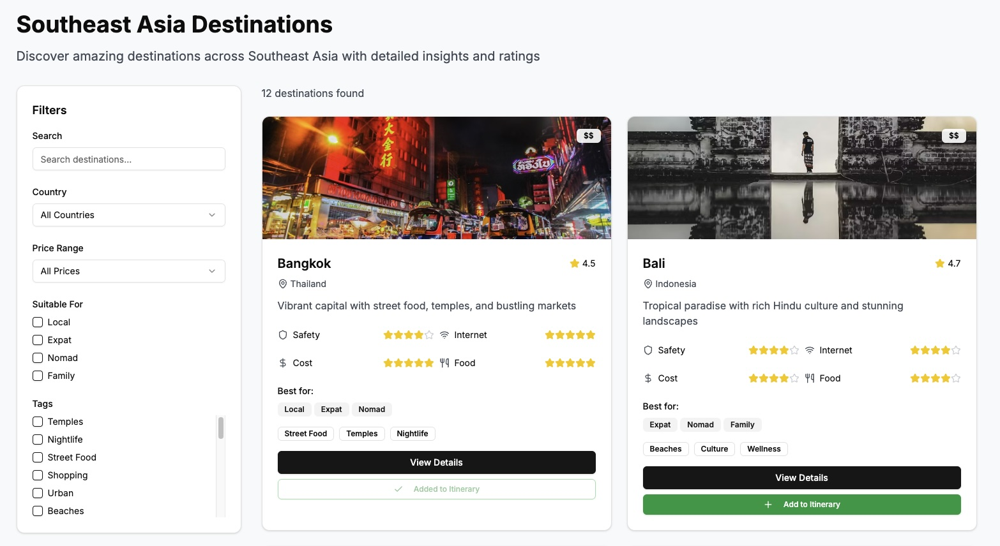
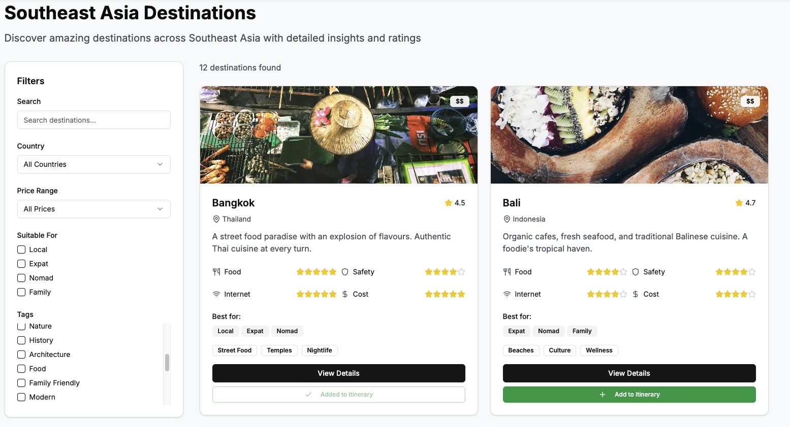

```mdx-code-block
import Mermaid from '@theme/Mermaid';
```

You'll now use your behavioral attributes to personalize the website experience in real-time. The travel website uses micro-segmentation based on behavioral data to customize various elements of the user experience.

The personalization system uses five different attributes that represent micro-segments based on user behavior patterns:
* `culinary_tourist`: users interested in food and culinary experiences
* `cultural_explorer`: users interested in cultural experiences
* `family_fun`: users interested in family friendly experiences and destinations
* `modern_urbanite`: users interested in urban experiences like architecture, nightlife, and shopping
* `tranquil_seeker`: users interested in relaxing experiences like beaches, spas, and nature

To determine the most appropriate micro-segment for a user, look at the value for each of these attributes (they are counters) and use the highest value.

## Data flow

Here's how the personalization works on the **Destinations** page:

<Mermaid value={`
sequenceDiagram
    React Frontend->>+Signals SDK (Node): domain_sessionid
    Signals SDK (Node)->>Signals API: domain_sessionid, service_name
    Signals API->>+Signals SDK (Node): Attribute values
    Signals SDK (Node)->>+React Frontend: Save to LocalStorage
  `}/>

To achieve this personalization you'll use the [Typescript Signals SDK](https://github.com/snowplow-incubator/snowplow-signals-typescript-sdk) to fetch the attribute values from the Signals API (requires authentication), and store these in local storage in the browser. You can then use these values to personalize the content on the destinations page.

## Customizing the page

The travel site has a **Destinations** home page, which you'll customise by:
1. Selecting images relevant to the segment
2. Modifying the description of the location based on the segment
3. Re-ordering the star ratings of different destination attributes, if relevant

Provide a JSON structure that defines which properties to use for each micro-segment. For example, here are the options for Bangkok, Thailand:

```json
[
  {
    "name": "Bangkok",
    "country": "Thailand",
    "image": "https://images.unsplash.com/photo-1508009603885-50cf7c579365?q=80&w=1950&ixlib=rb-4.0.3&auto=format&fit=crop&w=800&q=80",
    "images_category": {
        "cultural_explorer": "https://images.unsplash.com/photo-1690299490301-2eb3865bee58?q=80&w=2069&auto=format&fit=crop&ixlib=rb-4.1.0&ixid=M3wxMjA3fDB8MHxwaG90by1wYWdlfHx8fGVufDB8fHx8fA%3D%3D",
        "family_fun": "https://images.unsplash.com/photo-1733150632166-8d8752da4ff6?q=80&w=2232&auto=format&fit=crop&ixlib=rb-4.1.0&ixid=M3wxMjA3fDB8MHxwaG90by1wYWdlfHx8fGVufDB8fHx8fA%3D%3D",
        "modern_urbanite": "https://images.unsplash.com/photo-1593103499244-6c882f0163cf?q=80&w=2070&auto=format&fit=crop&ixlib=rb-4.1.0&ixid=M3wxMjA3fDB8MHxwaG90by1wYWdlfHx8fGVufDB8fHx8fA%3D%3D",
        "tranquil_seeker": "https://images.unsplash.com/photo-1591233244269-d8c4bcbbf1dd?q=80&w=987&auto=format&fit=crop&ixlib=rb-4.1.0&ixid=M3wxMjA3fDB8MHxwaG90by1wYWdlfHx8fGVufDB8fHx8fA%3D%3D",
        "culinary_tourist": "https://images.unsplash.com/photo-1506781961370-37a89d6b3095?q=80&w=1674&auto=format&fit=crop&ixlib=rb-4.1.0&ixid=M3wxMjA3fDB8MHxwaG90by1wYWdlfHx8fGVufDB8fHx8fA%3D%3D"
      },
    "description": "Vibrant capital with street food, temples, and bustling markets",
    "descriptions": {
        "cultural_explorer": "Grand palaces, ancient temples, and rich history await. Discover the soul of Thailand's capital.",
        "family_fun": "Kids love the tuk-tuks, canal tours, and vibrant markets. A city of endless family adventures.",
        "culinary_tourist": "A street food paradise with an explosion of flavours. Authentic Thai cuisine at every turn.",
        "tranquil_seeker": "Find peace in serene temples, tranquil gardens, and riverside long-tail boat journeys.",
        "modern_urbanite": "A vibrant, non-stop metropolis with world-class nightlife, shopping, and cutting-edge art."
      }
    }
]
```

For simplicity, these values are hardcoded but you could also generate them using generative AI. This results in more unique, but more randomized, results.

## Test the personalization

You can test the personalization by performing different actions across the website to increase the counter for a given micro-segment. Go back to your Jupyter notebook and examine the attribute definitions to see what actions trigger each segment.

Once you've performed 4 or more actions that align with a specific segment, refresh the destinations page. It should now be customized to your segment.

Here's what the page looks like before:



After personalization for a `culinary_tourist` user, the images and descriptions have been updated to focus on food, and the food star rating has been put first:



The same destination is presented differently based on the user's demonstrated interests and behaviors.
