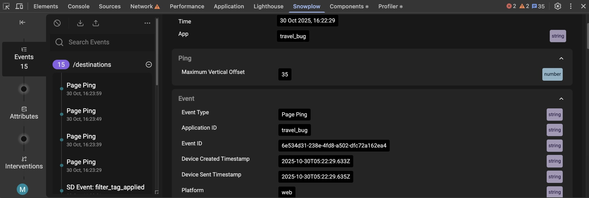

You'll now test your attributes to verify they're working correctly by generating behavioral events and checking that the attribute values update as expected.

You'll use the Snowplow Inspector browser extension to monitor both the events being sent to your collector and the resulting attribute values.

## Generate events

Start by generating events on your travel website:

1. Go to your [demo site](http://localhost:8086)
2. Click on **Destinations** in the top navigation bar
3. Click on any destination page
4. Refresh the page once you're on the destination page

## Check attribute values

Open your browser's developer console (Ctrl+Shift+I or equivalent) and navigate to the [Snowplow Inspector](https://chrome.google.com/webstore/detail/snowplow-inspector/maplkdomeamdlngconidoefjpogkmljm?hl=en) tab:

1. In the **Events** tab, verify you can see page view events being sent to your collector endpoint
2. In the **Attributes** tab, check that the `page_view_count` and `dest_page_view_count` attributes have non-zero values

If you're not using the Chrome extension, you can check the developer console logs instead. Note that the logs are output when the page is refreshed, so they may lag behind the values shown in the Inspector.

## Troubleshoot

If your attribute values appear as null or zero:

* Check that your events are being successfully sent to your collector
* If you're using event forwarding, verify your forwarding address is correct
* Ensure your Signals credentials are configured properly in the `.env` file

You can now move on to personalizing the website content using these attributes.
