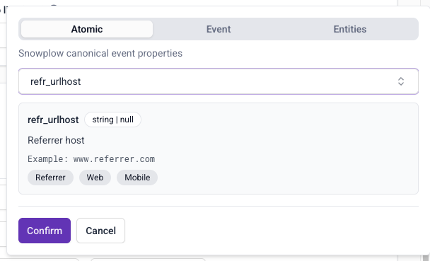
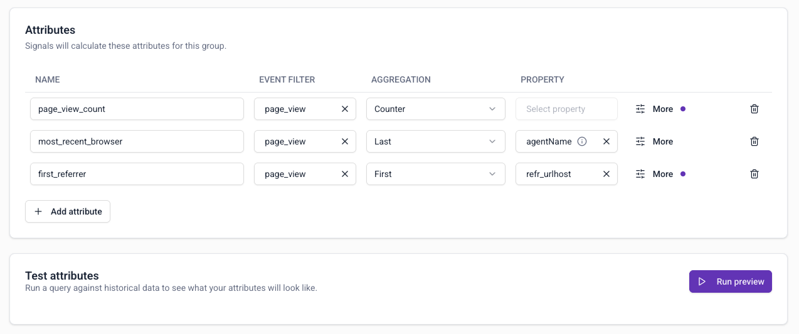

Attribute groups are where you define the data you want to calculate. To create an [attribute group](/docs/signals/concepts), go to **Signals** > **Attribute groups** in BDP Console and click **Create attribute group**.

Follow these instructions to configure Signals to calculate three different session metrics from page views in your real-time event stream:
* How many page views in the last 15 minutes for each session
* The last seen browser name for each session
* The first seen page referrer for each session

To learn how to define attribute groups using the Python SDK, check out the [Quick Start notebook](https://colab.research.google.com/github/snowplow-incubator/signals-notebooks/blob/main/quickstart.ipynb), hosted on Google Colab.

## Configure group information

Specify the basic configuration for your attribute group:

* **Name**: `quickstart_group`
* **Description**: Quick Start tutorial: page view session metrics
* **Source**: stream
* **Primary owner**: your email address

The name will be the group's unique identifier. The description and owner are optional.

Under the Configuration section, select the following:
* **Attribute key**: `domain_sessionid`
* **TTL**: leave as default

## Define attributes

Click **Add attribute** to create each one.

### Page view counter

The first attribute is a count of the number of page view events within the last 15 minutes. Enter `page_view_count` in the attribute name field.

To set the event to calculate this attribute from:
1. Click on the event filter field to bring up the event selection options
2. Page views are a built-in Snowplow event, so they'll be listed within the default **Snowplow events** tab
3. Click in the search box to find `page_view`
4. Click **Confirm** to add the event to the attribute

Leave the aggregation as `Counter`. No property is used for this aggregation, so leave the property field blank.

To set the time period:
1. Click on the **More** button
2. Update the time period to 15 minutes
3. Click **Done** to save

The purple dot next to **More** indicates that you have extended settings.

:::info Event processing limits
There's a limit on how many events can be considered for time-windowed [event processing in stream](/docs/signals/define-attributes/).
:::

### Most recent browser

The second attribute is the last seen browser name. The calculation makes use of the [YAUAA enrichment](/docs/pipeline/enrichments/available-enrichments/yauaa-enrichment/): the browser name is a field in the `yauaa_context` entity.

Create an attribute named `most_recent_browser`, and select `page_view` as before.

Choose the `Last` aggregation.

To set the property:
1. Click on the property selection field
2. Choose the **Entities** tab to search through all schemas that have been tracked as entities with your events
3. Use the search bar to search for `yauaa_context`
4. Select the entity `yauaa_context (nl.basjes)`
5. Select the `agentName` property
6. Click **Confirm** to save

### First referrer

The third attribute stores the first seen referrer path, based on the `refr_urlhost` [atomic event property](/docs/fundamentals/canonical-event/#platform-specific-fields).

Create an attribute named `first_referrer`, and select `page_view` as before.

Choose the `First` aggregation.

To set the property:
1. Click on the property selection field
2. Stay on the default **Atomic** tab to search through all atomic properties
3. Use the search bar to search for and select `refr_urlhost`
6. Click **Confirm** to save

For a trivial example of using criteria filters, add a filter to only consider events where the referrer is not an empty string.

To set the criteria filter:
1. Click on the **More** button
2. Click **Add criteria**
3. Choose the `page_referrer` atomic property and click **Confirm**
4. Change the operator to `not equals`
5. Leave the value blank
6. Click **Done** to return to the group details page

## Test the attribute definitions

Once you've added attributes, click **Run preview** to test your attribute group configuration.

This will calculate the attributes from your atomic events table using 10 random events from the last hour.

You should see something like this:

The first column shows the unique attribute key values, in this case for the session attribute key `domain_sessionid`.

## Save the attribute group

Once you're satisfied with the preview results, click **Create attribute group** to save it as a draft.

Click **Publish** to push this configuration to Signals and start calculating attributes.

