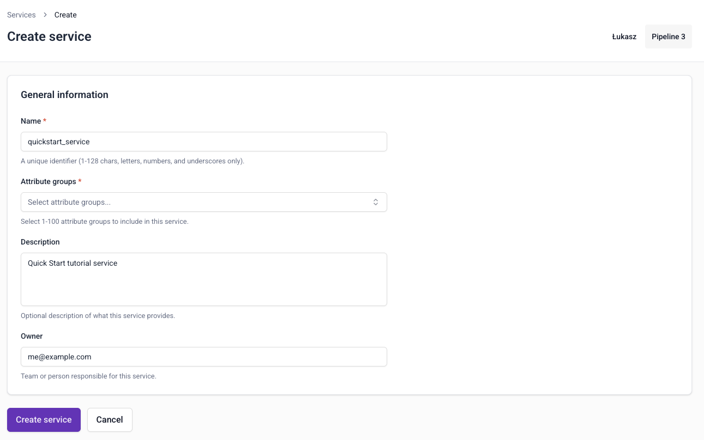
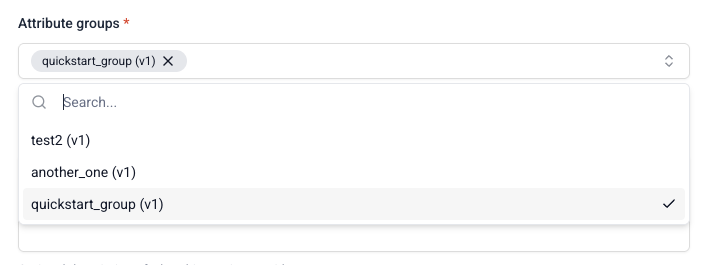
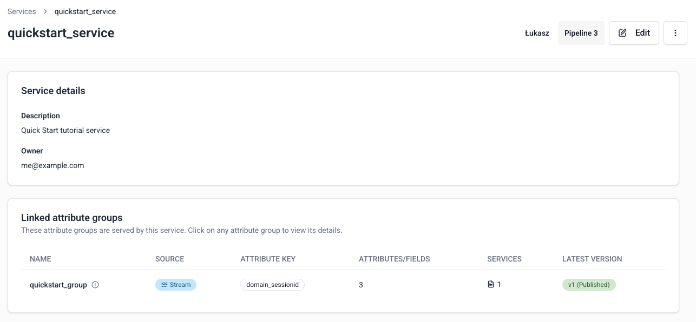

[Services](/docs/signals/concepts/#services) group attribute groups together for serving to your applications.

To create a service, go to **Signals** > **Services** in Snowplow Console and click **Create service**.

## Configure basic service information

Specify the configuration for your service:

* **Name**: `quickstart_service`
* **Description**: Quick Start tutorial service
* **Owner**: your email address

The name will be the service's unique identifier. The description and owner are optional.

## Select attribute groups

When choosing which attribute groups to include, you'll select a specific version of each attribute group.

To add an attribute group:
1. Click the attribute group selector
2. Search for and select the group you just created, `quickstart_group (v1)`

If `quickstart_group (v1)` attribute group isn't showing up, check that it's published.

## Create the service

Click **Create service** to save your service configuration. Services are automatically published as soon as they're created.

Your service is ready to use for retrieving attributes from the Profiles Store.
