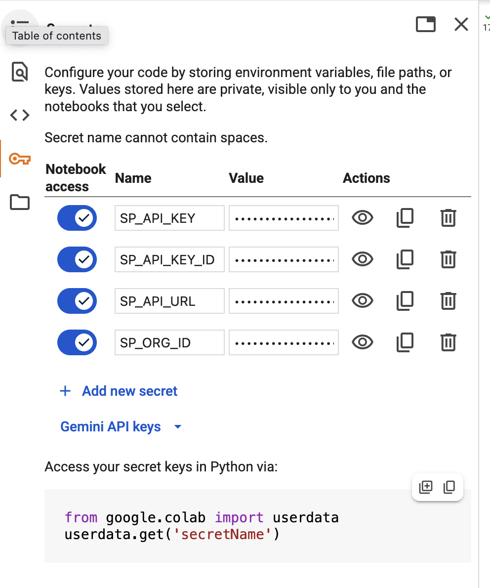

Choose where to store your Signals configurations. We recommend creating a new repository.

## Install the Python SDK

The easiest way to use the Python SDK is within a Jupyter notebook.

Create a new notebook in your repo. Add this code:

```bash
pip install snowplow-signals
```

Run this cell to install the SDK.

## Connect to Signals

The next step is to connect to your Signals deployment. You'll need this connection to test or apply your configuration, or retrieve calculated attributes from the Profiles Store.

Add your four connection tokens to the notebook secrets:
  * Signals API URL
  * API key
  * API key ID
  * Organization ID



Create a `Signals` object by passing in the required values:

```python
from snowplow_signals import Signals

sp_signals = Signals(
    api_url=userdata.get('SP_API_URL'),
    api_key=userdata.get('SP_API_KEY'),
    api_key_id=userdata.get('SP_API_KEY_ID'),
    org_id=userdata.get('SP_ORG_ID'),
)
```
