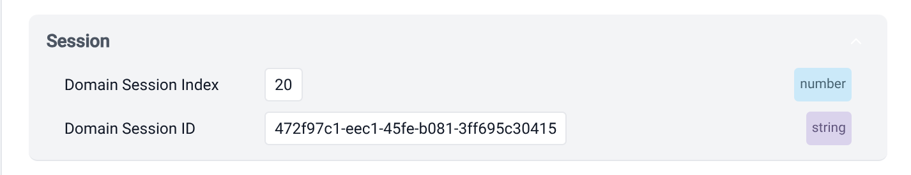
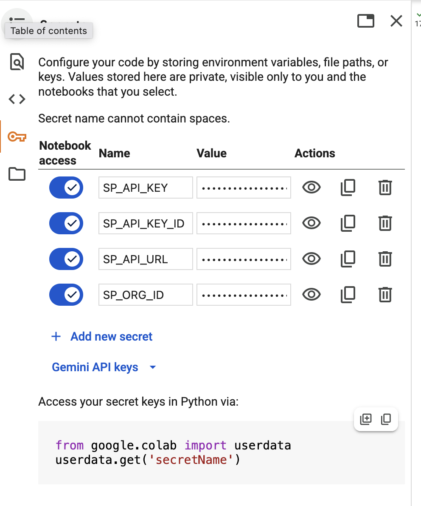

For a real use case, you'll want to consume calculated attributes in your applications. Read more about this [in the Signals documentation](/docs/signals/retrieve-attributes/).

For this tutorial, we've provided a [Jupyter notebook](https://colab.research.google.com/github/snowplow-incubator/signals-notebooks/blob/main/quickstart.ipynb) so you can quickly explore attribute retrieval using the Signals Python SDK.

## Finding your current session ID

In your real application code, you can access the current session ID and use it to retrieve the relevant attribute values. The attributes are being calculated in real time, in session. Read about how to access IDs such as `domain_sessionid` in your web application in [the JavaScript tracker](/docs/sources/trackers/web-trackers/cookies-and-local-storage/getting-cookie-values/#getdomainuserid) documentation.

To test this out, use the [Snowplow Inspector](/docs/data-product-studio/data-quality/snowplow-inspector/) browser extension to find out your current session ID on your web application. Click around and generate some page view events. Then find your `Domain Session ID` in the Inspector.



## Connecting to Signals

Install the [Signals Python SDK](https://pypi.org/project/snowplow-signals/) into the notebook, and connect to Signals.

1. Go to **Signals** > **Overview** in Snowplow Console to find your Signals credentials
2. Add them to the notebook secrets:



3. Install the SDK:

```python
%pip install snowplow-signals
```

4. Connect to Signals:

```python
from snowplow_signals import Signals
from google.colab import userdata

sp_signals = Signals(
    api_url=userdata.get('SP_API_URL'),
    api_key=userdata.get('SP_API_KEY'),
    api_key_id=userdata.get('SP_API_KEY_ID'),
    org_id=userdata.get('SP_ORG_ID'),
)
```

## Retrieving your session attributes

Use your current session ID to retrieve the attributes that Signals has just calculated about your session.

```python
response = sp_signals.get_service_attributes(
    name="quickstart_service",
    attribute_key="domain_sessionid",
    identifier="472f97c1-eec1-45fe-b081-3ff695c30415", # UPDATE THIS
)

df=response.to_dataframe()
df
```

The result should look something like this:

|     | `domain_sessionid`                     | `page_view_count` | `most_recent_browser` | `first_referrer` |
| --- | -------------------------------------- | ----------------- | --------------------- | ---------------- |
| 0   | `472f97c1-eec1-45fe-b081-3ff695c30415` | 2.0               | `Firefox`             | `snowplow.io`    |

### Retrieving single attributes

To retrieve individual attributes rather than using a service, use the `get_group_attributes()` method.

```python
response = sp_signals.get_group_attributes(
    name="quickstart_group",
    version=1,
    attributes=["page_view_count"],
    attribute_key="domain_sessionid",
    identifiers=["472f97c1-eec1-45fe-b081-3ff695c30415"]
)

df=response.to_dataframe()
df
```
