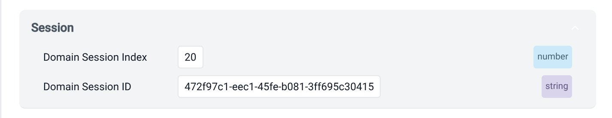
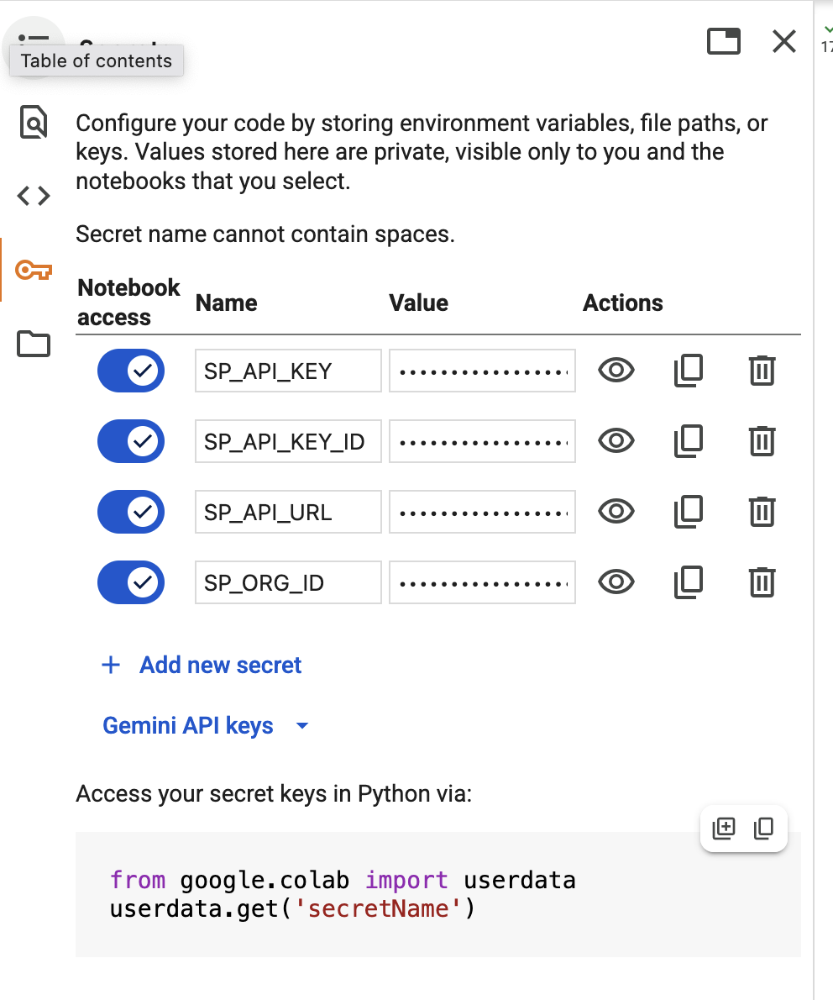

Signals is now calculating attributes from your real-time event stream. In this step, you'll verify the calculated values in your browser using the Snowplow Inspector extension, then retrieve them with the Signals Python SDK, the way your application would.

## Verify attributes in Snowplow Inspector

The quickest way to see your calculated attributes is the [Snowplow Inspector](/docs/testing/snowplow-inspector/) browser extension, without writing any code. Its [Signals integration](/docs/testing/snowplow-inspector/signals-integration/) connects to Signals and displays live attribute values for your own session in your browser developer tools.

To set up the integration, log in to Snowplow Console through the extension, and add API credentials for your organization in the extension options.

Once connected:

1. Go to your web application, and open the Inspector in your browser developer tools
2. Click around to generate some page view events: they'll appear in the **Events** tab
3. Switch to the **Attributes** tab to see the values Signals has calculated for your session

You should see the `quickstart_group` attribute group, with values for the `page_view_count`, `most_recent_browser`, and `first_referrer` attributes. The **Attributes** tab refreshes automatically as new events arrive: browse a few more pages and watch `page_view_count` increase.

## Use attributes in your application

For a real use case, you'll want to consume calculated attributes in your applications. Read more about this [in the Signals documentation](/docs/signals/attributes/).

For this tutorial, we've provided a [Jupyter notebook](https://colab.research.google.com/github/snowplow-incubator/signals-notebooks/blob/main/quickstart.ipynb) so you can quickly explore attribute retrieval using the Signals Python SDK.

### Find your current session ID

In your real application code, you can access the current session ID and use it to retrieve the relevant attribute values. The attributes are being calculated in real time, in session. Read about how to access IDs such as `domain_sessionid` in your web application in [the JavaScript tracker](/docs/sources/web-trackers/cookies-and-local-storage/getting-cookie-values) documentation.

To test this out, use the Inspector to find your current session ID on your web application. Find your `Domain Session ID` in the **Events** tab.



### Connect to Signals

Install the [Signals Python SDK](https://pypi.org/project/snowplow-signals/) into the notebook, and connect to Signals.

1. Go to **Signals** > **Overview** in Snowplow Console to find your Signals credentials
2. Add them to the notebook secrets:



3. Install the SDK:

```python
%pip install snowplow-signals
```

4. Connect to Signals:

```python
from snowplow_signals import Signals
from google.colab import userdata

sp_signals = Signals(
    api_url=userdata.get('SP_API_URL'),
    api_key=userdata.get('SP_API_KEY'),
    api_key_id=userdata.get('SP_API_KEY_ID'),
    org_id=userdata.get('SP_ORG_ID'),
)
```

### Retrieve your session attributes

Use your current session ID to retrieve the attributes that Signals has just calculated about your session.

```python
import pandas as pd

attributes = sp_signals.get_service_attributes(
    name="quickstart_service",
    attribute_key="domain_sessionid",
    identifier="472f97c1-eec1-45fe-b081-3ff695c30415", # UPDATE THIS
)

pd.DataFrame([attributes])
```

The result should look something like this:

| `page_view_count` | `most_recent_browser` | `first_referrer` |
| ----------------- | --------------------- | ---------------- |
| 2.0               | `Firefox`             | `snowplow.io`    |

The values should match what you saw in the Inspector's **Attributes** tab.

### Retrieve single attributes

To retrieve individual attributes rather than using a service, use the `get_group_attributes()` method.

```python
attributes = sp_signals.get_group_attributes(
    name="quickstart_group",
    version=1,
    attributes=["page_view_count"],
    attribute_key="domain_sessionid",
    identifier="472f97c1-eec1-45fe-b081-3ff695c30415", # UPDATE THIS
)

pd.DataFrame([attributes])
```
