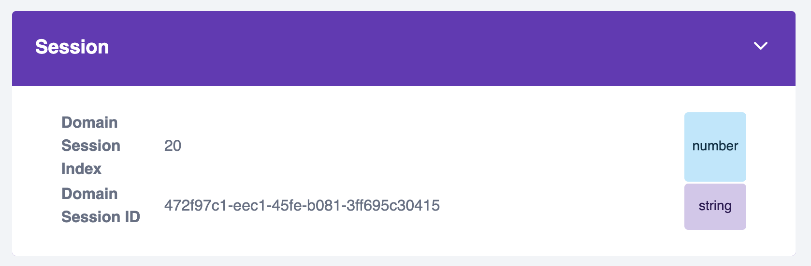

For a real use case, you'll want to retrieve calculated attributes into your applications.

You can use the Python SDK and Node.js SDKs to retrieve attributes from the Profiles Store, or the Signals API directly. Read about these options [in the Signals documentation](/docs/signals/retrieval/).

For this tutorial, you'll retrieve attributes into your notebook. Add a new cell for getting values.

## Using a service (recommended)

When retrieving calculated attributes, specify an instance of the relevant attribute key, in this case a `domain_sessionid`. This will return all the attributes defined in `my_quickstart_service` for this session.

```python
response = sp_signals.get_service_attributes(
    source="my_quickstart_service",
    attribute_key="domain_sessionid",
    identifier="d99f6db1-7b28-46ca-a3ef-f0aace99ed86",
)

df=response.to_dataframe()
df
```

## Using an attribute group

You can also retrieve calculated attributes for individual attribute groups. This isn't recommended for production use, where services are a better idea, but it can be useful for testing.

There are two methods to do this, depending if you have the attribute group instance available or not:

```python
# Option 1 (if you have the attribute group instance)
response = my_attribute_group.get_attributes(
    signals=sp_signals,
    identifier="d99f6db1-7b28-46ca-a3ef-f0aace99ed86",
)

# Option 2 (if you don't have the attribute group instance)
response = sp_signals.get_attributes(
    name="my_quickstart_attribute_group",
    version=1,
    attributes=["page_view_count", "most_recent_browser", "first_referrer"],
    attribute_key="domain_sessionid",
    identifiers=["d99f6db1-7b28-46ca-a3ef-f0aace99ed86"]
)

df=response.to_dataframe()
df
```

## Retrieving attributes for your current session

In your real application code, you can access the current session ID and use it to retrieve the relevant attribute values. The attributes are being calculated in near real time, in session. Read about how to access IDs such as `domain_sessionid` in your web application in [Getting cookie information](/docs/sources/trackers/web-trackers/cookies-and-local-storage/getting-cookie-values/#getdomainuserid).

To test this out, use the [Snowplow Inspector](/docs/data-product-studio/data-quality/snowplow-inspector/) browser extension to find out your current session ID on your web application. Click around and generate some page view events. Then find your `Domain Session ID` in the Inspector.



Use this identifier to retrieve the attributes that Signals has just calculated about your session.

|     | `domain_sessionid`                     | `page_view_count` | `most_recent_browser` | `first_referrer` |
| --- | -------------------------------------- | ----------------- | --------------------- | ---------------- |
| 0   | `472f97c1-eec1-45fe-b081-3ff695c30415` | 2.0               | `Firefox`             | `snowplow.io`    |
