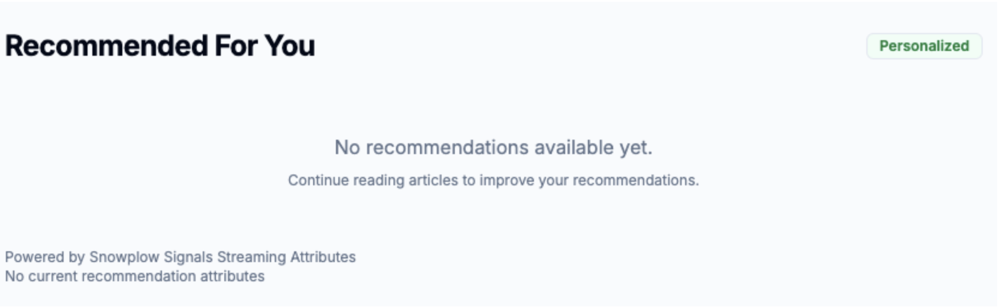
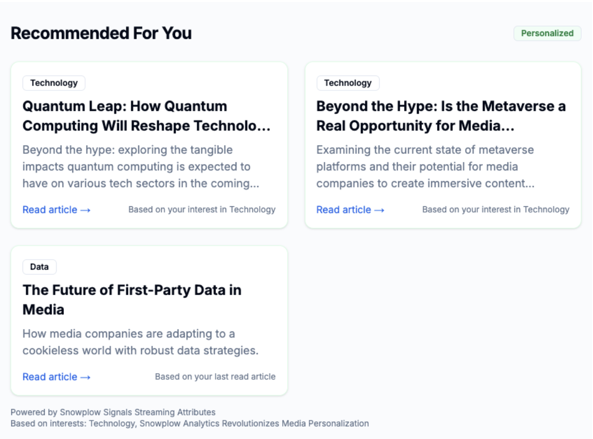

Personalisation is no longer a nice to have, consumers are expecting it. According to [McKinsey](https://www.mckinsey.com/capabilities/growth-marketing-and-sales/our-insights/enhancing-customer-experience-in-the-digital-age), 71% of consumers expect companies to deliver personalised experiences and 76% will switch if they don't like their experience. Snowplow Signals allows companies to personalise the user experience based on their behaviour to increase engagement, conversion, and retention.

In the example shown in this tutorial, we will personalise the experience for a newspaper website to increase customer engagement by recommending articles to customers based on their own reading habits. By keeping users engaged we can either increase our publisher ad revenue, or display paid content to a user that we know they are more likely to engage with and consequently convert to a paying subscriber.

This tutorial guides you through using Snowplow Signals to create personalized recommendations for anonymous users based on their behavioral data.  By the end, you'll understand how to configure Snowplow Signals and integrate them into your app to deliver personalized experiences.

We will use a NextJS newspaper website as an example but the principles can be applied to many use cases.  The focus will be on turning Snowplow events into real-time Signal attributes rather than on the recommendation algorithm itself which will be simplified. 

### Before Personalization

### After Personalization

## High-Level Architecture Overview

The following diagram illustrates the data flow from the user's activity on the website to the personalized recommendation they see.

### Key Components

1.  **Website with Snowplow Events**: Users browse the website, and the Snowplow SDK sends `page_view` and `article_detail` events.  The `article_detail` event includes the article's title and category (e.g., Business, Technology). 
2.  **Snowplow Signals Profiles API**: Snowplow events stream into Snowplow Signals, where they are aggregated in real-time based on predefined attributes. 
3.  **Recommendation API Service**: When a user visits the homepage, the website calls an internal API (`/api/recommended-articles`).  This service fetches the user's real-time attributes from the Profiles API and recommends articles based on their most-read categories and articles similar to their last-read one. 

## Prerequisites & Assumptions

This tutorial assumes you have a basic understanding of Snowplow Event Tracking and how APIs work. 

The complete code for this example is available in [this repository](https://github.com/snowplow/snowplow-media-demo).  To run it yourself, you will need: 
* A running Snowplow pipeline. 
* Snowplow Signals deployed on your pipeline. 