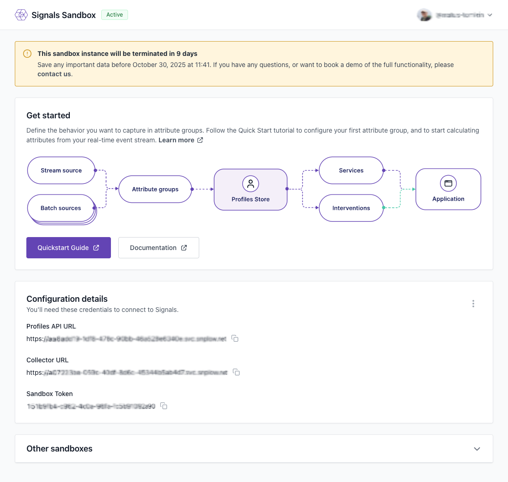

The first step is to create your Signals Sandbox deployment. This will provide you with a dedicated Signals environment and the credentials needed to connect to it.

## Deploy your Sandbox instance

1. Visit the [Signals Sandbox website](https://try-signals.snowplow.io/).
2. Click the button to sign in with your GitHub account.
5. Wait for the deployment to complete. This typically takes a few minutes.

Once your deployment is ready, you'll receive three important pieces of information:

* **Profiles API URL**: the endpoint for accessing your Signals Profiles API (e.g., `https://your-sandbox.signals.snowplowanalytics.com`)
* **Collector URL**: the Snowplow Collector endpoint for tracking events (e.g., `https://collector-sandbox.snowplow.io`)
* **Sandbox Token**: your authentication token for the Profiles API



:::note

Keep your credentials safe. The Sandbox Token provides access to your Signals instance. While the Sandbox is temporary and for testing purposes only, treat these credentials carefully.

:::

## Set up your Jupyter notebook environment

You can use either Google Colab or a local Jupyter notebook environment for this tutorial.

If you want to skip ahead, you can make use of the following notebook that contain all the Python code you'll need for this tutorial:

1. [Python notebook on Google Colab](https://colab.research.google.com/github/snowplow-incubator/signals-sandbox-ecom-demo/blob/main/attributes_and_interventions.ipynb)
2. [Jupyter notebook on GitHub](https://github.com/snowplow-incubator/signals-sandbox-ecom-demo/blob/main/attributes_and_interventions.ipynb)

### Using Google Colab

You can use the provided notebook, or create your own. To create a new notebook, open a new notebook at [Google Colab](https://colab.research.google.com/).

You'll need to add credentials as Colab secrets. Click the key icon in the left sidebar, and add three secrets:
  * `SP_API_URL`: your Profiles API URL
  * `SP_SANDBOX_TOKEN`: your Sandbox Token
  * `SP_COLLECTOR_URL`: your Collector URL (optional, for reference)

When you run the notebook, it will ask for access to the secrets. Choose to grant access.

If you're using your own notebook, follow these steps:
1. Install the Signals Python SDK:

```python
%pip install snowplow-signals
```

2. Load your credentials in the notebook:

```python
from google.colab import userdata
import os

os.environ["SP_API_URL"] = userdata.get('SP_API_URL')
os.environ["SP_SANDBOX_TOKEN"] = userdata.get('SP_SANDBOX_TOKEN')
```

### Using local Jupyter

Navigate into your working directory and environment, then follow these steps:

1. Install Jupyter and the Signals SDK:

```bash
pip install jupyter snowplow-signals python-dotenv
```

2. Create a `.env` file in your working directory:

```text
SP_API_URL=your_profiles_api_url
SP_SANDBOX_TOKEN=your_sandbox_token
```

3. Start Jupyter notebook:

```bash
jupyter notebook
```

4. In your notebook, load the environment variables:

```python
from dotenv import load_dotenv
load_dotenv()
```

## Connect to the Sandbox

Now you're ready to connect to your Signals Sandbox instance using the Python SDK.

```python
from snowplow_signals import SignalsSandbox
import os

sp_signals = SignalsSandbox(
    api_url=os.environ["SP_API_URL"],
    sandbox_token=os.environ["SP_SANDBOX_TOKEN"],
)
```

:::tip

The `SignalsSandbox` class is specifically designed for Sandbox environments. For production Snowplow deployments, you would use the `Signals` class instead, which requires API keys.

:::

You're now ready to start defining attributes and interventions in your Signals Sandbox.
