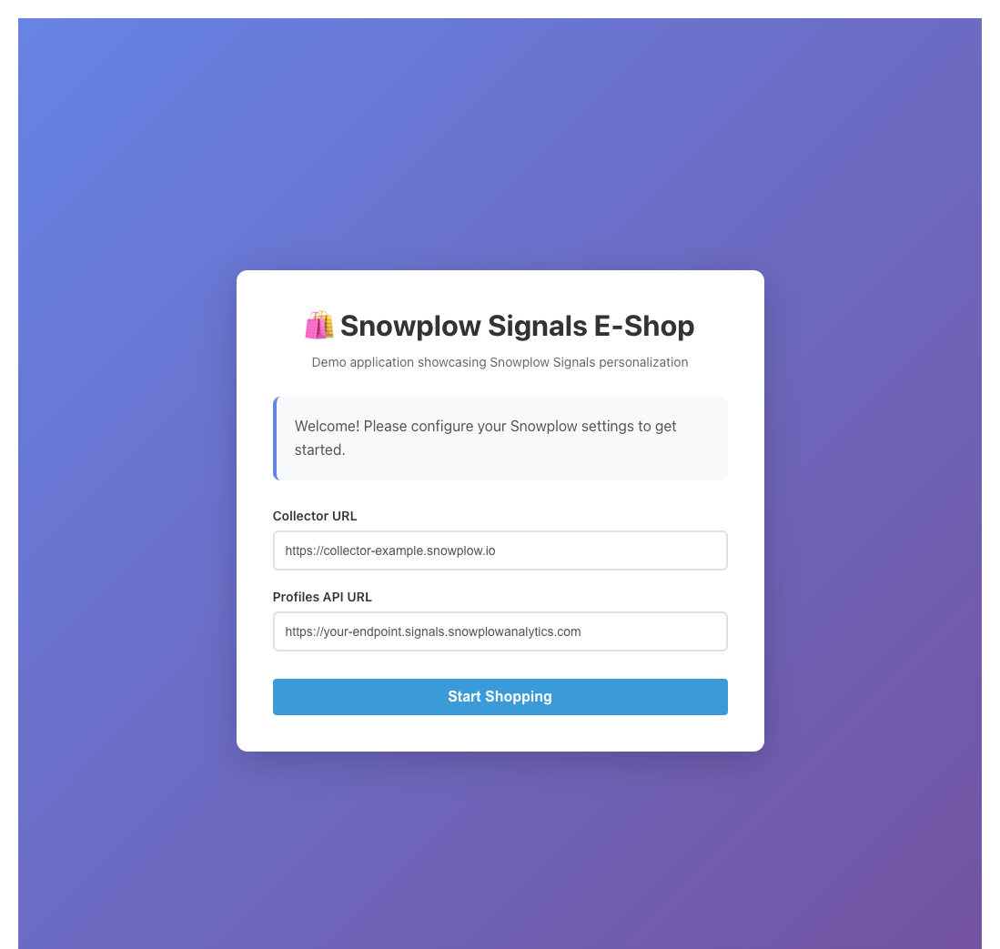
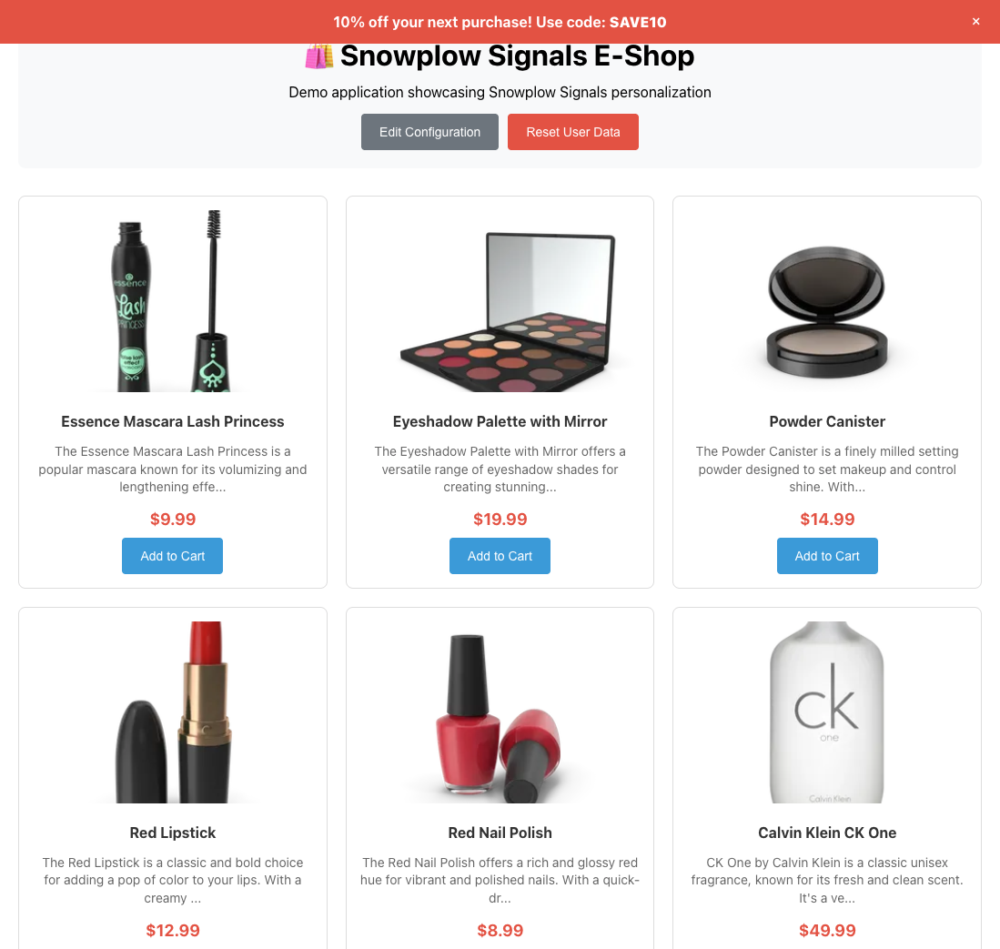

Now that you've defined attributes and interventions, it's time to see them work in a real application. We have a prepared a demo React application that can integrate with your Sandbox instance to demonstrate real-time personalization.

## Access the demo application

The demo application is deployed at:

[https://snowplow-incubator.github.io/signals-sandbox-ecom-demo/](https://snowplow-incubator.github.io/signals-sandbox-ecom-demo/)

When you first open the app, you'll see a configuration screen.

## Configure the demo app

Enter your Sandbox credentials from the setup step:

* **Collector URL**: your Snowplow Collector endpoint
* **Profiles API URL**: your Signals Profiles API endpoint

The app will store these values in your browser's local storage, so you won't need to enter them again during this session.

Click **Start Shopping** to proceed to the e-shop.

## Understanding the demo app

The demo application features:

* **Product catalog**: products fetched from an external API
* **Snowplow tracking**: the [JavaScript tracker](/docs/sources/trackers/web-trackers/) with the [e-commerce plugin](/docs/sources/trackers/web-trackers/tracking-events/ecommerce/)
* **Intervention display**: the [browser tracker plugin](/docs/signals/receive-interventions/#using-the-browser-tracker-plugin) to receive and show intervention banners
* **Reset functionality**: ability to clear your user data and start fresh

## Test your interventions

Follow these steps to trigger each intervention:

### Trigger the discount intervention

1. Browse the product catalog
2. Click on different products to view their details
3. After viewing more than 3 products, you should see a banner appear at the top:
   * **Message**: "10% off your next purchase!"
   * **Code**: `SAVE10`

### Trigger the cart abandonment intervention

1. Click **Add to Cart** on any product
2. After adding at least one item, you should see:
   * **Message**: "Don't forget your items in cart!"

### Trigger the free shipping intervention

1. Add multiple items to your cart until the total value exceeds $100
2. You should see:
   * **Message**: "Free shipping on orders over $100!"
   * **Code**: `FREE`

## Behind the scenes

Here's what happens when you interact with the demo app:

1. **Event tracking**: when you view a product or add to cart, the JavaScript tracker sends an e-commerce event to your Sandbox Collector
2. **Attribute calculation**: Signals processes the event and updates your user attributes in real time
3. **Intervention evaluation**: Signals checks if any intervention criteria are now met
4. **Delivery**: if an intervention triggers, Signals sends it to the browser via Server-Sent Events (SSE)
5. **Display**: the browser tracker plugin receives the intervention and your application displays the appropriate banner

## Reset and experiment

You can click **Reset User Data** to clear your current user session and start testing again with a fresh profile. This generates a new `domain_userid` so you can re-trigger interventions.

## Exploring the implementation

The demo app is open source. You can explore the implementation in the [GitHub repository](https://github.com/snowplow-incubator/signals-sandbox-ecom-demo):

* **Tracker setup**: see how the Snowplow tracker and Signals plugin are initialized in `app/src/snowplow.ts`
* **Intervention handling**: see how interventions are received and displayed in `app/src/App.tsx`
* **Attribute definitions**: review the Python notebook `attributes_and_interventions.ipynb` that you followed in this tutorial

You've successfully configured Signals to calculate real-time attributes and trigger personalized interventions based on user behavior!
