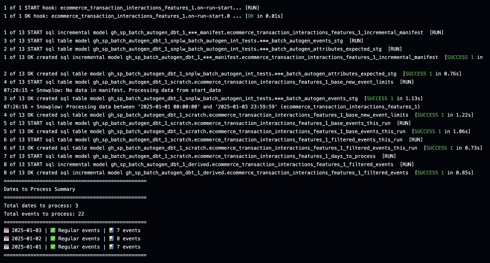

Now that your models are generated, it's time to run them and verify that everything works as expected. This step allows you to test your models locally before moving them to production.

## Prerequisites

Before running your models, make sure you have:

- A properly configured dbt profile for your data warehouse
- The necessary permissions to create tables and views
- Access to your data warehouse

## Running Your Models

### First Run

For your first run, you'll want to do a full refresh to ensure all tables are created properly:

```bash
dbt run --full-refresh
```



### Subsequent Runs

For later runs, you can use the standard command:

```bash
dbt run
```

## What to Expect

During the run process:

1. dbt will compile your SQL models
2. Tables and views will be created in your data warehouse
3. You'll see progress updates in the terminal
4. Any errors will be clearly displayed

## Best Practices

To ensure successful model runs:

1. Always test your models after generation
2. Review the generated SQL for accuracy
3. Document any custom modifications you make
4. Keep track of model versions
5. Regularly update your models as your data evolves

## Testing and Validation

This local testing phase is your opportunity to:

- Verify that the generated models meet your requirements
- Make any necessary adjustments to the models
- Explore the data transformations
- Ensure data quality and accuracy

## Next Steps

After you're satisfied with your local testing results, you can proceed to materialize these models to your feature store for production use. 