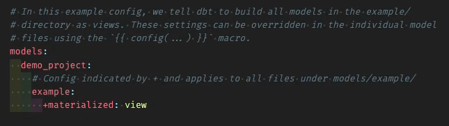

Installing the package:

1. Run the following command in a new directory to create a new dbt project

    ```bash
    dbt init
    ```

2. Set up a profile to connect to the warehouse where you have your Snowplow events.

    ```yaml
    profile: 'demo_project'
    ```

3. Create a new `packages.yml` file.
4. Paste the latest version of the Snowplow Unified package. You could also use a range here if you want to keep up to date with more recent versions or you can you can hard pin to a specific version.

    ```bash

    packages:
      - package: snowplow/snowplow_unified
        version: [">=0.4.0"]
    ```

5. Type the following to install the package into this project:

    ```bash
    dbt deps
    ```

6. In your `project.yml` copy across our dispatch piece so that you're using our macros over the dbt core ones. We do this because we have a slightly more optimized upsert which saves you time and cost on your on your cloud warehouse bill.

    ```bash
    dispatch:
      - macro_namespace: dbt
        search_order: ['snowplow_utils', 'dbt']
    ```

7. Delete some of the other default pieces that are in the default project as they are not needed.

    

## Setting Variables

Now we’ll get to using our variables, which is how you enable the parts of the model that are relevant to your use-case.

1. Define the location of your source data within your `vars` block where your raw events are being loaded into. Make sure to update these with your actual table names!

    ```yaml
    vars:
      snowplow_unified:
        snowplow__atomic_schema: schema_with_snowplow_events
        snowplow__database: database_with_snowplow_events
    ```

:::info Databricks only

Please note that your `target.database` is NULL if using Databricks. In Databricks, schemas and databases are used interchangeably and in the dbt implementation of Databricks therefore we always use the schema value, so adjust your `snowplow__atomic_schema` value if you need to.

Add the following variable to your dbt project's `dbt_project.yml` file

```yml title="dbt_project.yml"
vars:
  snowplow_unified:
    snowplow__databricks_catalog: 'hive_metastore'
```
Depending on the use case it should either be the catalog (for Unity Catalog users from databricks connector 1.1.1 onwards, defaulted to 'hive_metastore') or the same value as your `snowplow__atomic_schema` (unless changed it should be 'atomic'). This is needed to handle the database property within `models/base/src_base.yml`.

A more detailed explanation for how to set up your Databricks configuration properly can be found in [Unity Catalog support](/docs/modeling-your-data/modeling-your-data-with-dbt/dbt-configuration/#unity-catalog-support).

:::


2. Unified Digital assumes you are modeling both web and mobile events and expects certain fields to exist based on this. If you are only tracking and modeling e.g. web data, you can disable the other as below:

```yml title="dbt_project.yml"
vars:
  snowplow_unified:
    snowplow__enable_mobile: false
    snowplow__enable_web: true
```

3. Enable [entities](/docs/fundamentals/entities/) to make sure that they're processed within the package - this means they will be un-nested from the atomic columns and made available in the derived tables. Make sure to only enable the ones you need.

    ```yaml
    vars:
      snowplow_unified:
        snowplow__enable_iab: true
        snowplow__enable_ua: true
        snowplow__enable_yauaa: true
        snowplow__enable_browser_context: true
        snowplow__enable_mobile_context: true
        snowplow__enable_geolocation_context: true
        snowplow__enable_application_context: true
        snowplow__enable_screen_context: true
        snowplow__enable_deep_link_context: true
        snowplow__enable_consent: true
        snowplow__enable_cwv: true
        snowplow__enable_app_errors: true
        snowplow__enable_screen_summary_context: true
    ```

4. Set up some initial conditions for our app. So we need to go in here and we need to just set the start date to be whenever you've started tracking your data from:

    ```yaml
    vars:
      snowplow_unified:
        snowplow__start_date: 'yyyy-mm-dd'
    ```

5. Optimize your data processing

There are ways how you can deal with [high volume optimizations](/docs/modeling-your-data/modeling-your-data-with-dbt/dbt-custom-models/high-volume-optimizations/) at a later stage, if needed, but you can do a lot upfront by selecting carefully which variable to use for `snowplow__session_timestamp`, which helps identify the timestamp column used for sessionization. This timestamp column should ideally be set to the column your event table is partitioned on. It is defaulted to `collector_tstamp` but depending on your loader it can be the `load_tstamp` as the sensible value to use:

```yml title="dbt_project.yml"
vars:
  snowplow_unified:
    snowplow__session_timestamp: 'load_tstamp'
```

:::info BigQuery Only
Verify which column your events table is partitioned on. It will likely be partitioned on `collector_tstamp` or `derived_tstamp`. If it is partitioned on `collector_tstamp` you should set `snowplow__derived_tstamp_partitioned` to `false`. This will ensure only the `collector_tstamp` column is used for partition pruning when querying the events table:

```yml title="dbt_project.yml"
vars:
  snowplow_unified:
    snowplow__derived_tstamp_partitioned: false
```
:::

6. Configure more vars as necessary but theoretically this is all you need just to get started. If you are unsure whether the default values set are good enough in your case or you would already like to maximize the potential of your models, you can dive deeper into the meaning behind our variables on our [Config](/docs/modeling-your-data/modeling-your-data-with-dbt/dbt-configuration/unified/) page. It includes a [Config Generator](/docs/modeling-your-data/modeling-your-data-with-dbt/dbt-configuration/unified/#config-generator) to help you create all your variable configurations, if necessary.

7. Filter your data set

You can specify both `start_date` at which to start processing events and the `app_id`'s to filter for. By default the `start_date` is set to `2020-01-01` and all `app_id`'s are selected. To change this please add the following to your `dbt_project.yml` file:

```yml title="dbt_project.yml"
vars:
  snowplow_unified:
    snowplow__start_date: 'yyyy-mm-dd'
    snowplow__app_id: ['my_app_1','my_app_2']
```

Below we list a few more that might be of interest depending on your setup or modelling needs:

 - Enable extras
The package comes with additional modules and functionality that you can enable, for more information see the [consent tracking](/docs/modeling-your-data/modeling-your-data-with-dbt/dbt-models/dbt-unified-data-model/consent-module), [conversions](/docs/modeling-your-data/modeling-your-data-with-dbt/dbt-models/dbt-unified-data-model/conversions/), and [core web vitals](/docs/modeling-your-data/modeling-your-data-with-dbt/dbt-models/dbt-unified-data-model/core-web-vitals-module) documentation.

- adjust page ping variables, if needed
The Unified Digital Model processes page ping events to calculate web page engagement times. If your [tracker configuration](/docs/sources/web-trackers/tracking-events/#activity-tracking-page-pings) for `min_visit_length` (default 5) and `heartbeat` (default 10) differs from the defaults provided in this package, you can override by adding to your `dbt_project.yml`:

```yml title="dbt_project.yml"
vars:
  snowplow_unified:
    snowplow__min_visit_length: 5 # Default value
    snowplow__heartbeat: 10 # Default value
```

## Adding the `selectors.yml` file

Within the packages we have provided a suite of suggested selectors to run and test the models within the package together with the Unified Digital Model. This leverages dbt's [selector flag](https://docs.getdbt.com/reference/node-selection/syntax). You can find out more about each selector in the [YAML Selectors](/docs/modeling-your-data/modeling-your-data-with-dbt/dbt-operation/#yaml-selectors) section.

These are defined in the `selectors.yml` file ([source](https://github.com/snowplow/dbt-snowplow-unified/blob/main/selectors.yml)) within the package, however in order to use these selections you will need to copy this file into your own dbt project directory. This is a top-level file and therefore should sit alongside your `dbt_project.yml` file. If you are using multiple packages in your project you will need to combine the contents of these into a single file.

## Running the package

Run dbt_seed to make sure you see some data, so we have some seeds in our packages, run that in there, and then run the actual model.

    ```yaml
    dbt seed --select snowplow_unified --full-refresh
    dbt run --selector snowplow_unified
    ```
