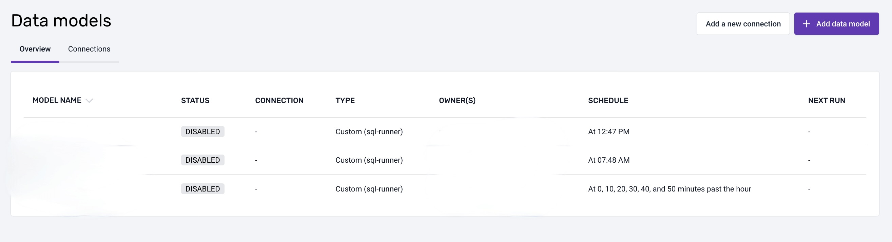
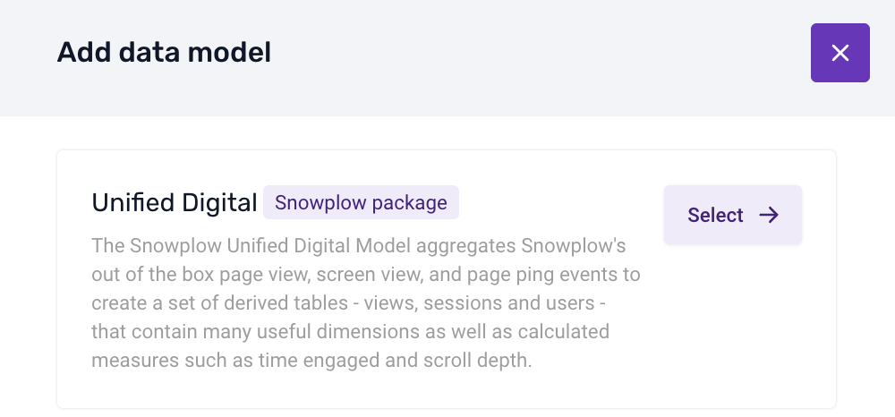
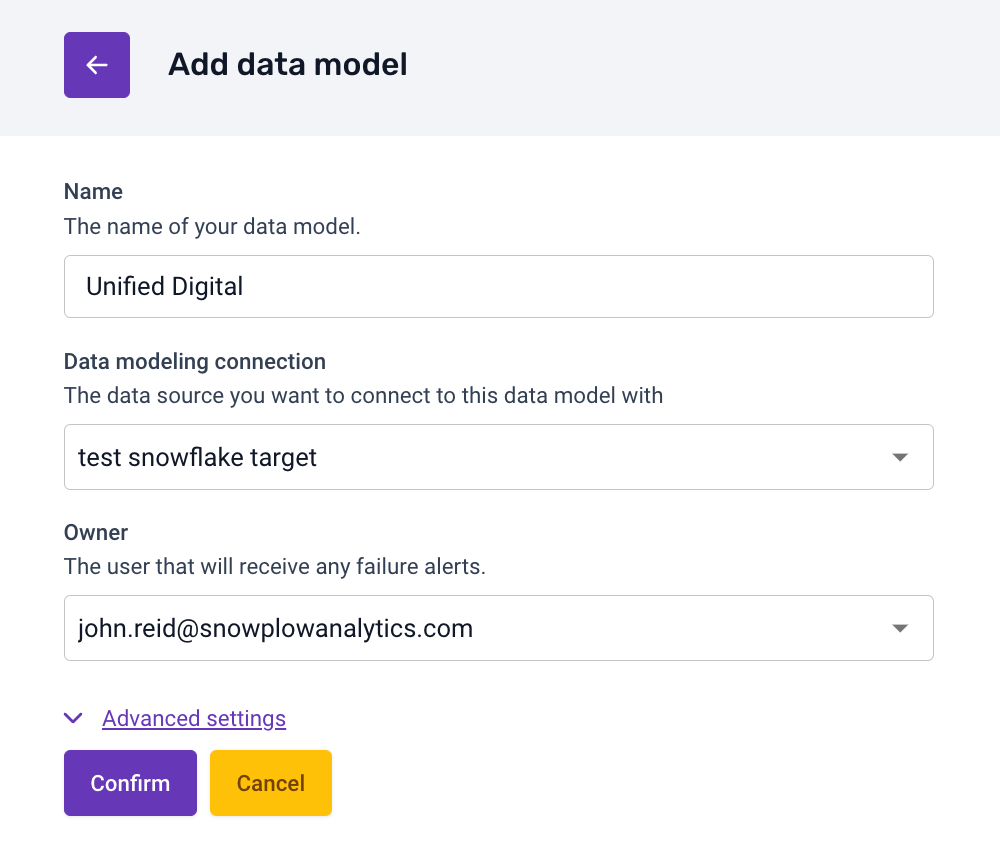
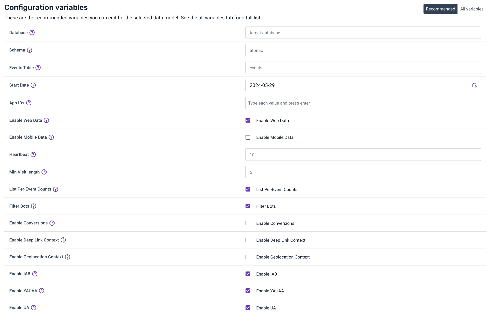
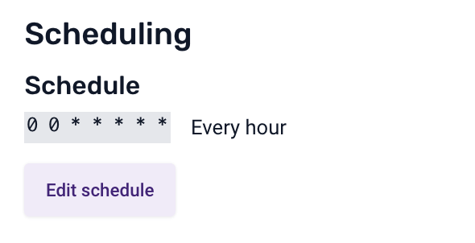

Snowplow provides a fully managed service for running data models. We recommend this if you are just getting started out, or don’t anticipate needing to build your own custom models. To get started, follow these steps:

1. Navigate to the Data models section of the Snowplow Console and click `Add data model`

1. Select `Unified Digital`

1. Set a name, warehouse connection and owner who will receive failure alerts.

1. Edit your configuration variables. Pay particular attention to web and mobile data, and the core enrichments e.g. IAB, YAUAA. This means they will be un-nested from the atomic columns and made available in the derived tables.
 For a more detailed guide check out the [Setting Variables](/tutorials/unified-digital/setting-up-locally/#setting-variables) section of the local setup section of this tutorial.

1. Set a schedule - use a CRON editor if necessary

1. Enable the model by clicking the Enable button in the top right

