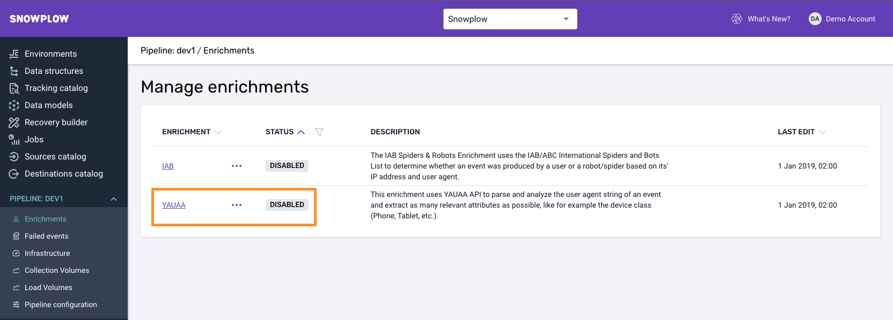
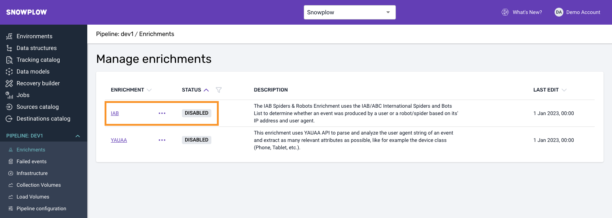

An enrichment either updates or populates fields of the atomic event or adds a self-describing context to derived_contexts. For this project, you need to enable the [YAUAA](https://docs.snowplow.io/docs/enriching-your-data/available-enrichments/yauaa-enrichment/) enrichment and it is highly advised to enable the [IAB](https://docs.snowplow.io/docs/enriching-your-data/available-enrichments/iab-enrichment/) Spiders and Robots enrichment.

## YAUAA

YAUAA (Yet Another User Agent Analyzer) enrichment is a powerful user agent parser and analyzer.

It uses the [YAUAA API](https://yauaa.basjes.nl/) to parse and analyze all user agent information of an HTTP request and extract as many relevant information as possible about the user's device and browser, like for instance the device class (Phone, Tablet, etc.).

The YAUAA enrichment is required in the web performance measurement context in order to be able to properly segment your data based on device, user agent name, version and more.

### Enabling it in BDP

For BDP users, you can navigate under your selected pipeline **Enrichments** section and find the YAUAA enrichment. Click on the enrichment for instructions on how to enable it or contact us.

### Open source

For Snowplow open source users, you can refer to the enrichment [documentation](https://docs.snowplow.io/docs/enriching-your-data/available-enrichments/yauaa-enrichment/).

## IAB Spiders and Robots

The IAB Spiders and Robots enrichment uses the [IAB/ABC International Spiders and Bots List](https://iabtechlab.com/software/iababc-international-spiders-and-bots-list/) to determine whether an event was produced by a user or a robot/spider based on its IP address and user agent.

Spiders and bots are sometimes considered a necessary evil of the web. We want search engine crawlers to find our site, but we also don't want a lot of non-human traffic clouding our reporting.

The Interactive Advertising Bureau (IAB) is an advertising business organization that develops industry standards, conducts research, and provides legal support for the online advertising industry. Their internationally recognized list of spiders and bots is regularly maintained to try and identify the IP addresses of known bots and spiders.

The IAB enrichment should be used to filter out web performance measurements coming from known bots and spiders that can add anomalies and noise to the analysis process.

### Enabling it in BDP

For BDP users, you can navigate under your selected pipeline **Enrichments** section and find the IAB enrichment. Click on the enrichment for instructions on how to enable it or contact us.

### Open source

For Snowplow open source users, you can refer to the enrichment [documentation](https://docs.snowplow.io/docs/enriching-your-data/available-enrichments/iab-enrichment/).
