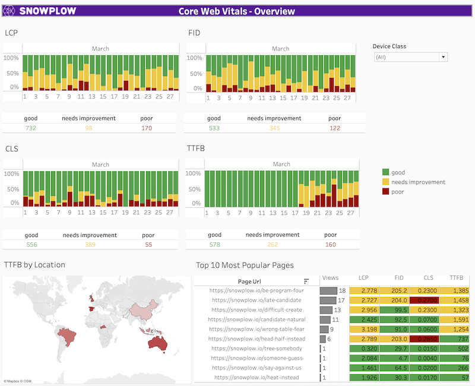

In this section, we'll give you a brief, but important, overview of why web performance data collection and monitoring is imperative to successful online business efforts.

## Why care about web performance?

Business success for a conversion-oriented web property, commerce or not, is undoubtedly dependent on delivering a great experience to the users interested in its offering. When loading a webpage, either on mobile or desktop, the perceived experience of a user depends on a few standard factors. These factors and their corresponding measurements converge into a few categories:

- **Perceived load speed**: how quickly a page can load and render all of its visual elements to the screen
- **Load responsiveness**: how quickly a page can load and execute any required JavaScript code in order for components to respond quickly to user interaction
- **Runtime responsiveness**: after page load, how quickly can the page respond to user interaction
- **Visual stability**: do elements on the page shift in ways that users don't expect and potentially interfere with their interactions?
- **Smoothness**: do transitions and animations render at a consistent frame rate and flow fluidly from one state to the next?

All of the above types of experience characteristics can be quantified in a best-effort way by monitoring and analyzing metrics which belong to the web performance category.

## Why track web vital metrics for your site?

One initiative which brought some attention into the website experience space is Google's [Core Web Vitals](https://web.dev/vitals/). Core Web Vitals are described as _quality signals that are essential to delivering a great user experience on the web_.

These metrics have, for quite some time now, been officially a factor for the Google algorithm for ranking pages in their search results. This fact makes any Core Web Vital metrics almost directly correlated to increased visitation and engagement on your site.

That is also the reason why we consider this accelerator a basic step to reaching the first milestone in monitoring these important site metrics.

## Website performance dashboard

To gain the most value out of web performance data, we recommend setting up a dashboard so that you can monitor the progress and spot any changes to your website's accessibility. We have included a sample dashboard that you can gain inspirations from as part of this accelerator (see the Visualize section). Let's go through the individual sections so that you can have a deeper understanding of some of the suggested visualizations you can use in your own monitoring dashboard.

### Core Web Vitals

Main dashboard with the most important metrics: LCP, FID, CLS and TTFB with most important dimensions such as period, device, top 10 most popular pages and location. This could be used to have an understanding about the overall performance of your website in the given period (28 days by default).

### Low performing URLs

Dashboard focusing on the worst performing URLs. This should help focus on the areas to improve.

### Core Web Vitals by period

Core Web Vital visuals tracked across time. You can monitor the health of your website and notice any unexpected changes or check whether attempts at improving the performance worked.

### Visits

This dashboard focuses on the number of page visits and classifies them according to value and result. This could give a more in-depth understanding about the overall results.

### Browser performance

These visuals show the percentage of good / needs improvement / poor results across web browsers to see if either of them performs worse.

### Core Web Vitals v2

Another variation of the overview for understanding the overall performance of your website.

## Sources

- [User-centric performance metrics](https://web.dev/user-centric-performance-metrics/)
- [Web Vitals main article](https://web.dev/vitals/)
