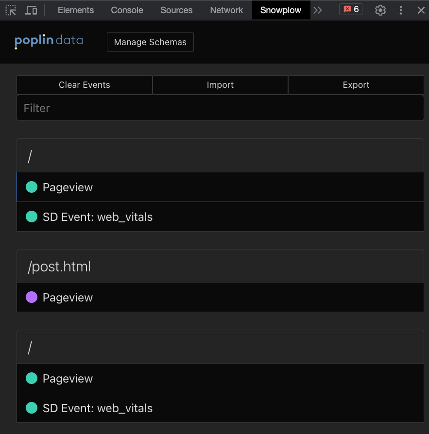
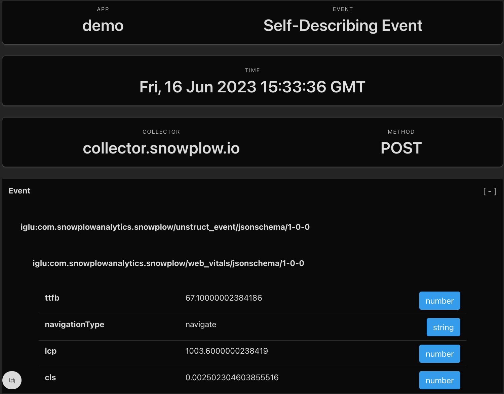

The Snowplow Chrome Extension can be used to ensure the event was emitted correctly but the browser extension does not check that the event was processed correctly.

## Step 1: Installation

Install the [Snowplow Chrome Extension](https://chrome.google.com/webstore/detail/snowplow-inspector/maplkdomeamdlngconidoefjpogkmljm?hl=en), you may need to restart your browser.

## Step 2: Check your data

Open up devtools (F12) and navigate to the Snowplow extension. In a regular setup you should probably see a list of Pageview and `web_vitals` events start to form as you interact with your site.

Click on an event to get a breakdown of the data being captured.

