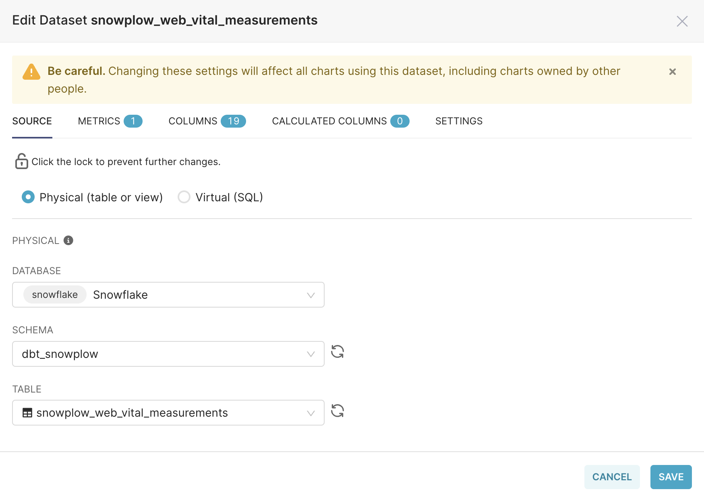
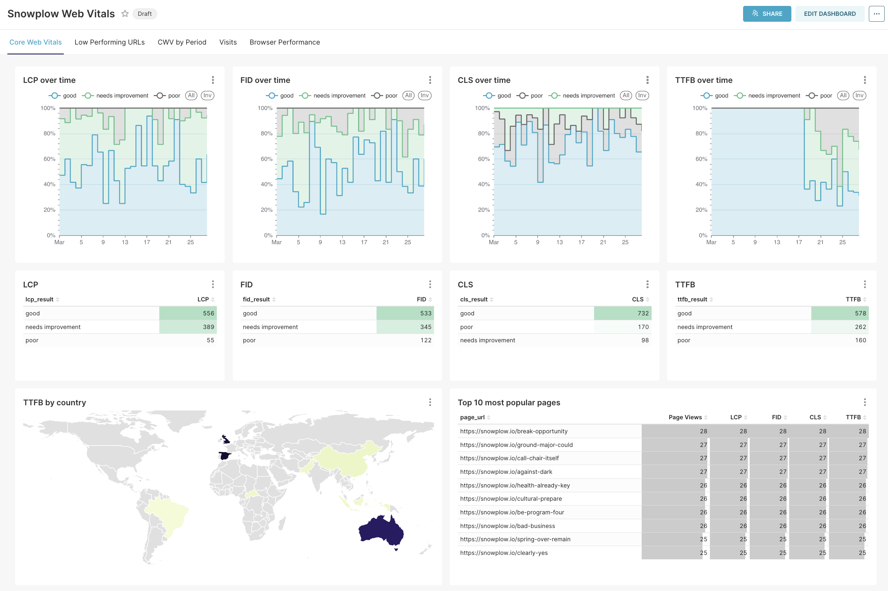

Now that you have modeled data you'll want to see the results in a visual way to be able to easily identify any performance issues with your website.

We have created a Preset dashboard template to showcase how you could do that, using public Google Sheets that were exported from the derived core web vitals tables (`core_web_vitals`, `core_web_vital_measurements`).

If you would like to see your own modeled data you can simply change the data sources and then you will be able to look at the visualizations to get inspiration of what you can build with your connector of choice (based on the warehouse you have).

## Accessing the Preset dashboard template

You can download the file [here](https://snowplow-demo-datasets.s3.eu-central-1.amazonaws.com/Visualization/snowplow_web_vitals_preset_dashboard.zip).

Once you have the file locally, you can import the dashboard from Preset's dashboard listing page.

## Change the dashboard data source

1. Create a database connection in Preset to your database containing your Snowplow web vitals tables if one doesn't already exist.

2. On Preset's dataset listing page edit the `snowplow_web_vitals_sample` and `snowplow_web_vital_measurements_sample` Google Sheet dataset sources to your own warehouse database tables.

You should have a working dashboard with your own data! Feel free to pick and choose visualizations and dashboards to make your custom one.

